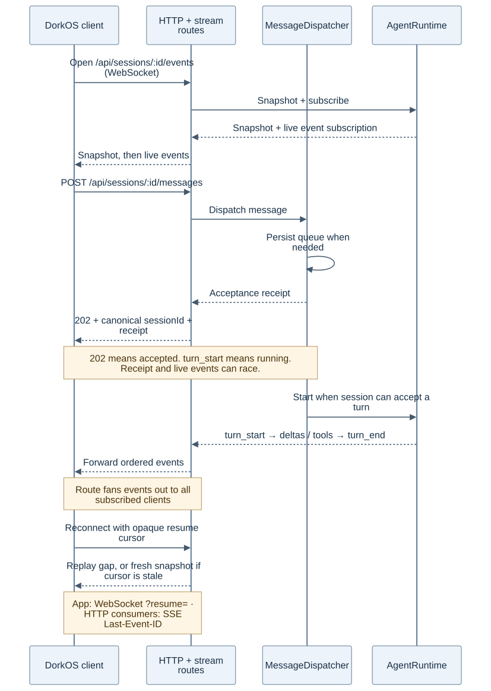

# DorkOS system architecture

## Overview

This is the cross-system map of DorkOS: what runs where, how the pieces communicate, which interfaces are replaceable, and who owns the data. Start here, then use [the implementation guide](architecture.md) for local internals.

**Code snapshot:** `ea6e06765385258d2cf07a5f078de1fec0041df5`, reviewed 2026-09-23. “Implemented” means present in this public source snapshot. Planned paths are labeled separately; a published contract does not prove service deployment. Cloud coverage uses only public contracts and public app code. Obsidian retirement updates on 2026-09-25 remove the in-process plugin path from this map.

For proposed improvements and independently selectable workstreams, see the [architecture improvement roadmap](../plans/architecture-improvement-roadmap.md). Linear tracks their live execution state.

## Key Files

Paths are relative to this repository. These are evidence pointers for the diagrams, not a complete module inventory.

| Boundary                               | Source of truth                                                                                                                                                                                                                                                                                                                             |
| -------------------------------------- | ------------------------------------------------------------------------------------------------------------------------------------------------------------------------------------------------------------------------------------------------------------------------------------------------------------------------------------------- |
| Local composition and routes           | [server startup](../apps/server/src/index.ts), [Express app](../apps/server/src/app.ts)                                                                                                                                                                                                                                                     |
| Client port and network implementation | [Transport](../packages/shared/src/transport.ts), [HttpTransport](../apps/client/src/layers/shared/lib/transport/http-transport.ts), [qualified Community methods](../apps/client/src/layers/shared/lib/transport/remote-community-methods.ts), [WSConnection](../apps/client/src/layers/shared/lib/transport/ws-connection.ts)             |
| WebSocket and SSE delivery             | [upgrade router](../apps/server/src/services/core/streams/upgrade-router.ts), [session socket](../apps/server/src/routes/session-events-socket.ts), [room socket](../apps/server/src/routes/room-events-socket.ts), [global socket](../apps/server/src/routes/events-socket.ts)                                                             |
| Turn acceptance and queueing           | [MessageDispatcher](../apps/server/src/services/session/message-dispatcher.ts), [runtime contract](../packages/shared/src/agent-runtime.ts)                                                                                                                                                                                                 |
| Independent Community                  | [app and route registration](../apps/community/src/app.ts), [SSE route](../apps/community/src/routes/events.ts), [browser](../apps/community/src/browser), [BlobStore](../apps/community/src/storage/blob-store.ts)                                                                                                                         |
| Community port and actual wiring       | [CommunityAdapter](../packages/shared/src/community-adapter.ts), [remote Community implementation](../apps/server/src/services/communities/remote), [qualified Community routes](../apps/server/src/routes/remote-communities.ts), [remote room stream](../apps/server/src/services/communities/remote/remote-room-subscription-runtime.ts) |
| Optional Cloud boundary                | [public wire contract](../packages/cloud-api/README.md), [existing client](../apps/server/src/services/core/auth/cloud-link-client.ts), [versioned client](../apps/server/src/services/core/cloud/v1-client.ts), [credits opt-in](../apps/server/src/services/core/cloud/credits-inference.ts)                                              |
| Marketplace delivery                   | [fetcher](../apps/server/src/services/marketplace/package-fetcher.ts), [installer](../apps/server/src/services/marketplace/marketplace-installer.ts), [transaction](../apps/server/src/services/marketplace/transaction.ts), [website reads](../apps/site/src/layers/features/marketplace/lib/fetch.ts)                                     |
| Harness projection                     | [harness package](../packages/harness), [server harness services](../apps/server/src/services/harness)                                                                                                                                                                                                                                      |
| Messaging and account actions          | [RelayAdapter](../packages/relay/src/types.ts), [ConnectorProvider](../packages/shared/src/connector-provider.ts), [account registry](../apps/server/src/services/connectors/registry.ts)                                                                                                                                                   |
| Memory                                 | [MemoryProvider](../packages/shared/src/memory-provider.ts), [built-in implementation](../packages/memory/src/builtin-provider.ts)                                                                                                                                                                                                          |

Additional evidence: [tenant resolution](../apps/community/src/tenant-context.ts), [host authority](../apps/community/src/host/authority.ts), [host limits and usage](../apps/community/src/routes/host-limits.ts), [community navigation](../apps/client/src/layers/entities/community/model/use-community-navigation.ts), and [hosted-community wire schemas](../packages/cloud-api/src/communities.ts).

## When to Use What

| Question                                         | View / guide                                                               | Why                                                                |
| ------------------------------------------------ | -------------------------------------------------------------------------- | ------------------------------------------------------------------ |
| What do I deploy, and what is optional?          | [System context](#system-context)                                          | Separates processes and data ownership                             |
| Where can I swap implementations?                | [Ports](#replaceable-interfaces)                                           | Separates code interfaces from network protocols                   |
| Where do messages and live updates travel?       | [Session flow](#commands-and-live-events)                                  | Separates acceptance from execution and delivery                   |
| Is Community part of Cloud or local Rooms?       | [Community](#local-rooms-and-independent-community)                        | Shows independent identity and persistence                         |
| Does the website install packages or run agents? | [Marketplace](#marketplace-discovery-and-delivery)                         | Separates discovery, local installation, and activation            |
| What does the app need from Cloud?               | [Cloud boundary](#cloud-public-boundary)                                   | Shows optional public calls without private implementation details |
| How do I change a local subsystem?               | [Implementation architecture](architecture.md) and the linked domain guide | Keeps detailed contracts out of the overview                       |

## Core Patterns

These are architecture patterns, so the examples are diagrams and wire contracts rather than application snippets. In flowcharts, solid arrows show implemented paths; dashed arrows explicitly label unfinished wiring or a schema relationship. The sequence diagram uses dashed arrows for responses and events, following sequence-diagram conventions. An optional path is still drawn solid when the app-side implementation exists. Arrows show the main operation or data direction, not every response packet. Open an image to read it at full size.

### System context

[Editable diagram](diagrams/architecture/system-context.mmd)

The local server is the execution and coordination host. Rooms, Tasks, Relay, Mesh, memory, workspaces, and installed extensions are subsystems of that host, not separate servers. Agent runtimes can own additional processes. OpenCode, for example, has a managed local sidecar.

There are three different browser experiences: the DorkOS client, the independent Community browser, and the public website. The desktop app wraps the DorkOS client and manages a local server; it does not replace the server with Electron IPC. The phone app reaches the same server over the network, optionally through a tunnel.

| Piece                           | Responsibility and state at this snapshot                                                                                                                                                                                                     |
| ------------------------------- | --------------------------------------------------------------------------------------------------------------------------------------------------------------------------------------------------------------------------------------------- |
| `apps/client` + `apps/server`   | Implemented local app, shared by web and desktop surfaces. Runtime and coordination services live here.                                                                                                                                       |
| `apps/community`                | Multi-community Hono host with its own browser, PostgreSQL, host-wide sign-in, tenant authorization, administration and pairing. Approved local installations participate through qualified local-server routes and a remote-room SSE stream. |
| Cloud                           | Optional hosted control-plane boundary. App-side clients and public contracts exist; hosted-community orchestration is still being built. A route in the contract is not proof of deployment.                                                 |
| `apps/site`                     | Next.js website, docs, marketplace browsing, and telemetry. Some existing account/device-link routes also remain here during the Cloud separation; do not equate the whole site with the final Cloud architecture.                            |
| Marketplace source repositories | Package content and registry metadata. The Dork Labs source is a separate public repository; other sources are supported.                                                                                                                     |
| `packages/cloud-api`            | Public schemas, route definitions, fixtures, and a fetch client. A library shared across the boundary, not a server.                                                                                                                          |

### Replaceable interfaces

A **port** is a typed boundary in code. An **adapter** implements that boundary. Neither word implies a separate process, and only some implementations make network calls.

[Editable diagram](diagrams/architecture/ports.mmd)

| Interface           | Replaces                                            | Important constraint                                                                                                                                                                                                                                                                                                                                |
| ------------------- | --------------------------------------------------- | --------------------------------------------------------------------------------------------------------------------------------------------------------------------------------------------------------------------------------------------------------------------------------------------------------------------------------------------------- |
| `Transport`         | How the React client reaches app operations         | `HttpTransport` uses HTTP, WebSockets, and Community SSE; tests can inject a mock.                                                                                                                                                                                                                                                                  |
| `AgentRuntime`      | The agent execution engine                          | Claude Code, Codex, and OpenCode implement a shared contract with declared capabilities and conformance tests. Switching runtimes does not migrate an existing conversation.                                                                                                                                                                        |
| `ConnectorProvider` | How authenticated actions reach external services   | Composio, Nango, raw MCP, and managed Cloud implementations sit behind local identity, policy, and execution routing. Account IDs do not expose backend routing.                                                                                                                                                                                    |
| `CommunityAdapter`  | Where a room's shared truth lives                   | A remote connection binds a pinned host origin and immutable community UUID; room addresses also include the room ID. Only the Local implementation is registered in `CommunityRegistry` at startup. Approved installations use lazily constructed, owner-qualified Remote Community implementations outside that registry; Buzz is not registered. |
| `MemoryProvider`    | How persistent agent notes are stored and retrieved | The built-in store uses files. Capability declarations and conformance govern alternatives; this port does not execute agents.                                                                                                                                                                                                                      |
| `RelayAdapter`      | How messages enter or leave Relay                   | Messaging platforms and agent delivery use this boundary. It is distinct from authenticated service actions and from Community membership.                                                                                                                                                                                                          |

Community's `BlobStore` is another, narrower storage port: filesystem and S3 implementations share the attachment/export contract. Mesh also uses discovery strategies. These do not need to become global registries just because they are replaceable.

### Commands and live events

[Editable diagram](diagrams/architecture/session-flow.mmd)

The message POST returns a receipt, not a token stream. A busy session queues the message. `turn_start` is the reliable signal that execution began; `202` and `queuePosition: 1` cannot distinguish an immediate start from the first queued message. Queued messages survive server restarts. The receipt and live events travel independently and may arrive in either order.

On a cold connection, the session stream sends a snapshot before live events. On reconnection it replays the missing range when possible, otherwise sends a fresh snapshot. Treat the full resume cursor as opaque. A newly created session may receive a canonical runtime ID different from the requested ID; the client must follow that ID.

| Connection                          | Protocol / endpoint                                                                                      | Purpose                                                                                                                                                       |
| ----------------------------------- | -------------------------------------------------------------------------------------------------------- | ------------------------------------------------------------------------------------------------------------------------------------------------------------- |
| DorkOS client → local server        | HTTP JSON, `/api/*`; local uploads use multipart/XHR and Community uploads use raw bytes                 | Queries, commands, settings, uploads, and approvals                                                                                                           |
| Local server → DorkOS client        | WebSocket at `/api/events`, `/api/sessions/:id/events`, `/api/rooms/:id/events`; qualified Community SSE | Global changes, session turns, local-room changes, and remote Community updates. The global, session, and local-room paths also expose SSE to HTTP consumers. |
| Local server ↔ Community            | Approved-installation HTTP commands plus Community channel SSE                                           | The local server retains personal and agent credentials, projects authorized Community rooms, and relays their resumable updates to the local app.            |
| Terminal client ↔ local PTY         | WebSocket at `/api/terminal/:id/socket`                                                                  | Bidirectional terminal bytes; separate from durable app events                                                                                                |
| Community browser → Community       | Tenant HTTP `/api/v1/communities/:communityId/*`, plus host-wide `/api/auth/*`                           | Channel operations, sign-in, uploads and exports                                                                                                              |
| Community → its browser             | SSE `/api/v1/communities/:communityId/channels/:id/events`                                               | Snapshot, replay and live channel updates; the browser uses `EventSource`                                                                                     |
| Local server ↔ OpenCode sidecar     | SDK over local HTTP; global SSE subscription                                                             | Runtime operations and events. This is separate from the browser's WebSocket connection.                                                                      |
| Local server ↔ Claude Code / Codex  | Their SDKs and managed runtime processes                                                                 | Agent turns; do not label all runtime links HTTP or SSE                                                                                                       |
| External tool caller → local server | MCP Streamable HTTP at `/mcp`; A2A gateway under `/a2a`                                                  | Tool access and agent-protocol access, not the browser's chat transport                                                                                       |
| Cloud-linked local server → Cloud   | HTTPS requests, polling, event pull/ack                                                                  | Device link, heartbeat and optional managed services; details below                                                                                           |
| Messaging platforms ↔ Relay         | Platform-specific API, polling, webhook, or socket                                                       | Protocol belongs to the concrete messaging implementation                                                                                                     |

See [SSE and WebSocket protocol](../docs/integrations/sse-protocol.mdx), [authentication](authentication.md), and [the terminal socket implementation](../apps/server/src/services/terminal/terminal-websocket.ts). WebSocket upgrades have their own credential, origin, and host checks because Express middleware does not run on an upgrade.

### Local rooms and independent Community

[Editable diagram](diagrams/architecture/community.mmd)

Local Rooms and Community solve related problems but do not share a database or login. Community can run without a local DorkOS server or a Cloud account. It owns member and channel authorization, posts, files, and replay cursors. It does not host an `AgentRuntime` or execute agents itself.

The `CommunityAdapter` seam is server-side. `GET /api/rooms` remains the caller-filtered local-room list and deliberately bypasses `LocalCommunityAdapter`: its single-identity model cannot express that route's per-caller permissions. An approved remote Community is addressed separately by community plus room ID through qualified `/api/communities/:ref/rooms/:roomId` routes. Its authorized rooms appear in the local app under that Community and update through the remote-room SSE stream; they are not copied into the generic local-room list.

Community pairing and agent credential routes are the admission path for native participation. A member approves an installation; that installation exchanges a verifier-bound code for a personal bearer. Agent enrollment issues a separate scoped agent bearer, and the local server uses those credentials for authorized channel reads, posts, files, membership changes, delivery control, and resumable updates.

One Community host can now serve many communities. Better Auth accounts and sessions belong to the host; memberships, roles, channels, entries, grants, files and exports belong to an immutable community UUID. Canonical HTTP routes use `/api/v1/communities/:communityId/*`; unqualified compatibility routes work only while the host has exactly one community. A second community makes an unqualified request fail with `COMMUNITY_SELECTION_REQUIRED`, rather than selecting a default.

Host operators manage community containers and lifecycle. Community owners and members govern content. Scoped host API keys reach administrative operations under `/api/v1/host/*`, including limits and usage, but cannot read tenant content or manage other API keys. A newly created community remains `pending_owner` until its intended owner uses a single-use claim link. Host operation does not silently grant membership.

The app's switcher selects this local installation or a connected community. Switching changes the room scope and available actions; it does not move the agent runtime onto the host. Server-owned subscriptions continue receiving eligible remote messages without a browser. Authorized joined rooms have local mirrors for dispatch, while Community remains authoritative. Agent posts use a durable outbox with bounded retry and remote receipts. Stop, disconnection, and revocation are checked again at delivery boundaries.

The guided `dorkos community deploy` launcher runs on the operator's machine, independently of the local server and Cloud. It provisions a separate deployment from a versioned, attested Community image. The [hosting guide](../apps/community/FLY.md) and [deployment acceptance record](../specs/community-live-deployment/04-acceptance.md) describe the operational proof and its limits.

Slack and Telegram bridges project messages into **local** rooms. They are Relay paths, not remote Community backends. See [Community development](community-server.md) and [implementing the Community port](adding-a-community-adapter.md).

### Marketplace discovery and delivery

[Editable diagram](diagrams/architecture/marketplace.mmd)

“Marketplace” names three things: source repositories, a discovery surface on the website, and the local install/activation machinery. There is no required central package-execution server between an installed package and an agent.

The site reads registry metadata and package descriptions. Update checks now use the installer’s own resolve/stage/validate path and the package → marketplace entry → commit version fallback. An uncheckable package reports `unknown`, not `current`. The local installer resolves sources, fetches and caches content, validates it, prepares a permission preview, and installs through a file transaction. Activation depends on the package type. Harness Sync projects agent-facing assets into the layouts each supported harness reads; executable app extensions and messaging packages have their own activation paths.

The install path is covered end to end. That does **not** certify all Claude Code marketplace compatibility claims: full superset compatibility remains behind the project's verification gate. See [registry format](marketplace-registry.md), [installation](marketplace-installs.md), and [Harness Sync](harness-sync.md).

### Cloud public boundary

[Editable diagram](diagrams/architecture/cloud-boundary.mmd)

Cloud is not required to build, test, or run the local app or Community host. Optional hosted-community management connects the two through public APIs; see [Cloud-hosted communities](#cloud-hosted-communities-planned-management-path). The public contract belongs in this repository; private service internals do not.

Two API families coexist in the current app. `cloud-link-client.ts` calls existing `/api/auth/device/*` and `/api/instances/*` routes for device linking, heartbeats and managed services. `cloud/v1-client.ts` uses the public versioned contract. Do not draw every existing call as `/v1`, or interpret every `/v1` schema as a completed app feature.

The public contract covers accounts, instances, managed services, entitlements, organizations/seats, remote access, inference tokens, and hosted-community provisioning and moves. Its SSE remote command stream (`GET /v1/remote/commands`) is a **contract surface**, not evidence that the current local tunnel manager consumes it. The existing tunnel manager uses the ngrok SDK. Remote browser traffic travels through that tunnel to the local server; it is a different path from Cloud control requests.

Inference is another distinct path. With the explicit credits flag and a linked instance, the app can request a scoped token and endpoint URLs, then configure runtime inference accordingly. Linking an account alone does not enable credits inference. This map does not assert hosted readiness, provider routing, or support parity across every runtime.

### Cloud-hosted communities: planned management path

[Editable diagram](diagrams/architecture/hosted-communities.mmd)

Independent deployment does not mean no relationship with Cloud. The [public host-operator specification](../specs/community-host-operator-api/02-specification.md) makes a hosted service an optional operator of the same Community software. Cloud can arrange hosting, pass limits to the host and read usage through its host API. It does not gain community membership, read conversations or files, or connect directly to the host database. Community still serves its members without Cloud being reachable.

| Boundary                      | Implemented at this snapshot                                                                   | Still specified or in progress                                                |
| ----------------------------- | ---------------------------------------------------------------------------------------------- | ----------------------------------------------------------------------------- |
| Community host administration | Scoped machine keys, owner claims, lifecycle administration, host-set limits and usage reads   | Short names, import, read-only holds and notice-gated host deletion           |
| Hosted-service wire           | `packages/cloud-api` schemas, routes and fixtures for list/start/claim, keep/restore and moves | End-to-end Cloud provisioning and launch are not established by these types   |
| Local app entry               | Existing pairing, community selection and member participation                                 | Start/move dialogs and `/api/cloud/communities/*` routing                     |
| Sign-in                       | Host-wide Community accounts with community-scoped memberships                                 | Optional generic OpenID Connect; shared Cloud sign-in is not a requirement    |
| Portability                   | Owner exports                                                                                  | Import on another host and member-erasure work remain separate delivery gates |

The published move contract sends the archive to a Community-server upload target; the Cloud control plane does not carry the file. The planned local-server relay keeps the instance credential and move upload token out of browser responses. A move copies history; it does not transfer live logins or make the old host stop serving. See [the public contract](../packages/cloud-api/README.md#hosted-communities) for one-time credentials, idempotency and forward-compatible states. These are contract promises, not a claim that the complete move flow ships today.

Since this snapshot, `c8fc697ad` (#2037) landed the local app's start/move dialogs and the `/api/cloud/communities/*` relay (`apps/server/src/routes/cloud-communities.ts`). They stay unannounced until the hosted service serves those routes, so the table above still describes what a person can rely on.

### Runtime tools and room publication

[Editable diagram](diagrams/architecture/runtime-tools.mmd)

Claude Code receives DorkOS tools in-process. Agent-bound Codex and OpenCode turns receive them through a loopback-only MCP Streamable HTTP listener with short-lived, turn-bound credentials. This is separate from external `/mcp`; switching off public MCP access does not remove an agent's own tools. The [injection policy](../apps/server/src/services/runtimes/shared/dorkos-mcp-injection.ts) binds identity, runtime and working directory, and revokes the bearer when the turn ends.

A room turn publishes by calling `post_to_room` or reacting; otherwise it stays silent. Its final text is not automatically a room post. Execution, session event delivery and shared-room publication are separate operations. See [the runner](../apps/server/src/services/rooms/room-turn-runner.ts).

An agent can also receive a signed-in Playwright browser through its managed MCP configuration. The local CLI owns the saved browser state; the server reports only site names and dates. That state grants website access and belongs in the credential inventory, separately from runtime keys and service accounts. Browser lifetime varies by runtime, and verification remains limited as described in the [signed-in browser guide](../docs/guides/agent-browser.mdx).

### Data ownership and trust boundaries

| Data               | Authority                                                                                                                              | Architectural consequence                                                                                                                                                        |
| ------------------ | -------------------------------------------------------------------------------------------------------------------------------------- | -------------------------------------------------------------------------------------------------------------------------------------------------------------------------------- |
| Session history    | Runtime-specific history: Claude Code transcripts; Codex thread bindings plus DorkOS-persisted event history; OpenCode sidecar storage | There is no universal transcript store or automatic cross-runtime migration. The Codex SDK cannot list/read threads, so its DorkOS implementation keeps the history it observed. |
| Local coordination | Local SQLite and DorkOS files                                                                                                          | Room posts, durable message queues, schedules and app state do not become Cloud data merely because the app is linked.                                                           |
| Agent identity     | `.dork/agent.json` with a derived SQLite registry                                                                                      | File-first writes; discovery rebuilds the registry.                                                                                                                              |
| Search             | Derived FTS index                                                                                                                      | Rebuildable; not the source of conversation history.                                                                                                                             |
| Community          | Host PostgreSQL and tenant-owned blobs                                                                                                 | Host-wide sign-in; tenant-scoped membership, content, grants and exports. Host administration is not content authority.                                                          |
| Marketplace        | Source repositories; installed files and local install metadata                                                                        | The website is not the authority for an installed package's execution.                                                                                                           |
| Cloud credentials  | Server-side Cloud client boundary                                                                                                      | Browser UI consumes app responses; server-side credentials stay out of diagrams, logs, and client payloads.                                                                      |

These are ownership boundaries, not a blanket promise that no content leaves the machine. Model calls, external service actions, opted-in telemetry, remote browser access, and Community posts cross different boundaries for different reasons.

## Anti-Patterns

| Avoid                                                                          | Use instead                                                                                              |
| ------------------------------------------------------------------------------ | -------------------------------------------------------------------------------------------------------- |
| ❌ One box called “backend” for local DorkOS, Community, and Cloud             | ✅ Separate deployment and data-ownership boxes                                                          |
| ❌ Every live arrow labeled SSE                                                | ✅ WebSocket for local app streams, SSE for Community and OpenCode events, with the exact boundary named |
| ❌ `202` drawn as the start of an agent turn                                   | ✅ Acceptance receipt followed by `turn_start` on the event channel                                      |
| ❌ A type or tested implementation drawn as a configured production connection | ✅ A dashed, labeled unfinished path; check composition-root registration                                |
| ❌ Marketplace drawn as a hosted execution service                             | ✅ Source → local transaction → activation/projection                                                    |
| ❌ Cloud inferred from private implementation details                          | ✅ Public contract plus verified app-side callers                                                        |
| ❌ A broad compatibility or platform claim inferred from a build               | ✅ The project's explicit verification status                                                            |

## Updating the diagrams

1. Change the `.mmd` sources in [diagrams/architecture](diagrams/architecture), then regenerate the SVGs. The [rendering instructions](diagrams/architecture/README.md) pin the renderer and configuration.
2. Check the corresponding implementation and startup registration, not just its interface. Record whether each changed path is implemented, optional, unwired, or contract-only.
3. Keep this guide, [the reader overview](../docs/concepts/architecture.mdx), and [the published developer reference](../docs/contributing/architecture.mdx) consistent. Reuse the SVG assets instead of copying diagram definitions.
4. Update the coverage map in [INDEX.md](INDEX.md), then run `node .claude/scripts/docs-coverage-map.mjs --regen` and `--check`.
5. Render and visually inspect every changed diagram. Check referenced paths and the docs build/MDX compilation before claiming the documentation is ready.

## Troubleshooting

**A diagram looks more complete than the feature.** Follow its code pointer to the startup wiring. A registered implementation, a conformance test, a public schema, and an end-user feature are four different kinds of evidence.

**An old document calls chat an SSE connection.** Check which caller it describes. SSE is still supported for HTTP consumers; the DorkOS browser's durable streams use WebSockets. Preserve correct SSE protocol guidance while correcting the browser claim.

**A schema and a deployed service disagree.** Record the discrepancy at the public contract boundary. Do not silently document private behavior as the contract.
