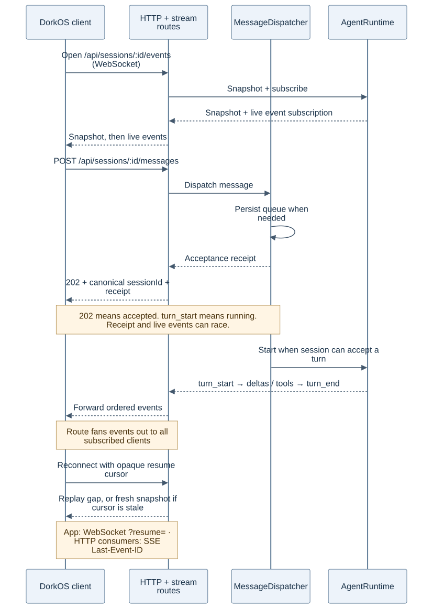

# DorkOS system architecture

## Overview

This is the cross-system map of DorkOS: what runs where, how the pieces communicate, which interfaces are replaceable, and who owns the data. Start here, then use [the implementation guide](architecture.md) for local internals.

**Cloud-boundary review:** public source `5794f638160a68811382347356fd29b31ee2e911`, reviewed 2026-09-27 after the initial Cloud implementation. This refresh checks Cloud callers, account handover, hosted-community wiring and related plans; it is not a new audit of every subsystem. Other views retain the September 23 baseline and September 25 Obsidian retirement update. Public diagrams use only public source and contracts. Implementation, app adoption, configured rollout and end-to-end availability are separate claims.

**Bounded follow-through review:** public source `710521034fbcfa9de43f0ae3a252b053a4b1db10`, reviewed 2026-09-28 for workspace lifecycle adoption, Community authority/restore evidence and the managed remote draft. These changes preserve the diagram topology. The identity update below supersedes the earlier Cloud identity snapshot.

**Identity reconciliation:** public source `2a847e0236dd643b6490acde294788de51bcf90e`, reviewed 2026-09-28 after [PR #2260](https://github.com/dork-labs/dorkos/pull/2260). Authenticated instance identity is now adopted for credits-token minting; this does not certify deployed compatibility or retire legacy callers.

For proposed improvements and independently selectable workstreams, see the [architecture improvement roadmap](../plans/architecture-improvement-roadmap.md). Linear tracks their live execution state.

## Key Files

Paths are relative to this repository. These are evidence pointers for the diagrams, not a complete module inventory.

| Boundary                               | Source of truth                                                                                                                                                                                                                                                                                                                             |
| -------------------------------------- | ------------------------------------------------------------------------------------------------------------------------------------------------------------------------------------------------------------------------------------------------------------------------------------------------------------------------------------------- |
| Local composition and routes           | [server startup](../apps/server/src/index.ts), [Express app](../apps/server/src/app.ts)                                                                                                                                                                                                                                                     |
| Client port and network implementation | [Transport](../packages/shared/src/transport.ts), [HttpTransport](../apps/client/src/layers/shared/lib/transport/http-transport.ts), [qualified Community methods](../apps/client/src/layers/shared/lib/transport/remote-community-methods.ts), [WSConnection](../apps/client/src/layers/shared/lib/transport/ws-connection.ts)             |
| WebSocket and SSE delivery             | [upgrade router](../apps/server/src/services/core/streams/upgrade-router.ts), [session socket](../apps/server/src/routes/session-events-socket.ts), [room socket](../apps/server/src/routes/room-events-socket.ts), [global socket](../apps/server/src/routes/events-socket.ts)                                                             |
| Turn acceptance and queueing           | [MessageDispatcher](../apps/server/src/services/session/message-dispatcher.ts), [runtime contract](../packages/shared/src/agent-runtime.ts)                                                                                                                                                                                                 |
| Independent Community                  | [app and route registration](../apps/community/src/app.ts), [SSE route](../apps/community/src/routes/community/events.ts), [browser](../apps/community/src/browser), [BlobStore](../apps/community/src/storage/blob-store.ts)                                                                                                               |
| Community port and actual wiring       | [CommunityAdapter](../packages/shared/src/community-adapter.ts), [remote Community implementation](../apps/server/src/services/communities/remote), [qualified Community routes](../apps/server/src/routes/remote-communities.ts), [remote room stream](../apps/server/src/services/communities/remote/remote-room-subscription-runtime.ts) |
| Optional Cloud boundary                | [public wire contract](../packages/cloud-api/README.md), [legacy client and origin resolution](../apps/server/src/services/core/auth/cloud-link-client.ts), [versioned client](../apps/server/src/services/core/cloud/v1-client.ts), [credits opt-in](../apps/server/src/services/core/cloud/credits-inference.ts)                          |
| Marketplace delivery                   | [fetcher](../apps/server/src/services/marketplace/package-fetcher.ts), [installer](../apps/server/src/services/marketplace/installer/marketplace-installer.ts), [transaction](../apps/server/src/services/marketplace/transaction.ts), [website reads](../apps/site/src/layers/features/marketplace/lib/fetch.ts)                           |
| Harness projection                     | [harness package](../packages/harness), [server harness services](../apps/server/src/services/harness)                                                                                                                                                                                                                                      |
| Messaging and account actions          | [RelayAdapter](../packages/relay/src/types.ts), [ConnectorProvider](../packages/shared/src/connector-provider.ts), [account registry](../apps/server/src/services/connectors/registry.ts)                                                                                                                                                   |
| Memory                                 | [MemoryProvider](../packages/shared/src/memory-provider.ts), [built-in implementation](../packages/memory/src/builtin-provider.ts)                                                                                                                                                                                                          |

Account handover evidence: [forwarding policy](../apps/site/src/lib/cloud-accounts/forward.ts), [site proxy](../apps/site/src/proxy.ts), [forwarding tests](../apps/site/src/lib/cloud-accounts/__tests__/forward.test.ts), and [public migration configuration](../apps/site/drizzle.public.config.ts).

Additional evidence: [tenant resolution](../apps/community/src/tenant-context.ts), [host authority](../apps/community/src/host/authority.ts), [host limits and usage](../apps/community/src/routes/host/host-limits.ts), [community navigation](../apps/client/src/layers/entities/community/model/use-community-navigation.ts), and [hosted-community wire schemas](../packages/cloud-api/src/communities.ts).

## When to Use What

| Question                                         | View / guide                                                               | Why                                                                |
| ------------------------------------------------ | -------------------------------------------------------------------------- | ------------------------------------------------------------------ |
| What do I deploy, and what is optional?          | [System context](#system-context)                                          | Separates processes and data ownership                             |
| Where can I swap implementations?                | [Ports](#replaceable-interfaces)                                           | Separates code interfaces from network protocols                   |
| Where do messages and live updates travel?       | [Session flow](#commands-and-live-events)                                  | Separates acceptance from execution and delivery                   |
| Is Community part of Cloud or local Rooms?       | [Community](#local-rooms-and-independent-community)                        | Shows independent identity and persistence                         |
| Does the website install packages or run agents? | [Marketplace](#marketplace-discovery-and-delivery)                         | Separates discovery, local installation, and activation            |
| What does the app need from Cloud?               | [Cloud boundary](#cloud-public-boundary)                                   | Shows optional public calls without private implementation details |
| How do I change a local subsystem?               | [Implementation architecture](architecture.md) and the linked domain guide | Keeps detailed contracts out of the overview                       |

## Core Patterns

These are architecture patterns, so the examples are diagrams and wire contracts rather than application snippets. In flowcharts, solid arrows show implemented paths; dashed arrows explicitly label unfinished wiring or a schema relationship. The sequence diagram uses dashed arrows for responses and events, following sequence-diagram conventions. An optional path is still drawn solid when the app-side implementation exists. Arrows show the main operation or data direction, not every response packet. Open an image to read it at full size.

### System context

[Editable diagram](diagrams/architecture/system-context.mmd)

The local server is the execution and coordination host. Rooms, Tasks, Relay, Mesh, memory, workspaces, and installed extensions are subsystems of that host, not separate servers. Agent runtimes can own additional processes. OpenCode, for example, has a managed local sidecar.

The server retains a [workspace reconciliation lifetime owner](../apps/server/src/services/workspace/workspace-reconciler-lifecycle.ts) before starting it. Shared service cleanup and startup-failure cleanup await its terminal disposal before unrelated cleanup. The owner rejects later startup, fences late reconciliation cache writes and shares a bounded completion result. This does not establish whole-server request draining, database/lock handoff or startup rollback; see the [bounded verification record](../specs/central-workspace-disposal/04-verification.md) and [remaining lifecycle work](../plans/architecture-improvement-roadmap.md#merged-follow-through-2026-09-28).

The main server shares one [request admission state](../apps/server/src/services/core/lifecycle/main-request-admission.ts) between Express and WebSocket upgrades. Ordinary cleanup and startup-failure cleanup close it synchronously before workspace disposal. New HTTP requests receive a generic 503 before parsing or authentication; upgrades are checked on arrival and after authorization. A narrow [listener guard](../apps/server/src/services/core/lifecycle/main-listener.ts) prevents late startup from serving or announcing readiness. Previously admitted handlers, established streams and separate listeners retain their existing lifetime behavior. This is admission control, not active-work drain or reset/restart exclusivity; see the [A1–A5 verification record](../specs/terminal-request-admission/05-verification.md).

Separate browser surfaces serve the DorkOS client, Community, the public website, and Cloud accounts. Account pages can be served locally by the website or handed to a separate origin through the public forwarding policy below. The desktop app wraps the DorkOS client and manages a local server; it does not replace the server with Electron IPC. The phone app reaches the same server over the network, optionally through a tunnel.

| Piece                           | Responsibility and state at this snapshot                                                                                                                                                                                                                                        |
| ------------------------------- | -------------------------------------------------------------------------------------------------------------------------------------------------------------------------------------------------------------------------------------------------------------------------------- |
| `apps/client` + `apps/server`   | Implemented local app, shared by web and desktop surfaces. Runtime and coordination services live here.                                                                                                                                                                          |
| `apps/community`                | Multi-community Hono host with its own browser, PostgreSQL, host-wide sign-in, tenant authorization, administration and pairing. Approved local installations participate through qualified local-server routes and a remote-room SSE stream.                                    |
| Cloud                           | Optional hosted-service boundary, separate from local execution and Community content. Public callers cover account linking, managed services, inference and hosted-community management. Each feature still needs compatible callers and configured availability.               |
| `apps/site`                     | Next.js website, docs, marketplace browsing, and telemetry. Account/device-link implementations remain alongside a configurable redirect/proxy handover. Managed connections have a separate migration boundary; do not treat the site as already reduced to marketing and docs. |
| Marketplace source repositories | Package content and registry metadata. The Dork Labs source is a separate public repository; other sources are supported.                                                                                                                                                        |
| `packages/cloud-api`            | Public schemas, route definitions, fixtures, and a fetch client. A library shared across the boundary, not a server.                                                                                                                                                             |

### Replaceable interfaces

A **port** is a typed boundary in code. An **adapter** implements that boundary. Neither word implies a separate process, and only some implementations make network calls.

[Editable diagram](diagrams/architecture/ports.mmd)

| Interface           | Replaces                                            | Important constraint                                                                                                                                                                                                                                                                                                                                |
| ------------------- | --------------------------------------------------- | --------------------------------------------------------------------------------------------------------------------------------------------------------------------------------------------------------------------------------------------------------------------------------------------------------------------------------------------------- |
| `Transport`         | How the React client reaches app operations         | `HttpTransport` uses HTTP, WebSockets, and Community SSE; tests can inject a mock.                                                                                                                                                                                                                                                                  |
| `AgentRuntime`      | The agent execution engine                          | Claude Code, Codex, and OpenCode implement a shared contract with declared capabilities and conformance tests. Switching runtimes does not migrate an existing conversation.                                                                                                                                                                        |
| `ConnectorProvider` | How authenticated actions reach external services   | Composio, Nango, raw MCP, and managed Cloud implementations sit behind local identity, policy, and execution routing. Account IDs do not expose backend routing.                                                                                                                                                                                    |
| `CommunityAdapter`  | Where a room's shared truth lives                   | A remote connection binds a pinned host origin and immutable community UUID; room addresses also include the room ID. Only the Local implementation is registered in `CommunityRegistry` at startup. Approved installations use lazily constructed, owner-qualified Remote Community implementations outside that registry; Buzz is not registered. |
| `MemoryProvider`    | How persistent agent notes are stored and retrieved | The built-in store uses files. Capability declarations and conformance govern alternatives; this port does not execute agents.                                                                                                                                                                                                                      |
| `RelayAdapter`      | How messages enter or leave Relay                   | Messaging platforms and agent delivery use this boundary. It is distinct from authenticated service actions and from Community membership.                                                                                                                                                                                                          |

Community's `BlobStore` is another, narrower storage port: filesystem and S3 implementations share the attachment/export contract. Mesh also uses discovery strategies. These do not need to become global registries just because they are replaceable.

### Commands and live events

[Editable diagram](diagrams/architecture/session-flow.mmd)

The message POST returns a receipt, not a token stream. A busy session queues the message. `turn_start` is the reliable signal that execution began; `202` and `queuePosition: 1` cannot distinguish an immediate start from the first queued message. Queued messages survive server restarts. The receipt and live events travel independently and may arrive in either order.

On a cold connection, the session stream sends a snapshot before live events. On reconnection it replays the missing range when possible, otherwise sends a fresh snapshot. Treat the full resume cursor as opaque. A newly created session may receive a canonical runtime ID different from the requested ID; the client must follow that ID.

| Connection                          | Protocol / endpoint                                                                                      | Purpose                                                                                                                                                       |
| ----------------------------------- | -------------------------------------------------------------------------------------------------------- | ------------------------------------------------------------------------------------------------------------------------------------------------------------- |
| DorkOS client → local server        | HTTP JSON, `/api/*`; local uploads use multipart/XHR and Community uploads use raw bytes                 | Queries, commands, settings, uploads, and approvals                                                                                                           |
| Local server → DorkOS client        | WebSocket at `/api/events`, `/api/sessions/:id/events`, `/api/rooms/:id/events`; qualified Community SSE | Global changes, session turns, local-room changes, and remote Community updates. The global, session, and local-room paths also expose SSE to HTTP consumers. |
| Local server ↔ Community            | Approved-installation HTTP commands plus Community channel SSE                                           | The local server retains personal and agent credentials, projects authorized Community rooms, and relays their resumable updates to the local app.            |
| Terminal client ↔ local PTY         | WebSocket at `/api/terminal/:id/socket`                                                                  | Bidirectional terminal bytes; separate from durable app events                                                                                                |
| Community browser → Community       | Tenant HTTP `/api/v1/communities/:communityId/*`, plus host-wide `/api/auth/*`                           | Channel operations, sign-in, uploads and exports                                                                                                              |
| Community → its browser             | SSE `/api/v1/communities/:communityId/channels/:id/events`                                               | Snapshot, replay and live channel updates; the browser uses `EventSource`                                                                                     |
| Local server ↔ OpenCode sidecar     | SDK over local HTTP; global SSE subscription                                                             | Runtime operations and events. This is separate from the browser's WebSocket connection.                                                                      |
| Local server ↔ Claude Code / Codex  | Their SDKs and managed runtime processes                                                                 | Agent turns; do not label all runtime links HTTP or SSE                                                                                                       |
| External tool caller → local server | MCP Streamable HTTP at `/mcp`; A2A gateway under `/a2a`                                                  | Tool access and agent-protocol access, not the browser's chat transport                                                                                       |
| Cloud-linked local server → Cloud   | HTTPS requests, polling, event pull/ack                                                                  | Device link, heartbeat and optional managed services; details below                                                                                           |
| Messaging platforms ↔ Relay         | Platform-specific API, polling, webhook, or socket                                                       | Protocol belongs to the concrete messaging implementation                                                                                                     |

See [SSE and WebSocket protocol](../docs/integrations/sse-protocol.mdx), [authentication](authentication.md), and [the terminal socket implementation](../apps/server/src/services/terminal/terminal-websocket.ts). WebSocket upgrades have their own credential, origin, and host checks because Express middleware does not run on an upgrade.

### Local rooms and independent Community

[Editable diagram](diagrams/architecture/community.mmd)

Local Rooms and Community solve related problems but do not share a database or login. Community can run without a local DorkOS server or a Cloud account. It owns member and channel authorization, posts, files, and replay cursors. It does not host an `AgentRuntime` or execute agents itself.

The `CommunityAdapter` seam is server-side. `GET /api/rooms` remains the caller-filtered local-room list and deliberately bypasses `LocalCommunityAdapter`: its single-identity model cannot express that route's per-caller permissions. An approved remote Community is addressed separately by community plus room ID through qualified `/api/communities/:ref/rooms/:roomId` routes. Its authorized rooms appear in the local app under that Community and update through the remote-room SSE stream; they are not copied into the generic local-room list.

Community pairing and agent credential routes are the admission path for native participation. A member approves an installation; that installation exchanges a verifier-bound code for a personal bearer. Agent enrollment issues a separate scoped agent bearer, and the local server uses those credentials for authorized channel reads, posts, files, membership changes, delivery control, and resumable updates.

One Community host can now serve many communities. Better Auth accounts and sessions belong to the host; memberships, roles, channels, entries, grants, files and exports belong to an immutable community UUID. Canonical HTTP routes use `/api/v1/communities/:communityId/*`; unqualified compatibility routes work only while the host has exactly one community. A second community makes an unqualified request fail with `COMMUNITY_SELECTION_REQUIRED`, rather than selecting a default.

Host operators manage community containers and lifecycle. Community owners and members govern content. Scoped host API keys reach administrative operations under `/api/v1/host/*`, including limits, usage, legal holds and notice-gated community deletion. These keys do not grant ordinary tenant membership or authority to manage other API keys. A newly created community remains `pending_owner` until its intended owner uses a single-use claim link. Host operation does not silently grant membership. Personal account/member erasure uses the person’s own session and reauthentication, not a host key.

The app's switcher selects this local installation or a connected community. Switching changes the room scope and available actions; it does not move the agent runtime onto the host. Server-owned subscriptions continue receiving eligible remote messages without a browser. Authorized joined rooms have local mirrors for dispatch, while Community remains authoritative. Agent posts use a durable outbox with bounded retry and remote receipts. Stop, disconnection, and revocation are checked again at delivery boundaries.

The guided `dorkos community deploy` launcher runs on the operator's machine, independently of the local server and Cloud. It provisions a separate deployment from a versioned, attested Community image. The [hosting guide](../apps/community/FLY.md) and [deployment acceptance record](../specs/community-live-deployment/04-acceptance.md) describe the operational proof and its limits.

The [authority tests added in PR #2271](https://github.com/dork-labs/dorkos/pull/2271) exercise open-stream owner/origin isolation and grant-specific revocation. The [two-community backup/restore rehearsal](../apps/community/scripts/rehearse-backup-restore.mjs), added in [PR #2272](https://github.com/dork-labs/dorkos/pull/2272), verifies restored content, attachments and authorization on disposable local resources. It is operator-run source-build evidence, not proof of a particular production image, deployment or rollback path.

Slack and Telegram bridges project messages into **local** rooms. They are Relay paths, not remote Community backends. See [Community development](community-server.md) and [implementing the Community port](adding-a-community-adapter.md).

### Marketplace discovery and delivery

[Editable diagram](diagrams/architecture/marketplace.mmd)

“Marketplace” names three things: source repositories, a discovery surface on the website, and the local install/activation machinery. There is no required central package-execution server between an installed package and an agent.

The site reads registry metadata and package descriptions. Update checks now use the installer’s own resolve/stage/validate path and the package → marketplace entry → commit version fallback. An uncheckable package reports `unknown`, not `current`. The local installer resolves sources, fetches and caches content, validates it, prepares a permission preview, and installs through a file transaction. Activation depends on the package type. Harness Sync projects agent-facing assets into the layouts each supported harness reads; executable app extensions and messaging packages have their own activation paths.

The install path is covered end to end. That does **not** certify all Claude Code marketplace compatibility claims: full superset compatibility remains behind the project's verification gate. See [registry format](marketplace-registry.md), [installation](marketplace-installs.md), and [Harness Sync](harness-sync.md).

### Cloud public boundary

[Editable diagram](diagrams/architecture/cloud-boundary.mmd)

Cloud is not required to build, test, or run the local app or Community host. The initial Cloud implementation does not change that boundary. Public schemas describe the agreement; public app code establishes which callers are implemented. Neither alone establishes the deployment's settings or end-to-end service availability.

#### App adoption is separate from service implementation

Two API families still coexist. `cloud-link-client.ts` calls `/api/auth/device/*` and `/api/instances/*` for device linking, heartbeats and managed services. `cloud/v1-client.ts` uses `@dork-labs/cloud-api/client`. Both resolve the base through `DORKOS_CLOUD_URL`, falling back to the website origin. The presence of a `/v1` schema does not redirect an old caller or select a different origin. Review origin configuration and compatibility before retiring old routes.

The public contract covers accounts, linked instances, managed services, entitlements, organizations/seats, remote access, inference and hosted communities. Remote access now describes command leasing and acknowledgements, address designation, credential replacement and idempotent event batches. The local managed command-stream consumer remains a separate app-side task ([DOR-2086](https://linear.app/dorkspace/issue/DOR-2086)); the [merged draft specification](../specs/managed-remote-app-consumer/02-specification.md) now has its app-side identity prerequisite implemented; person enrollment and trusted ingress-proof contracts, plus deployed acceptance evidence, remain gates. The existing tunnel manager uses the ngrok SDK. Browser traffic through a tunnel is a data path to the local server, distinct from Cloud control requests. The contract's SSE stream must not be drawn as already connected to the local tunnel manager.

Credits inference is another path. With the explicit credits flag and a linked instance, [the credits service](../apps/server/src/services/core/cloud/credits-inference.ts) resolves the authenticated `/v1/session` response's service-issued `instanceId` immediately before requesting a scoped inference token. Both calls share one [captured credential, origin and link generation](../apps/server/src/services/core/cloud/v1-client.ts). Missing or refused identity leaves that mint unavailable; there is no credential-hash or telemetry-ID fallback. No new persistent machine ID is invented, and rotation requires a fresh authenticated lookup even if the service returns the same ID.

Late identity/mint results cannot replace the current link's credits state. Held inference credentials are checked for expiry and current-link ownership again when the [Claude Code launch environment](../apps/server/src/services/runtimes/claude-code/messaging/launch-resolver.ts) is finally assembled, after asynchronous agent credential resolution. Only Claude Code is wired to this credits path; Codex and OpenCode remain follow-ups. Linking alone never enables spending. These guards prevent stale credentials entering new launches; they do not cancel already-running turns.

[CloudLink](../apps/server/src/services/core/auth/cloud-link.ts) also guards delayed polling, heartbeat and managed-service settlements against credential/origin/generation changes. Unlink withdraws the local credential before awaiting best-effort remote revocation, and an old response cannot clear a replacement link. The [legacy revoke call](../apps/server/src/services/core/auth/cloud-link-client.ts) still presents an instance bearer to a session-guarded endpoint: local withdrawal is implemented, successful remote self-revocation is not guaranteed. Legacy caller retirement and deployment compatibility remain separate work.

#### Website account handover

[Editable diagram](diagrams/architecture/accounts-handover.mmd)

`DORKOS_CLOUD_ACCOUNTS_ORIGIN` selects an implemented compatibility path in the public site. With it unset or invalid, account routes remain local. With a valid origin:

- Account pages and eligible browser navigations receive a temporary 307 redirect, putting the browser on the host that owns its session cookie. Query strings survive.
- Machine/bearer requests, bodies and background fetches use a rewrite that preserves method, body and authorization. This keeps released binaries' existing account and instance paths useful.
- Only the listed account paths and exact instance registry routes are forwarded. This is not a catch-all `/api` or `/v1` proxy. Managed connections are excluded and disabled on the site while forwarding is enabled; their migration is separate.
- Forwarding-aware site sweeps stand down. Public-site schema migrations have their own configuration/history. Deleting the remaining account implementation is a later cleanup ([DOR-2442](https://linear.app/dorkspace/issue/DOR-2442)), requiring a verified handover first.

This documents both supported configurations, not which is enabled in production. Do not equate a merged handover mechanism with completed traffic cutover or code retirement.

### Cloud-hosted communities: management and content paths

[Editable diagram](diagrams/architecture/hosted-communities.mmd)

The [public host-operator specification](../specs/community-host-operator-api/02-specification.md) defines optional hosting management over the same independently runnable Community software. Hosting manages lifecycle, limits and usage through the host API. It does not grant the hosting account ordinary community membership or route participation through Cloud. Content and its authorization remain with the Community host.

| Boundary                      | Public evidence at this snapshot                                                                                                       | Remaining boundary                                                                                          |
| ----------------------------- | -------------------------------------------------------------------------------------------------------------------------------------- | ----------------------------------------------------------------------------------------------------------- |
| Community host administration | Scoped keys, owner claims, lifecycle, short names, limits/usage, legal holds and notice-gated community deletion routes are registered | Import/move completion and additional host operations require their own Community delivery evidence         |
| Hosted-service wire           | Schemas, route table and fixtures cover list/start/claim, keep/restore and moves                                                       | Runtime availability and completion must be checked; a schema is not deployment proof                       |
| Local app entry               | Start/move dialogs, `/api/cloud/communities/*` router and parsed contract client are implemented and mounted                           | Refusals and unavailable states remain possible; UI presence is not a hosted launch guarantee               |
| Sign-in                       | Host-wide accounts with community-scoped membership                                                                                    | Optional generic OIDC/shared sign-in remains a separate design; Cloud accounts are not Community membership |
| Participation                 | Qualified local-server HTTP and Community SSE                                                                                          | Does not depend on routing posts or agent execution through the hosting control plane                       |

The local server stages an export, starts the move through Cloud, and uploads the file to the returned Community-server target. The archive does not pass through the Cloud control plane. The installation credential and move upload token stay server-side. The one-time owner-claim URL reaches the browser only through the explicit claim-link action, with `no-store`; list, start and poll responses omit it. `GET /api/cloud/communities/sign-in` relays the origins whose single sign-on is the DorkOS account; the client opens a claim, invitation or approval on one of them with `?sign-in=single-sign-on` (`withCommunitySingleSignOnHint`), and the Community server's pages then lead with that sign-in. The hint grants nothing, and an unlisted server (every self-run one) is opened exactly as before. See [the local relay](../apps/server/src/routes/cloud-communities.ts) and [public contract](../packages/cloud-api/README.md#hosted-communities).

A move copies history; it is not transfer of live logins or proof that the old host stopped serving. Keep the implemented local relay distinct from full import/provisioning acceptance. The diagrams label the hosting relationship as a public contract rather than speculating about private service internals or rollout.

### Runtime tools and room publication

[Editable diagram](diagrams/architecture/runtime-tools.mmd)

Claude Code receives DorkOS tools in-process. Agent-bound Codex and OpenCode turns receive them through a loopback-only MCP Streamable HTTP listener with short-lived, turn-bound credentials. This is separate from external `/mcp`; switching off public MCP access does not remove an agent's own tools. The [injection policy](../apps/server/src/services/runtimes/shared/dorkos-mcp-injection.ts) binds identity, runtime and working directory, and revokes the bearer when the turn ends.

A room turn publishes by calling `post_to_room` or reacting; otherwise it stays silent. Its final text is not automatically a room post. Execution, session event delivery and shared-room publication are separate operations. See [the runner](../apps/server/src/services/rooms/room-turn-runner.ts).

An agent can also receive a signed-in Playwright browser through its managed MCP configuration. The local CLI owns the saved browser state; the server reports only site names and dates. That state grants website access and belongs in the credential inventory, separately from runtime keys and service accounts. Browser lifetime varies by runtime, and verification remains limited as described in the [signed-in browser guide](../docs/guides/agent-browser.mdx).

### Data ownership and trust boundaries

| Data               | Authority                                                                                                                              | Architectural consequence                                                                                                                                                        |
| ------------------ | -------------------------------------------------------------------------------------------------------------------------------------- | -------------------------------------------------------------------------------------------------------------------------------------------------------------------------------- |
| Session history    | Runtime-specific history: Claude Code transcripts; Codex thread bindings plus DorkOS-persisted event history; OpenCode sidecar storage | There is no universal transcript store or automatic cross-runtime migration. The Codex SDK cannot list/read threads, so its DorkOS implementation keeps the history it observed. |
| Local coordination | Local SQLite and DorkOS files                                                                                                          | Room posts, durable message queues, schedules and app state do not become Cloud data merely because the app is linked.                                                           |
| Agent identity     | `.dork/agent.json` with a derived SQLite registry                                                                                      | File-first writes; discovery rebuilds the registry.                                                                                                                              |
| Search             | Derived FTS index                                                                                                                      | Rebuildable; not the source of conversation history.                                                                                                                             |
| Community          | Host PostgreSQL and tenant-owned blobs                                                                                                 | Host-wide sign-in; tenant-scoped membership, content, grants and exports. Host administration is not content authority.                                                          |
| Marketplace        | Source repositories; installed files and local install metadata                                                                        | The website is not the authority for an installed package's execution.                                                                                                           |
| Cloud credentials  | Server-side Cloud client boundary                                                                                                      | Browser UI consumes app responses; server-side credentials stay out of diagrams, logs, and client payloads.                                                                      |

These are ownership boundaries, not a blanket promise that no content leaves the machine. Model calls, external service actions, opted-in telemetry, remote browser access, and Community posts cross different boundaries for different reasons.

## Anti-Patterns

| Avoid                                                                          | Use instead                                                                                              |
| ------------------------------------------------------------------------------ | -------------------------------------------------------------------------------------------------------- |
| ❌ One box called “backend” for local DorkOS, Community, and Cloud             | ✅ Separate deployment and data-ownership boxes                                                          |
| ❌ Every live arrow labeled SSE                                                | ✅ WebSocket for local app streams, SSE for Community and OpenCode events, with the exact boundary named |
| ❌ `202` drawn as the start of an agent turn                                   | ✅ Acceptance receipt followed by `turn_start` on the event channel                                      |
| ❌ A type or tested implementation drawn as a configured production connection | ✅ A dashed, labeled unfinished path; check composition-root registration                                |
| ❌ Marketplace drawn as a hosted execution service                             | ✅ Source → local transaction → activation/projection                                                    |
| ❌ Cloud inferred from private implementation details                          | ✅ Public contract plus verified app-side callers                                                        |
| ❌ A broad compatibility or platform claim inferred from a build               | ✅ The project's explicit verification status                                                            |

## Updating the diagrams

1. Change the `.mmd` sources in [diagrams/architecture](diagrams/architecture), then regenerate the SVGs. The [rendering instructions](diagrams/architecture/README.md) pin the renderer and configuration.
2. Check the corresponding implementation and startup registration, not just its interface. Record whether each changed path is implemented, optional, unwired, or contract-only.
3. Keep this guide, [the reader overview](../docs/concepts/architecture.mdx), and [the published developer reference](../docs/contributing/architecture.mdx) consistent. Reuse the SVG assets instead of copying diagram definitions.
4. Update the coverage map in [INDEX.md](INDEX.md), then run `node .claude/scripts/docs-coverage-map.mjs --regen` and `--check`.
5. Render and visually inspect every changed diagram. Check referenced paths and the docs build/MDX compilation before claiming the documentation is ready.

## Troubleshooting

**A diagram looks more complete than the feature.** Follow its code pointer to the startup wiring. A registered implementation, a conformance test, a public schema, and an end-user feature are four different kinds of evidence.

**An old document calls chat an SSE connection.** Check which caller it describes. SSE is still supported for HTTP consumers; the DorkOS browser's durable streams use WebSockets. Preserve correct SSE protocol guidance while correcting the browser claim.

**A schema and a deployed service disagree.** Record the discrepancy at the public contract boundary. Do not silently document private behavior as the contract.
