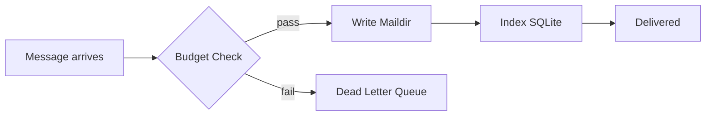

# Relay: The Universal Message Bus for DorkOS

**By Dorian Collier**
**February 2026**

---

## The Gap

AI agents can write code, fix bugs, and ship features. But they can't talk to anyone.

A coding agent runs in a terminal. It sees files, executes commands, creates pull requests. What it can't do: send a Slack message when the deploy finishes. Reply to a Telegram message from your cofounder. Tell the finance agent to approve a purchase order. Notify you at 3am that the build broke.

Every agent that needs communication reinvents it. One uses a webhook. Another shells out to `curl`. A third writes to a file and hopes something reads it. There's no standard transport layer, no shared message format, no audit trail, no safety mechanism to prevent an agent from spamming your entire contact list.

**The result: agents are trapped.** They can think but they can't speak. They can compute but they can't coordinate. The intelligence is there. The infrastructure isn't.

We solved this for applications decades ago. We called it IPC — inter-process communication. Every modern operating system has a kernel messaging layer that any process can use to talk to any other process. D-Bus on Linux. Mach ports on macOS. Named pipes on Windows.

Agents need the same thing.

---

## The Core Idea: Kernel IPC for Agents

Relay is the universal message bus for DorkOS. One message format. One delivery system. Every endpoint — agent, human, external service, system component — communicates through the same transport.

**Relay is deliberately dumb.** It doesn't know what agents are. It doesn't know what schedules exist. It doesn't understand Slack or Telegram or email. It knows about endpoints and messages. That's it.

This is the D-Bus model. D-Bus doesn't know about desktop applications or system services. It moves messages between named endpoints on a bus. Everything else — service discovery, protocol negotiation, capability declaration — lives in higher layers. Relay follows the same principle. It's the kernel messaging layer that every higher-level DorkOS module builds on.

**Endpoints are hierarchical subjects.** Every participant in the system gets a dot-separated address — `relay.agent.myproject.backend`, `relay.human.telegram.dorian`, `relay.system.pulse`. Wildcards enable pub/sub: subscribe to `relay.agent.myproject.*` to hear from every agent in a project, or `relay.human.telegram.>` to receive all Telegram messages. This is the NATS subject convention — proven in cloud-native infrastructure, adapted for agent communication.

The subject hierarchy is convention, not enforcement. Relay doesn't validate that `relay.agent.billing.finance` is a real agent. It routes messages to matching subscriptions. Higher layers — specifically Mesh — handle discovery and validation.

---

## How Messages Flow

Relay handles two kinds of communication.

**Messages** are persistent. When an agent sends a message, Relay writes it to the recipient's mailbox on disk, indexes it in SQLite, and delivers it. Messages survive restarts. They can be queried, traced, and audited. This is the default mode for anything that matters — requests, responses, notifications, task dispatches.

**Signals** are ephemeral. Typing indicators, read receipts, presence updates, progress notifications. Signals flow through in-memory event emitters and never touch disk. They use the same subject hierarchy and wildcard matching as messages, but they're fire-and-forget. When the process stops, signals vanish.

Both modes through one system. No separate infrastructure for real-time versus persistent communication.

### The Envelope

Every message travels in a thin envelope. The envelope contains routing information — where it's from, where it's going, when it expires — and a safety budget. The actual content is an opaque payload that Relay never inspects.

This is critical. Relay doesn't care if the payload is a Slack notification, an agent-to-agent request, a Pulse schedule dispatch, or a Telegram reply. Same envelope, same delivery path, same safety guarantees. The content is someone else's problem.

All DorkOS components agree on a shared payload schema for interoperability — sender identity, channel context, attachments, response instructions. But Relay doesn't enforce it. The schema lives in the shared package. Relay just delivers envelopes.

### Storage: Maildir + SQLite

Messages are stored in **Maildir** format — one file per message, organized into `tmp/`, `new/`, `cur/`, and `failed/` directories per endpoint. Delivery is an atomic POSIX `rename()` from `tmp/` to `new/`. No locks. No corruption risk. Agents can `ls` their own mailbox.

**SQLite** provides the index — fast queries for message history, delivery metrics, budget tracking, and rate limiting. The index is derived from the Maildir files and fully rebuildable. If the index corrupts, scan the files and regenerate. One source of truth, always.

This follows the pattern DorkOS already uses everywhere: files as truth, programmatic reading on top.

**Delivery guarantee: at-most-once.** Relay delivers a message exactly once and does not retry. Failed deliveries go to the dead letter queue. Consumers handle their own retry logic. This is simple, predictable, and correct for a local system where network partitions don't exist.

**Ordering: per-endpoint FIFO.** Messages within a single mailbox are ordered by timestamp. No global ordering across endpoints — that's a distributed systems problem Relay doesn't need to solve.

---

## Budget Envelopes: Safety by Design

The infinite loop problem is real. Agent A messages Agent B. Agent B responds to Agent A. Agent A responds back. Each hop is an LLM call — real money, real compute, real time. Without a safety mechanism, a misconfigured pair of agents can burn through your API credits in minutes.

**Budget envelopes solve this.** Every message carries a budget that can only shrink, never grow. The budget tracks hop count, maximum allowed hops, an ancestor chain of every endpoint that touched the message, a TTL expiry, and a remaining call budget.

The rules are absolute. Before every delivery, Relay checks:

- **Hop count** — has the message bounced too many times? Reject.
- **Ancestor chain** — has this endpoint already handled this message? Cycle detected. Reject.
- **TTL** — has the message expired? Reject.
- **Call budget** — are there calls remaining? No? Reject.

Rejected messages go to the dead letter queue with the reason. Always auditable. Always recoverable.

**A concrete example.** Your scheduling agent detects a birthday next week. It sends a message to the finance agent with a budget: five hops maximum, ten calls remaining, one hour TTL. The finance agent receives it (hop 1, nine calls remaining), approves a $50 budget, and forwards to the purchasing agent (hop 2, eight calls remaining). The purchasing agent orders flowers and replies (hop 3). If the purchasing agent accidentally messages the scheduling agent again, the ancestor chain catches the cycle. If a buggy loop somehow forms, the hop count catches it at five. If everything stalls, the TTL kills it after an hour.

**Budget envelopes are non-negotiable.** They're the seatbelt that makes autonomous agent communication safe enough to run unsupervised.

---

## External Channels: The Adapter Model

Relay's subject hierarchy doesn't stop at the process boundary. Any external channel — Telegram, Slack, email, webhooks, voice — becomes a set of endpoints via a plugin adapter.

An adapter does two things. It listens for incoming messages on the external platform and publishes them into Relay's subject hierarchy. And it receives outbound messages from Relay and delivers them via the platform's API. A Telegram adapter maps `relay.human.telegram.dorian` to your Telegram chat. A Slack adapter maps `relay.human.slack.channel.deploys` to your #deploys channel.

**Adapters normalize.** A Telegram message, a Slack DM, and an email all arrive as the same envelope with the same payload schema. The agent processing the message doesn't need to know which platform it came from. It reads the content, the sender name, and the response context — which tells it the platform's constraints (message length limits, supported formats, reply instructions).

Phase 1 ships with internal-only messaging — agent-to-agent and system-to-agent. External adapters follow. The architecture supports them from day one; the implementation is additive.

---

## What Relay Enables

Relay is foundation infrastructure. It doesn't do flashy things on its own. It makes flashy things possible.

**The Console becomes an endpoint.** Today, the DorkOS Console sends messages via HTTP POST to the Engine. With Relay, the Console is `relay.human.console.{userId}` — just another endpoint on the bus. Chat messages, tool approvals, status updates — all flow through the same transport as everything else. One message log. One SSE stream. One audit trail.

**Pulse dispatches through Relay.** Today, Pulse calls the AgentManager directly to create sessions. With Relay, Pulse publishes a message to the target agent's subject. Same behavior, but now every scheduled dispatch has a delivery receipt, a budget envelope, and dead letter handling for free.

**Activity feeds are native.** Relay's SSE event stream — message delivered, message failed, budget exceeded, endpoint registered — is a real-time view of everything happening in the system. The marketing site's simulated activity feed becomes a live one.

**Agent execution is a subscription.** The Engine subscribes to `relay.agent.>` — all agent messages. When a message arrives, it creates an Agent SDK session in the target project directory, passes the message content as the prompt, and publishes the response back through Relay. The agent doesn't know about Relay. It just receives a prompt and produces a response. Relay handles everything else.

---

## Part of the DorkOS Suite

Relay is the foundation layer of DorkOS's communication architecture. It sits beneath everything else.

**Mesh configures it.** When Mesh discovers an agent, it registers the agent's endpoint in Relay and writes access control rules. Mesh is DNS and iptables; Relay is the network stack they configure.

**Pulse dispatches through it.** Scheduled tasks become messages with budget envelopes and delivery guarantees.

**Relay ships before Mesh exists.** Internal messaging — agent-to-agent, Pulse dispatches, Console chat — works without Mesh. Mesh adds discovery and topology when it arrives. This is the correct dependency direction: Relay depends on nothing. Everything depends on Relay.

See the [DorkOS Litepaper](../dorkos-litepaper.md) for the full system vision. See the [Mesh Litepaper](./mesh-litepaper.md) for the discovery and topology layer that builds on Relay.

---

## Roadmap

**Phase 1 — Core Transport and Safety.** Endpoint registry. Maildir message store with SQLite index. Subject matching with NATS-style wildcards. Atomic delivery with dead letter queue. Budget envelope enforcement (hop count, ancestor chain, TTL). Signal mode for ephemeral events. HTTP routes for send, inbox, and message history.

**Phase 2 — Advanced Reliability.** Rate limiting per sender. Circuit breakers per endpoint pair. Backpressure handling.

**Phase 3 — External Adapters.** Plugin adapter interface. Telegram adapter with message and signal support. Webhook adapter for inbound and outbound. Console activity feed via SSE subscription.

**Phase 4 — Convergence.** Delivery metrics and message tracing. Agent runtime adapter interface. Pulse migration to Relay dispatch. Console migration to Relay endpoint.

---

## The Kernel Layer

Every operating system has a messaging primitive buried deep in the kernel. It's invisible to users. Applications rarely think about it. But without it, nothing communicates. No window manager. No clipboard. No drag and drop. No inter-process anything.

Relay is that layer for DorkOS. It's not the feature you show off in a demo. It's the reason every other feature works.

D-Bus for agents. The kernel layer everything builds on.
