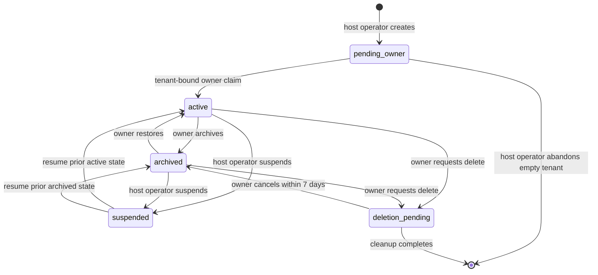

# Community administration lifecycle contract

**Status:** Approved

**Date:** 2026-09-20

## Overview

An independent Community host exposes two administration planes. Host operators manage tenant metadata, creation, suspension, and operational cleanup without content access. Community owners manage their community's identity, admission, ownership, archive, export, and deletion. Admins may maintain non-identity presentation fields and continue their existing member/channel duties. Every action is tenant-qualified, audited, concurrency-safe, and independent of DorkOS Cloud.

This specification consumes the accepted DOR-2171 tenancy contract (PR #1943, queued when this document was written). Its implementation must land after the tenant persistence and authorization foundation in DOR-2172.

## Goals

- Make host and community authority visibly distinct in the API and interface.
- Define create, claim, list, settings, transfer, archive, restore, suspend, resume, and permanent deletion.
- End tenant access immediately while long-running deletion proceeds safely.
- Preserve exact data through archive and remove exact tenant data through deletion.
- Keep another community on the same host fully available during every lifecycle action.

## Non-goals

- DorkOS Cloud provisioning, billing, organization policy, or portable identity.
- Moving a community between hosts or restoring an individual deleted community from a host-wide backup.
- Public community discovery, open signup, vanity slugs, custom domains, or per-community OAuth settings.
- An online host-operator lost-owner override. DOR-2171 requires offline recovery for that condition.
- Implementing the contract in DOR-2175.

## Authority matrix

| Action                                                            | Host operator without membership | Owner                             | Admin                 | Member                |
| ----------------------------------------------------------------- | -------------------------------- | --------------------------------- | --------------------- | --------------------- |
| List host community metadata/state                                | yes                              | own memberships only              | own memberships only  | own memberships only  |
| Create `pending_owner` community and owner claim                  | yes                              | only if also host operator        | no                    | no                    |
| Edit name or admission policy                                     | no                               | yes                               | no                    | no                    |
| Edit description or icon                                          | no                               | yes                               | yes                   | no                    |
| Transfer ownership                                                | no                               | yes, with recent reauthentication | no                    | no                    |
| Archive/restore                                                   | no                               | yes, with recent reauthentication | no                    | no                    |
| Suspend/resume                                                    | yes                              | no                                | no                    | no                    |
| Request/cancel permanent deletion                                 | no                               | yes, with recent reauthentication | no                    | no                    |
| Delete an unclaimed `pending_owner` community                     | yes                              | n/a                               | no                    | no                    |
| Read channels, members, entries, files, exports, or content audit | never by host role alone         | yes by existing rules             | yes by existing rules | yes by existing rules |

An account may hold both authorities, but each request proves the authority required for that route. Host-operator status never substitutes for membership.

## Settings model

Community settings add:

- `name`: 1–80 Unicode characters after trim; mutable display identity, never an address.
- `description`: nullable, at most 1,000 characters.
- `icon_blob_key`: nullable reference to a private server-owned raster blob. Accept PNG, JPEG, GIF, or WebP up to 2 MiB; never accept an external URL, SVG, or caller-selected storage key.
- `admission_policy`: `invite_only | closed`. `invite_only` is today's behavior. Changing to `closed` atomically revokes every outstanding invitation and pending admission for that community; it does not remove existing members.
- `settings_version`: monotonic integer used as an ETag. Mutations require `If-Match`; stale edits return `409 STATE_CONFLICT` with the current safe projection.

Owner-only name and admission changes are audit events. Owner/admin description and icon changes are also audited. Replacing or clearing an icon commits the new reference first, then queues the old blob for idempotent deletion. Public metadata never exposes a storage URL.

## Lifecycle state machine

The persisted state is `pending_owner | active | archived | suspended | deletion_pending`. `suspended_from_state` is nullable and is `active` or `archived` only while suspended. `lifecycle_version`, lifecycle timestamps, and actor IDs support optimistic concurrency and audit.

- `pending_owner` has no owner, contains no member content, and serves only claim/host metadata operations.
- `active` serves normal tenant traffic.
- `archived` retains all rows and blobs. Ordinary content is read-only; new posts, uploads, invites, ordinary pairings, agent actions, and membership changes fail with `COMMUNITY_ARCHIVED`. The only pairing exception is the tenant-qualified archived read-only flow defined below. Owner export, restore, and delete remain available. Host account sessions remain valid.
- `suspended` rejects all tenant member/agent traffic with `COMMUNITY_SUSPENDED`. Only host metadata and host resume remain available. It records whether resume returns to `active` or `archived`.
- `deletion_pending` immediately rejects tenant traffic with `COMMUNITY_DELETION_PENDING`. Only the requesting active owner may cancel during the grace period through the control route. Host operators can see status but cannot cancel or accelerate deletion.

State checks happen after tenant resolution and before content lookup. Streams close with the typed terminal reason as soon as the lifecycle transaction commits.

## Creation and owner claim

A host operator creates a community with an idempotency key, final immutable UUID, initial settings, `pending_owner` state, and one tenant-bound owner-claim grant. Retrying the same key returns the same tenant and grant receipt; a different payload under that key returns `409`. The one-time secret is delivered only through the private claim handoff, never logs or list responses.

The claim expires after 24 hours. A host operator may revoke and reissue it only while the community remains `pending_owner`. Redeeming it requires a host account session, locks the community and grant, creates exactly one owner membership, creates its handle, consumes the grant, and transitions to `active` atomically. It cannot target an active, archived, suspended, or deletion-pending community. An unclaimed tenant may be abandoned only after all claim grants are revoked; the database proves it has no members or content.

The first-install bootstrap remains the DOR-2171 atomic host-operator/community/owner flow. It does not become a reusable recovery secret.

## Ownership transfer

Transfer is allowed only in `active`, by the current owner, after password reauthentication no more than five minutes old. The successor must be an active member of the same community and cannot be an agent. One transaction locks the community, current owner, and successor; checks `lifecycle_version`; changes the current owner to `member`; changes the successor to `owner`; increments the version; and writes one audit event. Existing host sessions remain. No host operator can perform or approve the transfer by host authority alone.

## Archive and restore

Archiving requires the owner, recent reauthentication, exact community-name confirmation, and current lifecycle ETag. The transaction changes `active → archived`, revokes invitations and pending admissions, cancels pairings, revokes personal grants and agent credentials, marks agents inactive, and records an audit event. Browser host sessions and membership rows remain; content and channel membership remain unchanged.

Restoring changes `archived → active` and records an audit event. Revoked invitations, grants, credentials, and agents stay revoked/inactive. People reconnect installations and owners explicitly reactivate or reenroll agents. This prevents a restore from silently reviving machine access.

Archive cancels or revokes every pending or pre-existing pairing and installation grant. An active human membership may later use the existing tenant-qualified pairing start, approve, and exchange protocol to create a fresh installation grant while the community remains archived only when the request asks for exactly the personal `{read}` scope. Every step binds the selected tenant and member; a scope, lifecycle, tenant, or membership mismatch returns a typed response and creates no credential. The grant stores an immutable `history_only` discriminator because `{read}` alone also describes an ordinary active grant that may subscribe. It may read community metadata, the member's visible channels, history, threads, roster, and authorized attachment bytes. Its only permitted mutation is updating that same tenant/member's read cursor as personal view state. It cannot open live subscriptions; mutate content, membership, invitations, administration, agents, or exports; or post, upload, join, leave, enroll, or use an agent. The archived capability projection is exactly `read=true`, `post=false`, `enrollAgent=false`, and `stream=false`. Restore neither widens nor revives it; those values remain until the person separately approves a new active grant.

Connection and room projections carry server-confirmed access with `state`, `effective`, and `lastKnown`. `effective` has `read`, `post`, `enrollAgent`, and `stream` booleans and is the only authority for a live request. `lastKnown` contains the last verified lifecycle, those four capabilities, and verification time. A pending pairing has no access projection. A verified connection reports current effective capabilities. A temporary `unverified` outage sets every effective capability false but may retain a last-known read capability solely to render protected cached history with a visible stale state; internal credential/status probes remain allowed so verification can recover. `reconnect-required` also sets every effective capability false and purges protected cache regardless of last-known read access, retaining only safe label and origin metadata. Suspension, deletion, revocation, and unknown authorization never create an effective read path. Servers which omit the required lifecycle or capability projection are treated as an incompatible remote response and remain unconnected; a client must never derive stream access from legacy scopes. Server-confirmed access travels through both connection and room projections so a local client never infers write or stream access from membership, lifecycle, or channel state alone. The browser session remains separate and is never imported into an installation; owner export, restore, and deletion continue to require the browser session and recent reauthentication.

Host suspension uses the same immediate credential and stream revocation. Resume returns to `suspended_from_state`; it never revives credentials. Suspending `pending_owner` or `deletion_pending` is invalid because those states already deny tenant traffic.

## Permanent deletion

Only an owner may request deletion of an `active` or `archived` community. The request requires recent password reauthentication, current ETag, and two confirmations: exact display name and the final eight characters of the immutable community UUID. The interface offers a fresh owner export first and states whether it completed, but export is not mandatory because an export failure must not make an owner unable to delete their data.

The request atomically enters `deletion_pending`, records `delete_after = now() + 7 days`, revokes the same access as archive, and creates a deletion job keyed by community UUID. Repeating the request is idempotent. Cancel is allowed only to the same still-active owner during the grace period; it returns the community to `archived`, not `active`, and keeps credentials revoked.

After the deadline, a bounded worker:

1. locks one due deletion job with `SKIP LOCKED` and confirms the tenant/state/version;
2. enumerates the tenant's durable blob inventory, including current icons, attachments, retained exports, upload reservations, replacement cleanup, and unreferenced-object cleanup;
3. deletes blobs idempotently in bounded pages and records per-key completion/retry without deleting inventory needed for recovery;
4. proves no current reference, in-flight reservation, pending cleanup row, or managed object remains for the tenant;
5. deletes tenant rows in a database-enforced order or tenant-scoped cascade;
6. writes a host-level tombstone containing only community UUID, request/completion times, outcome, and retry counts; then marks the job complete.

No name, account identifier, member identifier, content, blob key, or credential survives in the tombstone. Tombstones expire after 30 days. A failed job remains visible with a redacted error class and resumes from committed progress. No query may derive deletion candidates from an unqualified blob prefix or a caller-supplied tenant ID alone.

Every new object write first creates a durable inventory reservation with immutable `community_id`, generated blob key, purpose, and lifecycle state before bytes are stored. Committing an attachment, icon, or export reference re-locks the community and rechecks its lifecycle version in the database transaction that marks the reservation referenced. If archive, suspension, or deletion won the race, the reference cannot commit and the tenant-qualified reservation moves to cleanup. Cleanup rows retain tenant ownership even when the content row never committed.

DOR-2172 owns the additive storage foundation before it enables creation of a second community: tenant-qualified inventory/reservations for every existing attachment and export write, plus reconciliation of the complete managed object namespace while the deployment still has zero or one community. Referenced objects receive that community's ownership; legacy `pending_blob_deletions` and unreferenced managed objects must be deleted or converted into tenant-qualified inventory. A zero-community deployment must drain unexplained objects. If object listing is unavailable, ownership is ambiguous, or cleanup cannot finish, the multi-community gate fails closed. DOR-2176 extends that inventory to icons and lifecycle deletion progress; it does not defer the initial reconciliation. The service cannot declare tenant deletion complete from current content metadata alone.

Deletion of a community never deletes host-wide accounts, sessions, OAuth records, or host-operator rows. If an account has no remaining memberships it simply sees the chooser/empty state. Deleting one community cannot strand the only host operator because host authority is independent of membership; removing the final host operator requires a separate host-operation contract and is out of scope.

## Exports, audit, and recovery

Owner export remains a snapshot, not a server backup. It is available in `active` and `archived`, requires recent reauthentication, and becomes unavailable as soon as deletion is requested. The export records the lifecycle/settings version and attachment checksums so a person can identify what they saved.

Tenant audit events are append-only while the community exists and are included in owner export. Lifecycle events record actor kind, immutable community ID, action, timestamp, prior/next state, and safe changed-field names; they never log values for secrets or credentials. Host operations have a separate host audit table with metadata-only events. Host operators cannot query tenant audit content through that table.

Archive is the supported reversible retention path. Permanent deletion is not an online restore point. Disaster recovery uses a coordinated host PostgreSQL and blob backup under the operations guide and may restore the whole host to an isolated target; it does not let an operator browse or selectively resurrect deleted tenant content.

## API boundary

Qualified routes extend the DOR-2171 API:

- host: list/create communities; issue/revoke pending-owner claims; suspend/resume; read deletion job status;
- tenant settings: read projection, update settings/icon with ETag;
- owner lifecycle: transfer, archive, restore, request/cancel deletion, export;
- icon download: authenticated account must have a visible membership or host metadata permission; response proxies bytes and never returns a storage URL.

Every mutation uses strict shared schemas, tenant-qualified database predicates, stable typed errors, no-store responses for claim material, and audit in the same transaction. Cross-tenant object IDs return `404`; lifecycle conflicts return `409`; typed state unavailability is `423` for archived/deletion-pending and `503` for host suspension. The exact code is stable across browser and local server consumers.

## Management experience

Host operators see a host-administration list with community name, immutable short ID, lifecycle state, owner-present boolean, and redacted cleanup status. It contains no private member directory, counts derived from content, latest-message data, or file details.

Owners reach Settings from the current community menu. Presentation, Access, People, Export, and Danger Zone are separate sections. Admins see editable description/icon and their existing member/channel controls; controls they cannot use are absent rather than failing late. Members see ordinary community metadata only.

Every archive, suspension, transfer, and deletion result identifies the affected community. Destructive dialogs retain keyboard focus, label their consequences, and work at narrow widths. Progress survives reload from server state. Archived members remain at the canonical community route with read-only history and a clear archived banner; owner restore, export, and delete controls remain reachable there. A person removed from the community, suspended, or pending deletion is routed to another membership or the chooser without signing out of the host. Ownership transfer leaves the former owner in the active community as a member.

## Verification matrix

Use communities A and B, an A/B account, A-only and B-only accounts, a host-only operator, an owner/admin/member in A, and one agent/file/stream per tenant.

- Every matrix row above has positive and negative API tests, including a host operator with no membership.
- Rename and icon replacement cannot change canonical UUID routing or expose a blob URL.
- Concurrent settings edits reject stale ETags without losing a winning update.
- Transfer races leave exactly one active owner; transfer against archive/suspend/delete fails.
- Archive immediately ends posting, uploads, streams, invitations, every pending or pre-existing pairing/grant, and agents while preserving exact history and attachment hashes. Only a later tenant-qualified archived pairing with exact `{read}` scope may create a new tenant/member-bound read-only grant; restore revives browser content access but revives no revoked credential or capability.
- Suspension cannot be bypassed by owner, admin, cookie, grant, agent credential, export URL, or compatibility route and resumes to the recorded state.
- Deletion cancel works before the deadline and returns to archived; the worker refuses early execution.
- Injected blob/database failures resume exactly, remove all A blobs/rows once, retain no sensitive tombstone fields, and leave every B row/blob/session/stream unchanged. The matrix includes an A upload that stores bytes but fails before its content row commits, a replaced A icon queued for cleanup, and an upload racing deletion; completion stays blocked until those A objects are absent.
- An abandoned `pending_owner` tenant cannot contain content and is deleted without affecting first-install bootstrap or another claim.
- The service remains complete with DorkOS Cloud egress blocked.

## Implementation phases

1. DOR-2176 adds schema, host operations, settings, lifecycle transitions, deletion jobs, cleanup, and API tests after DOR-2172.
2. DOR-2177 adds the host and community management interface after the APIs are stable.
3. DOR-2178 runs adversarial browser, concurrency, failure-recovery, and two-tenant deletion proof after DOR-2174.

## Open questions

All decisions required for implementation are resolved. Moving a community between hosts, open signup, public discovery, and online lost-owner recovery remain separate contracts.

## Related ADR

- `260920-201101` — Separate community retention from permanent tenant deletion

## References

- DOR-2171 and PR #1943 — accepted tenant identity and authorization contract
- DOR-2175 — this specification
- `plans/community-next-phase.md` section C
- `apps/community/src/schema.ts`
- `apps/community/src/app.ts`
- `apps/community/src/routes/members.ts`
- `apps/community/src/routes/exports.ts`
- `apps/community/src/storage/pending-deletions.ts`
- `packages/shared/src/community-wire.ts`
