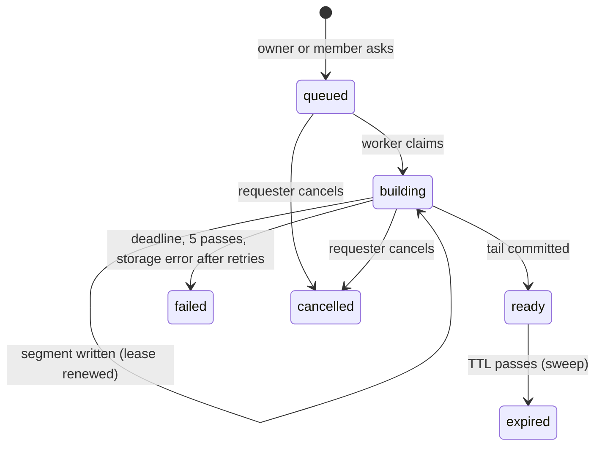

# Export a Community of any size

**Status:** Approved (decisions pre-authorized by the operator for this programme)
**Author:** Claude (for DOR-2283)
**Date:** 2026-09-23

## Overview

An owner can export a community of any size, and a member can export their own messages however many they wrote. The export becomes a background job that writes one ZIP64 archive in bounded pieces ("segments"), so no request runs for hours, no single write outlives its storage reservation, and local disk use is bounded by one segment. The finished archive downloads as one `.zip` with resumable ranges. Its manifest moves to version 2, which adds the community's name, description, icon, and channel memberships. Import (host-operator P3) reads versions 1 and 2 of any size through one reader and accepts uploads in resumable parts.

## Background / Problem Statement

Today (`apps/community/src/routes/exports.ts`):

- **Hard caps.** The snapshot reads every collection with `LIMIT 10_001` and answers `413` above 10,000 rows in any collection, above 1 GiB of files (`MAX_EXPORT_BYTES`), or above a 16 MiB manifest (`MAX_MANIFEST_BYTES`). It uses the code `ATTACHMENT_TOO_LARGE`, which is wrong for this.
- **In the request.** The snapshot, the zip, and the storage write all run inside `POST /owner/export`. A large export cannot finish before a proxy or client gives up, and a restart loses it.
- **Disk.** `stageBlob` (`storage/blob-store.ts`) writes every `put` to a local temp file before storing it, the S3 store included. An export's disk use equals its size.
- **Reservation.** A managed blob must commit within one hour of its reservation (`MANAGED_BLOB_RESERVATION_TTL_MS`).
- **Format.** `fflate` has no ZIP64: no archive over 4 GiB, no more than 65,535 entries.
- **Download.** One stream, no `Range`, two membership queries per chunk; an archive lives one hour.
- **Import.** Host-operator P3 reads with `fflate`'s streaming `Unzip`, holds the whole manifest in memory, restores in one transaction, and takes one `PUT` of at most 1 GiB.

An owner of a community that grew past 10,000 messages cannot take their data out, which a hosted service cannot launch with.

## Goals

- Owner and personal exports of any size, bounded per job by configured time and by one segment of local disk.
- One downloadable `.zip` that every common unzip tool opens, with resumable downloads.
- A version 2 manifest that carries the community's name, description, admission policy, icon, and channel memberships, and marks removed messages.
- Erasure's guarantee kept: an export never commits content that an erasure (or a removal or takedown) changed after the export read it.
- Import reads versions 1 and 2 of any size, uploaded in resumable parts, within a host-set maximum.
- The published move contract grows additively.

## Non-Goals

- Incremental exports, scheduled exports, or backups.
- Exporting straight to another service.
- Changing what a personal export contains (your own messages and files in channels you can still read).
- Time or effort estimates.

## Technical Dependencies

| Dependency                                   | Used for                                                                                                                      |
| -------------------------------------------- | ----------------------------------------------------------------------------------------------------------------------------- |
| Node `zlib` (built in, Node 24 in the image) | `crc32`, `createDeflateRaw`/`createInflateRaw` for NDJSON entries                                                             |
| Node `crypto`                                | SHA-256 of attachments (verification) and uploaded parts                                                                      |
| `@aws-sdk/client-s3` 3.1135.0                | ranged `GetObject` for `BlobStore.get(key, { range })`                                                                        |
| `yauzl` (new **dev** dependency)             | tests only: an independent ZIP64 reader to cross-check the writer                                                             |
| `fflate` 0.8.3                               | no longer used for exports; still used where it is today for anything else (icons, tests) until nothing uses it, then removed |
| Member erasure 1.1 (#2029)                   | `community_content_versions`, `entry_redactions`, erasure's `deleteExports` step                                              |
| `specs/community-single-item-delete/`        | the invariant that every content change writes an `entry_redactions` row                                                      |
| Host-operator tasks 4.1/4.2 (import)         | phase 2 only                                                                                                                  |
| `pg` + hand-written SQL migrations           | one migration for phase 1 and one for phase 2, each **the next free number at build time**                                    |

## Detailed Design

### The archive

One ZIP64 file. Entry names are UTF-8 (general-purpose flag bit 11). NDJSON entries are raw-deflated (method 8); attachment and icon bytes are stored (method 0), as version 1 stored them. Every local header uses a data descriptor (flag bit 3) because CRC-32 and sizes are known only after streaming; the ZIP64 data descriptor (8-byte sizes) is used for any entry whose size needs it. **Every central-directory record always carries the ZIP64 extended-information extra field** with the uncompressed size, compressed size, and local-header offset, and sets the three 32-bit fields to `0xFFFFFFFF`, whatever the values. Offsets are only known once earlier segments' sizes are final, so records are never stored as bytes: each segment stores its entries as structured rows (name, CRC-32, method, sizes, offset relative to the segment start, DOS time and date), and the tail writer encodes every record at the end with the absolute offset. Emitting the extra field always keeps one record shape for every entry, which the cross-tool test below checks. The archive always ends with a ZIP64 end-of-central-directory record, its locator, and the classic end record.

```
entries/000001.ndjson           rows of the first segment's messages (deflated)
attachments/000001.ndjson       metadata rows of those messages' files (deflated)
files/<attachmentId>/<name>     the files themselves, stored (name sanitized; see below)
entries/000002.ndjson …         next segment, and so on
channels.ndjson                 ┐
members.ndjson                  │
agents.ndjson                   │ written at the end ("tail")
channel-members.ndjson          │
agent-channel-members.ndjson    │
audit-events.ndjson             │ owner scope only
community/icon                  │ when the community has an icon
manifest.json                   ┘ always the last entry before the central directory
```

`<name>` is the attachment's display name passed through `sanitizeDisplayName` (`storage/blob-store.ts`: NFKC, control characters and slashes replaced, at most 180 characters, no leading dots), so a person opening the zip sees real file names in one folder per file. Readers never use a name from the archive as a filesystem path.

**Segments.** The archive is stored as consecutive segments, each its own managed blob (`purpose='export'`). A segment holds whole zip entries only, so its first bytes are a local file header. The logical archive is the concatenation of the segments in order. A data segment covers one contiguous range of messages in `(channel_id, seq)` order: their `entries/NNNNNN.ndjson`, their `attachments/NNNNNN.ndjson`, then their files. The planner closes a segment when the estimated size (JSON length of the rows plus the files' `byte_size` plus header overhead) reaches `COMMUNITY_EXPORT_SEGMENT_BYTES` (default 256 MiB, range 64 MiB to 1 GiB). A single file is at most 25 MiB, so it always fits. The tail may take more than one segment (a large central directory is simply bytes and may be split anywhere).

**Central directory.** Each segment's entry rows (above) are stored with the segment row (`entries_index bytea`, a compact binary list). The tail writer encodes the central directory from them, adding each segment's starting offset in the logical archive, so rebuilding one segment (which can change its size) only means recomputing the tail.

### Manifest version 2

`manifest.json` (at most 1 MiB) indexes the archive:

```ts
/** Owner, personal, or takedown-evidence export, version 2. Rows live in NDJSON files. */
export const CommunityExportManifestV2Schema = z
  .strictObject({
    version: z.literal(2),
    scope: z.enum(['personal', 'owner', 'evidence']),
    exportId: id,
    requesterMemberId: id.nullable(), // null only for evidence
    createdAt: timestamp,
    completedAt: timestamp,
    community: z.strictObject({
      id,
      name: z.string().min(1).max(80),
      description: z.string().max(1_000).nullable(),
      admissionPolicy: CommunityAdminAdmissionPolicySchema,
      // owner and personal: held reads as archived, as in version 1.
      // evidence: the state before the takedown, as stored.
      lifecycle: z.enum(['active', 'archived', 'held', 'suspended', 'deletion_pending']),
      lifecycleVersion: z.int().positive(),
      settingsVersion: z.int().positive(),
      icon: z
        .strictObject({
          path: z.literal('community/icon'),
          contentType: z.string(),
          byteSize: z.int().positive(),
          checksum: z.string().regex(/^[a-f0-9]{64}$/),
        })
        .nullable(),
    }),
    files: z.strictObject({
      channels: z.array(archivePath),
      members: z.array(archivePath),
      agents: z.array(archivePath),
      channelMembers: z.array(archivePath),
      agentChannelMembers: z.array(archivePath),
      auditEvents: z.array(archivePath), // empty unless owner or evidence
      entries: z.array(archivePath),
      attachments: z.array(archivePath),
    }),
    counts: z.strictObject({/* the same eight keys, each z.int().nonnegative() */}),
  })
  .refine((m) => m.scope === 'evidence' || ['active', 'archived'].includes(m.community.lifecycle), {
    message: 'Only an evidence archive records held, suspended, or deletion_pending.',
  });
```

Row shapes (`CommunityExportRowsV2`, one strict schema per file kind) are version 1's row shapes (the column names and types `CommunityExportManifestV1Schema` pins) with these changes:

- **entries** gain `removal: z.enum(['author','moderator','host','erased']).nullable()` from `removed_by` / `erased_at`, so an importer restores a tombstone as a tombstone;
- **attachments** keep version 1's camelCase fields; `archivePath` becomes `files/<id>/<sanitized name>`;
- **channelMembers**: `{ channel_id, member_id, joined_at }`; **agentChannelMembers**: `{ channel_id, agent_id, joined_at }` (column names as in the tables);
- **members** keep `email` for owner and evidence scope (nullable, `LEFT JOIN "user"` as erasure made it) and omit it in personal scope except the requester's own, as today.

Row counts are unbounded; each NDJSON file holds one segment's rows (tail files are split at 100,000 rows).

### Consistency

At job start, in one short transaction, the worker records:

- `watermark`: `max(seq)` per exported channel (for personal scope, the channels the member can read now, as today's `snapshot()` selects them);
- `start_redaction_id`: `max(entry_redactions.id)` for the community (0 if none);
- `verified_content_version`: the community's `community_content_versions.version`.

Data segments read messages with `seq <= watermark[channel]` in keyset pages of 1,000, and their mentions and files, in ordinary short transactions. Messages posted after the start are not exported. The tail reads the small collections in one `REPEATABLE READ` transaction at the end, so names, roles, and memberships are as of completion.

**Rebuild after removals.** The rule this relies on is stated in `specs/community-single-item-delete/` ("Invariant for every content change"): a change to an existing entry bumps the content version and then writes an `entry_redactions` row; a bump with no row is allowed only for export deletions and member or agent changes, which the tail reads fresh anyway. Each data segment also stores `content_digest`, a SHA-256 over its entries' `(id, payload_hash, removed_at, erased_at)` and its files' ids, computed as it is written. `payload_hash` is included because tombstones (removal, erasure, takedown) replace it, so any change that rewrites a payload is caught even if a timestamp column were missed. A text change that keeps `payload_hash` (erasure's `rewriteHandleTokens` on someone else's message deliberately keeps it so their retries replay) is **not** caught by the digest and relies on its redaction row (rule 1). The digest is a safety net for removals and file changes, and says so. Before writing the tail, the worker:

1. reads `v = version` from `community_content_versions`;
2. if `v` differs from `verified_content_version`, reads every `entry_redactions` row with `id > last_checked_redaction_id` joined to its entry's `(channel_id, seq)`, maps each to the data segment whose range contains it (rows above the watermark are ignored), and rewrites those segments from the database as they are now (new blob; the old one is queued for deletion);
3. **unexplained change:** if `v` moved but step 2 found no row, it recomputes every data segment's `content_digest` from the database and rewrites each segment whose digest differs (a safety net for a change that broke the rule; normally a tail-only bump finds nothing to rewrite);
4. stores `verified_content_version = v` and the new `last_checked_redaction_id`, and repeats from 1 at most 5 times, then fails with `EXPORT_CONTENT_CHANGING`.

**A file gone mid-segment is a change.** If a file's `attachments` row or its blob disappears between reading the page and streaming the bytes (`BLOB_NOT_FOUND`, or the row no longer exists), the worker discards the segment in progress and writes it again from current rows; that counts as one rebuild pass.

The tail's final transaction reads `version … FOR SHARE` (the same lock erasure's export check uses) and commits only if it equals `verified_content_version`; otherwise it goes back to step 1 (counted as a pass). An erasure, removal, or takedown that commits before that lock therefore always forces a rebuild, and one that commits after it waits for the export to be marked ready and then deletes it (erasure and takedown) or leaves it (removal). This keeps the erasure spec's guarantee without failing a many-hour export for one change.

### Job model

`export_archives` becomes the job and the archive:



- **Create.** `POST /me/export` and `POST /owner/export` (owner: password reauthentication, as today) insert a `queued` row and answer `202 { export }`. While one is open (`queued`, `building`, or `ready` and not expired) for the same scope and requester (personal) or community (owner), the same request answers `200 { export }` with the open one. Allowed lifecycles are unchanged: personal in `active`; owner in `active`, `archived`, and `held`.
- **Worker** (`src/export-worker.ts`, started from `main.ts` beside the deletion worker): claims one due job with `FOR UPDATE SKIP LOCKED`, sets a 5-minute lease, and renews it after every segment. At most `COMMUNITY_EXPORT_CONCURRENCY` jobs (default 1, range 1 to 8) per replica. A replica that dies leaves the lease to expire; another resumes from the last committed segment, and an uncommitted segment's reservation is discarded through the existing cleanup.
- **Authority while building.** Before each segment the worker re-checks that the requester is still an active member (owner scope: still the owner; personal: still able to read each exported channel) and that the community is in an allowed lifecycle; otherwise the job is `failed` with `EXPORT_ACCESS_ENDED` and its segments are queued for deletion.
- **Evidence scope** (`specs/community-host-takedown/`). There is no requester. Authority is the takedown: before each segment the worker checks that the `community_takedowns` row that created the job exists (state `active` or `reversed`; a reversal does **not** stop evidence, which then finishes and is stored). Any lifecycle is allowed while the community row exists (`deletion_pending`, and `suspended` after a reversal); the tenant deletion worker cannot run while that takedown's evidence is pending, so the rows cannot vanish under it. Its reservations use a new option, `reserveManagedBlob(client, id, 'export', { evidence: takedownId })`, which accepts any lifecycle and records the takedown id instead of relying on `community_lifecycle_version`; `prepareManagedBlobCommit` for such a reservation checks that the takedown row still exists instead of comparing lifecycle versions (a reversal bumps the version mid-segment). The one-open-export rule, the requester checks, and the download route do not apply; an evidence export is never listed or downloadable. Its manifest records `community.lifecycle` as the state **before** the takedown (see the manifest schema).
- **Segments.** Each segment reserves a managed blob (`reserveManagedBlob(…, 'export', { allowArchived: scope === 'owner' })`), streams through `blobStore.put` with `kind: 'export_segment'` (a new kind: a local-header or central-directory signature is accepted as the first bytes, the ceiling is 1 GiB), and commits the blob and its `export_segments` row in one transaction. Disk use is at most one staged segment per running job.
- **Deadline.** `COMMUNITY_EXPORT_MAX_HOURS` (default 24, range 1 to 168) from claim. Past it: `failed` with `EXPORT_TIMED_OUT`.
- **Ready.** `ready_at = now()`, `expires_at = now() + COMMUNITY_EXPORT_TTL_HOURS` (default 24, range 1 to 168), `byte_size` = the sum of segment sizes, and the tenant audit row `export.create` as today.
- **Cancel.** `POST /exports/:id/cancel` by the requester, in `queued` or `building`: `cancelled`, segments queued for deletion.
- **Sweep.** The existing `sweepExpiredExports` handles `ready` rows whose `expires_at` passed, queueing every segment (and version 1's single `blob_key`), and `failed`/`cancelled` rows older than a day. Exports stay exempt from the storage limit (host-operator P2); their bytes still appear in host usage as export bytes.

### Routes and wire

Tenant routes, qualified and alias:

| Route                      | Result                                                          |
| -------------------------- | --------------------------------------------------------------- |
| `POST /me/export`          | `202 { export }`, or `200` with the open one                    |
| `POST /owner/export`       | the same, with `{ password }` (unchanged request schema)        |
| `GET /exports`             | the caller's exports that are open or ended within 7 days       |
| `GET /exports/:id`         | `200 { export }` (status; previously this route streamed bytes) |
| `GET /exports/:id/archive` | the bytes; `200` or `206`; see below                            |
| `POST /exports/:id/cancel` | `200 { export }`; `409` once ready                              |

```ts
/** One export job or archive, as its requester sees it. */
export const CommunityWireExportSchema = z.strictObject({
  id,
  scope: z.enum(['personal', 'owner']),
  state: z.enum(['queued', 'building', 'ready', 'failed', 'cancelled', 'expired']),
  // Messages plus files written, and the total once planning is done. One bar needs no more.
  progress: z.strictObject({
    done: z.int().nonnegative(),
    total: z.int().nonnegative().nullable(),
  }),
  byteSize: z.int().positive().nullable(), // set when ready
  failureCode: z
    .enum([
      'EXPORT_TIMED_OUT',
      'EXPORT_ACCESS_ENDED',
      'EXPORT_CONTENT_CHANGING',
      'EXPORT_STORAGE_UNAVAILABLE',
    ])
    .nullable(),
  createdAt: timestamp,
  readyAt: timestamp.nullable(),
  expiresAt: timestamp.nullable(),
});
export const CommunityWireExportResponseSchema = z.strictObject({
  export: CommunityWireExportSchema,
});
export const CommunityWireExportListSchema = z.strictObject({
  exports: z.array(CommunityWireExportSchema).max(50),
});
```

`CommunityWireExportResponseSchema` replaces today's `{ archiveId, version, createdAt }`. Only the same-origin browser bundle parses it (checked: no consumer in `apps/server` or `apps/client`), so it changes in one release.

**Download.** `GET /exports/:id/archive` answers only for a `ready`, unexpired export whose requester is the caller, with the same authority rules as today (owner scope: still the owner; personal: still able to read every exported channel). Headers: `Accept-Ranges: bytes`, `ETag: "<export id>.<ready_at as epoch ms>"` (strong; a ready archive never changes), `Content-Length`, `Cache-Control: private, no-store`, and the existing `downloadHeaders` with name `community-export.zip` or `my-community-data.zip`. A single `Range: bytes=a-b` (or `a-`, or `-n`) answers `206` with `Content-Range`; `If-Range` that does not match the ETag answers the whole `200`; a range past the end answers `416`; multiple ranges are served as the whole `200`. The server maps the range onto segments (one ranged `get` per segment touched). Authority is re-checked before the first byte and then every 16 MiB or 10 seconds, whichever comes first: the requester's rights as above **and the export row itself** (it still exists, is still `ready`, and has not been deleted by an erasure or a takedown). The stream ends with an error when either no longer holds, so a download in progress stops within 16 MiB of an erasure or takedown deleting the export. A version 1 archive (made before this ships, one blob) is served the same way.

**Blob store.** `BlobStore.get(key, { signal, range?: { start: number; end: number } })` (inclusive `end`). The filesystem store opens a read stream with `start`/`end`; the S3 store sends `Range: bytes=start-end` and checks the `Content-Range` it gets back. `byteSize` is the range's length. Both implementations get unit tests at the first byte, last byte, and a middle slice.

### Erasure, removal, and takedown

- **Erasure** (`erasure.ts`): two statements change. `deleteExports` deletes only `state='ready'` rows and, in the same transaction, selects every segment `blob_key` of those exports (and any version 1 `blob_key`) and queues them **before** deleting the rows (deleting first would cascade away `export_segments` and lose the keys). `applyHusk`'s leftover check (`EXISTS (SELECT 1 FROM export_archives WHERE community_id=$1 AND deleted_at IS NULL)`, ~L486 on #2029) becomes `… AND state='ready' AND deleted_at IS NULL`; unchanged, a queued or building job would make the husk step answer `again` forever. Jobs in progress are left to the rebuild, which will see erasure's redaction rows and version bumps; the husk and other small collections are read in the tail. AC-4 of the erasure spec (an export snapshotted before a change cannot commit after it) is re-proved against the job model (AC-7 below).
- **Removal** (`specs/community-single-item-delete/`): bumps the version and writes a redaction row; ready exports stay until they expire.
- **Takedown** (`specs/community-host-takedown/`): deletes ready exports like erasure; its community takedown uses this job with `scope='evidence'` (no requester, allowed in `deletion_pending`, never downloadable through any route) and copies the finished segments to the evidence store.

### Import reads version 2 (phase 2)

Changes to host-operator P3 (tasks 4.1/4.2), made by task 2.1 here after they land:

- **One reader.** `src/archive/zip-reader.ts` reads any archive through its central directory over ranged reads of a segmented source (the uploaded parts): find the end records in the last 64 KiB plus 22 bytes, follow the ZIP64 locator, stream the central directory, and read each entry by offset. It refuses: encrypted entries, methods other than 0 and 8, names outside the version's allowed patterns, duplicate names (a set of name digests), directory entries, a local header whose name or sizes disagree with the central directory, overlapping entries, and inflated output past the declared size by one byte. It replaces `fflate`'s streaming `Unzip` for version 1 too; version 1's rules (manifest first, `attachments/<uuid>` names, the 10,000-row and 16 MiB limits) still apply to version 1 archives.
- **Dispatch.** Read `manifest.json` through the central directory; `version: 1` → the P3 rules unchanged; `version: 2` → the rules below; anything else → `IMPORT_VERSION_UNSUPPORTED`. `scope` other than `owner` → `IMPORT_NOT_OWNER_EXPORT`.
- **Validate (version 2).** Stream every NDJSON file in manifest order, parse each line with its strict row schema, and compare counts with the manifest; stream every file, compare length and SHA-256 with its metadata row; check the storage limit against the sum. Referential checks that the database cannot express (a mention resolves to exactly one member or agent of this import; a thread root is not a reply) run per batch during restore with indexed lookups against rows already restored. The report (`CommunityAdminImportReportSchema`) accepts `manifestVersion: 1 | 2`.
- **Restore (version 2).** Rows are inserted in batches of up to 1,000 in dependency order (channels, members, handles, agents, channel memberships, entries per channel in `seq` order, mentions, attachments, audit), each batch its own transaction with derived IDs and `ON CONFLICT DO NOTHING`, so a restarted worker resumes. The community stays `pending_owner` with no member, so nothing is visible until the final transaction commits the reserved blobs, sets `imported_at`, and marks the job `ready`; a failure goes through the existing abandon path. Version 1 keeps its single transaction.
- **What version 2 restores beyond version 1.** The description (when the create request gave none; the host-supplied name always wins), the admission policy (when the create request gave none), the icon, removal markers (`removed_by`, or `erased_at` for `erased`), and the adopted owner's own channel memberships (instead of every channel; a version 1 archive, or an owner with no memberships, still gets every channel). Other people's channel memberships are not restored: their member rows are historical (P3 identity rules).
- **Parts upload.** Beside P3's single `PUT /api/v1/imports/:importId/archive` (unchanged, at most 1 GiB), the upload token or host authority with `communities:import` may use:
  - `PUT /api/v1/imports/:importId/archive/parts/:partNumber` (1 to 10,000), body at most `COMMUNITY_EXPORT_SEGMENT_BYTES`, headers `Content-Length` and `X-Part-SHA256`. Each part is a managed blob (`purpose='import_staging'`). The same part again with the same hash is `200` with no write; a different hash replaces it. **In-flight limits:** at most 4 part uploads at once per import and `COMMUNITY_IMPORT_PART_CONCURRENCY` (default 8, range 1 to 64) per replica; beyond either, `429 RATE_LIMITED` with `Retry-After: 5` before any byte is read. Parts stage to local disk like every put, so local disk for imports is bounded by that concurrency times `COMMUNITY_EXPORT_SEGMENT_BYTES`.
  - `GET /api/v1/imports/:importId/archive/parts` lists received part numbers, sizes, and hashes, so an uploader resumes after a crash.
  - `POST /api/v1/imports/:importId/archive/complete { parts, archiveBytes, archiveSha256 }`: the parts must be exactly 1..`parts`; the server streams them in order computing SHA-256 and compares; a mismatch discards every part (`400 IMPORT_ARCHIVE_INVALID`, the token stays valid in its window); success spends the token and moves the job to `validating`.
  - `archiveBytes` at most `COMMUNITY_IMPORT_MAX_BYTES` (default 1 GiB, at most 1 TiB), else `413 IMPORT_TOO_LARGE`. The upload window is `COMMUNITY_IMPORT_UPLOAD_HOURS` (default 24, range 1 to 168).
- **Move contract (additive).** `packages/cloud-api/src/communities.ts`: `CommunityMoveUploadSchema` gains `parts: z.object({ partBytes: z.number().int().positive(), maxBytes: z.number().int().positive() }).optional()`: when present, the app may upload a file of up to `parts.maxBytes` in parts of at most `partBytes` to `${url}/parts/{n}` and finish with `POST ${url}/complete`. `maxBytes` keeps meaning "the largest file a single `PUT` accepts". Contract first, in its own PR, labelled `cloud-contract`. The DorkOS app's move flow (host-operator task 5.2) uses parts whenever `parts` is present, resumes from `GET …/parts` after a restart, and keeps the single `PUT` otherwise.

### Data model changes

**Phase 1 migration (next free number at build time):**

- `export_archives`: `format_version int NOT NULL DEFAULT 1 CHECK (format_version IN (1,2))`; `state text NOT NULL DEFAULT 'ready' CHECK (state IN ('queued','building','ready','failed','cancelled'))` (existing rows are ready); `blob_key` nullable with `CHECK ((format_version = 1) = (blob_key IS NOT NULL))`; `byte_size` and `expires_at` nullable with `CHECK ((state = 'ready') = (byte_size IS NOT NULL AND expires_at IS NOT NULL))`; `scope` check widened with `evidence`; `requester_member_id` nullable with `CHECK ((scope = 'evidence') = (requester_member_id IS NULL))`; `evidence_takedown_id uuid NULL` (set exactly when `scope='evidence'`), `watermark jsonb`, `start_redaction_id bigint`, `last_checked_redaction_id bigint`, `verified_content_version bigint`, `rebuild_passes int NOT NULL DEFAULT 0`, progress counters, `lease_until`, `attempts`, `next_attempt_at`, `deadline_at`, `ready_at`, `failure_code` (pattern `^[A-Z][A-Z0-9_]{0,63}$`). A partial unique index allows one open owner export per community and one open personal export per requester.
- `export_segments(export_id uuid REFERENCES export_archives(id) ON DELETE CASCADE, segment_no int CHECK (segment_no > 0), kind text CHECK (kind IN ('data','tail')), blob_key text NOT NULL UNIQUE, byte_size bigint NOT NULL CHECK (byte_size > 0), first_channel_id uuid, first_seq bigint, last_channel_id uuid, last_seq bigint, entries_index bytea NOT NULL, content_digest text NOT NULL, entry_count int NOT NULL, file_count int NOT NULL, created_at, PRIMARY KEY (export_id, segment_no))`, with the range columns set exactly when `kind='data'`.
- The tenant deletion worker already deletes every managed blob of the tenant; it also deletes `export_segments` through the cascade.
- `managed_blobs.evidence_takedown_id uuid NULL`: set on reservations made for an evidence export (the `evidence` option above).

**Phase 2 migration (next free number at build time):** `community_import_parts(import_id, part_number, blob_key UNIQUE, byte_size, sha256, PRIMARY KEY (import_id, part_number))`; `community_imports.upload_kind text CHECK (upload_kind IN ('single','parts'))`; the import restore progress columns version 2 needs (last restored file and line per collection).

### Code structure

| Path                                                                                                                                                           | Change                                                                              |
| -------------------------------------------------------------------------------------------------------------------------------------------------------------- | ----------------------------------------------------------------------------------- |
| `apps/community/src/archive/zip64-writer.ts` (new)                                                                                                             | segment writer: entries, data descriptors, relative central-directory records, tail |
| `apps/community/src/archive/zip-reader.ts` (new)                                                                                                               | central-directory reader over a ranged, segmented source                            |
| `apps/community/src/archive/segmented-source.ts` (new)                                                                                                         | a logical byte range over ordered blobs (download and import)                       |
| `apps/community/src/export-worker.ts` (new)                                                                                                                    | planning, segments, rebuild passes, tail, deadline, lease                           |
| `apps/community/src/routes/exports.ts`                                                                                                                         | routes only; download with ranges                                                   |
| `apps/community/src/storage/blob-store.ts`, `file-system-blob-store.ts`, `s3-blob-store.ts`                                                                    | ranged `get`; `export_segment` kind                                                 |
| `apps/community/src/erasure.ts`                                                                                                                                | `deleteExports` handles segments                                                    |
| `apps/community/src/config.ts`                                                                                                                                 | the seven settings                                                                  |
| `apps/community/src/main.ts`                                                                                                                                   | start the export worker                                                             |
| `packages/shared/src/community-wire.ts`                                                                                                                        | export schemas, `CommunityExportManifestV2Schema`, row schemas                      |
| `apps/community/src/browser/` (`Manage.tsx`, `CommunityAdministration.tsx`)                                                                                    | export progress and download UI                                                     |
| phase 2: `routes/imports.ts`, `import-worker.ts`, `packages/shared/src/community-admin-wire.ts`, `packages/cloud-api/src/communities.ts`, the DorkOS move flow | as above                                                                            |

## User Experience

Copy follows `writing-for-humans`.

- **Owner, Settings → Export.** "Export this community" → password → "We're preparing your export. A large community can take a while. You can close this page; we'll keep going." A progress bar shows messages and files written against the total (determinate once planning is done). When ready: **Download** with its size ("Download (12.4 GB)") and "Available until {date, time}." If a download stops, the browser can resume it from its downloads list. Failed: one sentence per failure code ("This export took too long and stopped. Try again.", "Your access changed while we were preparing it.", "The community kept changing while we were preparing it. Try again later.", "We couldn't store the export. Try again later.") with **Try again**. **Cancel** while it is being prepared.
- **Member, "Download my data".** The same states for a personal export.
- **What's in it.** The help text says: "The export is a .zip. It has your community's messages, files, members, and settings. Messages posted after the export starts aren't included. Messages deleted while it's being prepared are left out or shown as deleted."
- **Moving a community (DorkOS app).** Unchanged screens; files larger than 1 GB now upload in parts with the same progress bar, and an interrupted upload continues where it stopped.

## Testing Strategy

Integration tests on real PostgreSQL with both BlobStores. Each test has a purpose comment.

### Acceptance criteria that discriminate

- **AC-1 — Past every old cap.** A community with 12,000 messages in one channel, 11,000 members, and files totalling 1.2 GiB (sparse synthetic bytes), with `COMMUNITY_EXPORT_SEGMENT_BYTES` = 64 MiB: the owner export reaches `ready`; the archive has more than one data segment; `yauzl` and the built-in reader both list every entry; every message, member, and file is present once; every file's bytes hash to its checksum. Fails at any old limit (10,000 rows, 1 GiB, 16 MiB manifest).
- **AC-2 — ZIP64 paths.** Every central-directory record carries the ZIP64 extra field (byte check). An AC-1-shaped archive (three segments plus tail) is read without error by `yauzl`, Info-ZIP `unzip -t`, `bsdtar -tf`, and Python's `zipfile` (`testzip()` returns `None`), and, on macOS runners, `ditto -x -k`; each tool that is not installed is skipped with a logged reason, and CI installs the first three. With a synthetic stream of more than 65,535 entries and one logical offset above 4 GiB written to a null sink (no storage), `yauzl` reads the central directory and entry offsets correctly. An opt-in test (`COMMUNITY_EXPORT_BIG_TEST=1`) writes and re-reads a 5 GiB archive end to end. Fails if 32-bit fields overflow.
- **AC-3 — Bounded disk and memory.** During AC-1, the staging directory never holds more than one segment per running job (sampled after each segment), and the worker's heap stays under 256 MiB. Fails if the whole archive is staged or buffered.
- **AC-4 — Restartable.** Kill the worker after the first data segment and again during the tail (test hooks); after the lease expires another worker finishes; the archive is byte-identical to an uninterrupted run with the same inputs, and no orphaned `export` blob stays in the inventory after cleanup. Fails without per-segment commits.
- **AC-5 — Consistency window.** A message posted after the job's start is not in the archive; a member renamed after the start appears with the new name (tail read at the end).
- **AC-6b — Unexplained change and vanished file.** A test hook deletes a file row of segment 2 without a redaction row but with a version bump: the finished archive omits that file (segment 2 rewritten through the digest check, the others not). A file whose blob disappears while its segment is being written (hook) makes the worker rewrite that segment and finish.
- **AC-6 — Rebuild, not restart.** After the second of four data segments is written, delete a message in segment 1 (single-item delete) and erase a member whose messages are in segment 3 (test hooks). The finished archive has the tombstones and the husk, segments 2 and 4 were not rewritten (their blob keys unchanged), and `rebuild_passes` is 1. Fails if the job restarts from scratch or keeps the old text.
- **AC-7 — Erasure's guarantee.** A removal committed between the tail's last check and its final `FOR SHARE` read (hook) makes the tail go round again; a removal that waits on that lock commits after the export is ready, and (for erasure) deletes it. After 5 passes of changes (hook) the job fails with `EXPORT_CONTENT_CHANGING` and leaves no segment after cleanup.
- **AC-8 — Resumable download.** Download the AC-1 archive in three `Range` requests (start, middle across a segment boundary, end) and concatenate: the SHA-256 equals a single full download. `If-Range` with a wrong ETag returns `200` full; `bytes=<size>-` returns `416`; a multi-range request returns `200` full. After the owner is demoted mid-download (hook), the stream ends within 16 MiB; separately, an erasure (or takedown) that deletes the export mid-download ends the stream within 16 MiB and a following ranged request answers `404`. Fails without range mapping or re-checks.
- **AC-9 — Manifest version 2.** `manifest.json` is the last entry before the central directory and parses with `CommunityExportManifestV2Schema`; every NDJSON line parses with its row schema; counts match; the community's name, description, admission policy, and icon (bytes and checksum) are present; channel memberships match the tables; a removed entry has `removal: 'author'` and an erased one `removal: 'erased'`; file entries are named `files/<id>/<sanitized name>`, and a file named `../../evil` is stored as a name without slashes.
- **AC-10b — Erasure and jobs.** With an owner export `building`, an erasure in the community completes (the husk step does not loop on the building job), leaves the job to rebuild, and a ready export present at the same time is deleted with every one of its segment blobs queued (inventory shows them `pending_delete`, none orphaned).
- **AC-10 — One at a time, and lifetime.** A second owner export request while one is building returns the same export with `200`. A ready export expires after the TTL (clock injected) and its segments are deleted by the sweep. Cancel while building leaves no segment after cleanup.
- **AC-11 — Access ends.** Demoting the owner while their export builds fails it with `EXPORT_ACCESS_ENDED` before the next segment. A personal export whose requester leaves a channel fails the same way.
- **AC-12 — Deadline.** With `COMMUNITY_EXPORT_MAX_HOURS=1` and a clock injected past it, the job fails with `EXPORT_TIMED_OUT` and its segments are queued.
- **AC-13 — Isolation.** Community B's rows and blobs are never read by A's export (a query log filter on B's id finds nothing).
- **AC-14 — Import version 2 (phase 2).** Round trip: seed A with removed and erased messages, private channels, an icon, and 12,000 messages; export (version 2, 64 MiB segments); upload in parts to another community on the same host, killing the upload after two parts and resuming from `GET …/parts`; complete; validate; commit; claim. Counts, text, thread shape, tombstones, removal markers, file bytes, the icon, the description, and the owner's own channel memberships match through the ID map. A version 1 archive from a real version 1 export still imports through the new reader (the P3 round trip, unchanged). Tampered version 2 archives each fail with the named code and leave nothing after cleanup: a changed file byte, an NDJSON line that fails its schema, a count mismatch, a duplicate name, a name with `..`, an entry whose inflated size exceeds its declared size, `version: 3`. An archive larger than `COMMUNITY_IMPORT_MAX_BYTES` is refused at `complete` with `413 IMPORT_TOO_LARGE`. A worker killed mid-restore resumes and finishes with each row once. A fifth concurrent part upload to one import, and uploads past `COMMUNITY_IMPORT_PART_CONCURRENCY` on a replica, answer `429` with `Retry-After` before reading the body.
- **AC-15 — Move contract (phase 2).** `packages/cloud-api` fixtures parse `CommunityMoveUploadSchema` with and without `parts`; the catalog-blindness test stays green. The DorkOS move flow uploads a 3 GiB file in parts against a fake Community server, resumes after a simulated crash, and uses the single `PUT` when `parts` is absent.

### Other tests

- Unit: the writer's local header, data descriptor, central-directory record, and end records against byte-exact fixtures from the ZIP application note; CRC-32 against `zlib.crc32` vectors; the planner's segment boundaries; `Range` parsing.
- Browser: the export states render at phone, tablet, and desktop widths; progress updates from polling `GET /exports/:id` every 5 seconds.

### Mocking strategy

None for PostgreSQL or the BlobStores. Clocks are injected into the worker and sweep. Large inputs use sparse synthetic file bytes and a null sink where the test is about the format, not storage.

## Performance Considerations

- Keyset pages over `entries (channel_id, seq)` and `attachments (entry_id)` (both indexed); no transaction lasts longer than one page or one segment commit.
- One segment of local disk and bounded memory per job; `COMMUNITY_EXPORT_CONCURRENCY` bounds jobs per replica.
- A rebuild rewrites only affected segments; a quiet community needs none.
- The download does one ranged read per segment touched and one authority check per 16 MiB or 10 seconds.

## Security Considerations

- Exports keep today's authority rules; a ready archive is readable only by its requester, re-checked during download.
- Archive entry names come from sanitized display names and are never used as paths by our readers; the import reader refuses path tricks, duplicates, encryption, and inflation past the declared size.
- An export lives longer (24 hours by default instead of 1). Erasure and takedown delete ready exports as before, so the longer life never keeps erased or taken-down content downloadable.
- No new host route; the host sees export bytes only as an aggregate in usage.

## Documentation

- `apps/community/API.md`: the export job routes, the download's range behaviour, the manifest version 2 format (files, row shapes, what is and isn't included), the import parts upload, new failure codes.
- `apps/community/OPERATIONS.md`: the seven settings (the six export and import settings plus `COMMUNITY_IMPORT_PART_CONCURRENCY`), disk sizing (one segment per concurrent export job, plus part concurrency times part size for imports), storage used by exports and their lifetime.
- `docs/guides/communities.mdx`: exporting a large community, resuming a download, what the file contains.
- `packages/cloud-api/README.md`: the optional `parts` on the move upload.
- A changelog fragment per phase.

## Implementation Phases

- **Phase 1, task 1.1 — Archive primitives.** ZIP64 segment writer, central-directory reader, segmented source, ranged `BlobStore.get`, the `export_segment` kind. Unit and cross-check tests (AC-2 and the unit list). No behaviour change yet.
- **Phase 1, task 1.2 — Export jobs, version 2, resumable download (launch blocker).** Migration, worker, planning, rebuild passes, tail, routes, wire schemas, erasure's export step, browser UI, docs. AC-1, AC-3 to AC-13.
- **Phase 2, task 2.1 — Import reads version 2 of any size.** After host-operator 4.2. The reader swap, version dispatch, parts upload, batched restore, version 2 restore additions. AC-14.
- **Phase 2, task 2.2 — Move contract and app.** `packages/cloud-api` `parts` (contract PR first), then the DorkOS move flow. After 2.1 and host-operator 5.2. AC-15.

### Landing order with the other hosting gaps

- After member erasure 1.1 (#2029), whose content version and redaction rows this relies on.
- `specs/community-single-item-delete/` task 1.1 need not land first, but its invariant guard does protect this spec's rebuild; if this spec lands first, its AC-6 uses erasure alone for the segment-3 change and adds the single-delete case when that lands.
- `specs/community-host-takedown/` phase 2 (community takedown with evidence) depends on task 1.2 here.

### Backout

- **Phase 1:** before reverting, cancel open jobs and delete version 2 archives (an operations command, `pnpm --filter @dorkos/community exports:purge-v2`, which queues their segments); then revert the code. The migration stays; old code sees only version 1 rows, which still have `blob_key`.
- **Phase 2:** revert the code; the parts table is ignored; the `parts` field stays published (additive), and apps fall back to the single `PUT`.

## Open Questions

None. Resolved while specifying:

- ~~Manifest version 2 now or later?~~ (RESOLVED) **Answer:** now, for every new export. **Rationale:** a large export cannot be version 1, and the operator already approved version 2's additions (host-operator Open Question 6).
- ~~ZIP64 or tar?~~ (RESOLVED) **Answer:** ZIP64. **Rationale:** one format family, one import reader for both versions, and the `.zip` people already know; tar's only advantage (no central directory) is matched by relative central-directory records per segment.
- ~~One long snapshot or a watermark?~~ (RESOLVED) **Answer:** a watermark plus targeted rebuilds. **Rationale:** a multi-hour snapshot transaction harms the whole database; messages are append-only, and every other change leaves a redaction row.
- ~~Keep the one-hour lifetime?~~ (RESOLVED) **Answer:** no, 24 hours by default. **Rationale:** a large download takes hours and must be resumable.
- ~~Should import read version 2 in P3's first build?~~ (RESOLVED) **Answer:** no; P3 ships version 1 as specified and task 2.1 swaps the reader. **Rationale:** P3 is decomposed and useful now; the swap is contained.

## Related ADRs

- `260923-214431` — Exports are resumable background jobs that write one segmented ZIP64 archive with a version 2 manifest (accepted, from this spec)
- `260923-121153` — Import restores an owner export into a new community with derived IDs and historical members
- `260923-134614` — Erasure tombstones a member's history in place and deletes everything else (the content version rule this keeps)
- `260920-201101` — Separate community retention from permanent tenant deletion (blob inventory)

## References

- DOR-2283 — this specification
- `specs/community-host-operator-api/02-specification.md` (P3, Open Question 6, P5)
- `specs/community-member-erasure/02-specification.md` (export changes, AC-4)
- `specs/community-single-item-delete/02-specification.md` (the redaction-row invariant)
- `specs/community-host-takedown/02-specification.md` (evidence exports)
- `apps/community/src/routes/exports.ts`, `storage/blob-store.ts`, `storage/s3-blob-store.ts`, `storage/managed-blobs.ts`, `erasure.ts`
- `packages/cloud-api/src/communities.ts` (`CommunityMoveUploadSchema`)
- PKWARE APPNOTE.TXT 6.3.10 (ZIP64 records, data descriptors, UTF-8 flag); RFC 9110 §14 (range requests)
