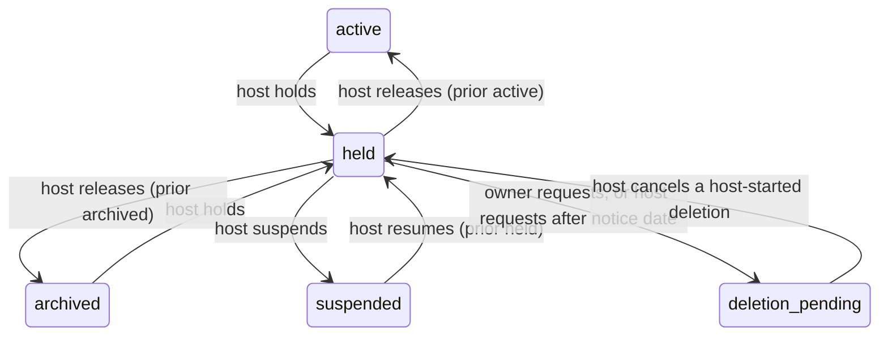

# Community host-operator API

**Status:** Approved (operator answers, 2026-09-23); decomposed into `03-tasks.json`
**Author:** Claude (for DOR-2243)
**Date:** 2026-09-23

## Overview

A Community host that serves many communities needs six general tools: a machine credential for host routes (P1), host-set limits per community with a usage read (P2), short names in the path (P6), import of an owner export from another host (P3), entry points in the DorkOS app for starting or moving a hosted community (P5), and optional sign-in through a generic OpenID Connect issuer (P4). Two host lifecycle additions follow P1 and P2 in their own phase and use the same credential: a read-only **hold** that stops growth while the owner can still export, and a narrow, notice-gated host-started deletion of a held community. Host-configured terms, privacy, and report-abuse links ship with P4. Every one of them is useful to any self-hosting operator. A hosted service such as DorkOS Cloud may be one host operator. The Community server stays complete with every DorkOS host blocked.

The design keeps the tenancy contract's central rule: host authority manages communities as containers and never reads, writes, or mints access to community content. The one deliberate exception is import, where the host writes content it was handed into a brand-new community it cannot then read. Host-started deletion removes a whole community without reading it, and only after a hold with a published notice date.

## Background / Problem Statement

Today every host route in `apps/community/src/routes/host.ts` calls `requireHostOperator(c, auth, pool)` (`data.ts`), which needs a signed-in person's browser session. A program that creates communities for people (a hosting panel, a provisioning script, a support tool) has to hold a person's session cookie. There is no scoped, revocable credential for that job.

The host also cannot shape what one community may consume. `COMMUNITY_AGENTS_PER_OWNER` (`config.ts:38`, default 20, ceiling 100) is the only per-person cap, it is host-wide, and when reached it answers `429 RATE_LIMITED` (`routes/agents.ts`, enrollment handler). A client that sees `429` backs off and retries, which never succeeds, because a cap is a state and not a rate. `owner_quota_windows` (`schema.ts`) is a daily upload _rate_ window, not a size limit. Nothing limits a community's member count or stored bytes, and the host cannot see how much a community uses.

A community is reachable only at `/c/<uuid>`. That is right for identity and wrong for a person typing an address. The tenancy contract excluded vanity slugs; this spec reopens only the path form, as a mutable alias that never becomes identity.

An owner can export a community (`POST /owner/export`, `routes/exports.ts`), but no host can read that archive back in. Moving to another host means starting over.

Finally, sign-in is email and password plus optional Google and GitHub (`auth.ts`). A team whose people sign in through their own identity service (Keycloak, Authentik, Okta, Entra ID and others) cannot use it.

## Goals

- A scoped, revocable, hashed-at-rest machine credential for host routes that cannot reach community content, with issuance, rotation, revocation, and audit.
- Host-set limits per community for active members and stored bytes, a per-member override of the agents-per-person limit, clear typed errors for each cap, and a host-only usage read.
- A unique, renamable `/<name>` short name per community beside the immutable `/c/<uuid>`, with old names still leading to the community.
- Restore a version 1 owner export into a new `pending_owner` community on another host, keeping history and files, with installations and agents pairing again.
- "Start a community" and "Move a community" in the DorkOS app's community switcher, shown only when the installation is linked to a DorkOS account, with the wire shape in `packages/cloud-api`.
- An optional generic OpenID Connect sign-in set by host configuration, beside email and password, with explicit account linking only.
- A host hold that makes a community read-only without cutting its owner off from an export, and a host-started deletion that only follows a hold with a published notice date.
- Host-configured terms, privacy, and report-abuse links shown to every person on the host.

## Non-Goals

- Any limit on message history. History is never limited.
- A community-wide agent cap.
- Subdomains or per-community custom domains.
- Moving a single membership between hosts, cross-host identity, or rebinding an imported person's history to their new account.
- Online lost-owner recovery, including replacing an owner who cannot be reached. The tenancy contract's offline-only rule stands; a break-glass contract is deferred.
- Erasing one member's content. It rewrites immutable history and must be performed by the person or their community, never by host authority, so it needs its own contract. It is specified in `specs/community-member-erasure/` (DOR-2247), which also builds host account deletion, and it blocks the launch of any hosted service in this project (Open Question 7).
- Any host route that reads channels, entries, files, the member directory, invitations, or content audit.
- Pricing, plans, billing, or anything about how a hosted service decides who may start a community. `packages/cloud-api` carries mechanism only (its catalog-blindness rule).
- Per-community sign-in settings. OpenID Connect is host-wide.
- Time or effort estimates.

## Technical Dependencies

| Dependency                         | Version in repo                       | Used for                                                                                                                  |
| ---------------------------------- | ------------------------------------- | ------------------------------------------------------------------------------------------------------------------------- |
| `hono`                             | 4.13.8                                | routes, streaming upload body                                                                                             |
| `better-auth`                      | 1.7.5                                 | sessions, `verifyPassword` reauthentication, the `genericOAuth` plugin for P4 (discovery URL, PKCE)                       |
| `pg` + hand-written SQL migrations | `apps/community/migrations/0001…0011` | schema changes; new files 0012–0015 are added to the list in `src/migrate.ts`                                             |
| `drizzle-orm`                      | 0.45.2                                | `src/schema.ts` mirrors every migration                                                                                   |
| `fflate`                           | 0.8.3                                 | already writes the export zip; its streaming `Unzip` reads the import archive                                             |
| `zod`                              | ^4.1.13                               | strict wire schemas in `@dorkos/shared/community-wire`, `@dorkos/shared/community-admin-wire`, and `@dork-labs/cloud-api` |
| Node `crypto`                      | built in                              | SHA-256 token hashing (`security.ts`), UUIDv5 derivation for import IDs                                                   |

No new runtime dependency is needed. UUIDv5 is a SHA-1 over a namespace and a name, which Node `crypto` computes directly.

## Detailed Design

### Shared rules

- **Authority split.** Host authority is now either a host operator's session or a host API key. Both reach only `/api/v1/host/*` plus the import upload route. Neither reaches any route in `communityApi` (`app.ts`), and neither can mint a membership, grant, agent credential, invitation, or owner claim for a community that is not `pending_owner`.
- **Tenant first.** Every host route that names a community resolves the UUID from the path, returns `404` for an unknown or malformed UUID, and locks the community row before changing anything.
- **Audit in the same transaction.** Every host mutation writes one `host_audit_events` row in its own transaction, naming the actor as a person or a key.
- **No secret twice.** A one-time secret (API key secret, owner claim token, import upload token) is returned once with `Cache-Control: no-store`, stored only as its SHA-256 hash, and never appears in a list, log, audit row, or error.
- **Error codes.** New codes are added to `CommunityWireErrorCodeSchema`. Only the same-origin browser bundle and the community app parse that enum today (no consumer in `apps/server` or `apps/client`), so adding members is safe.

### P1. Host API keys

#### Credential model

A host API key is a host-owned machine credential. It is not a person, not a member, and not a host operator. It carries a fixed set of scopes chosen when it is issued.

| Scope                   | Allows                                                                                                                                                                                            |
| ----------------------- | ------------------------------------------------------------------------------------------------------------------------------------------------------------------------------------------------- |
| `communities:read`      | `GET /host/communities`, `GET /host/communities/:id`, `GET /host/communities/:id/usage`, `GET /host/usage`, `GET /host/imports/:id`                                                               |
| `communities:write`     | create a `pending_owner` community (with its short name and limits in the same call), reissue or revoke its owner claims, abandon it, set limits and member overrides, set or release short names |
| `communities:lifecycle` | suspend, resume, hold, release a hold, request and cancel a host-started deletion                                                                                                                 |
| `communities:import`    | create, commit, cancel, and upload to imports                                                                                                                                                     |

The host routes this unlocks already exist or are added in this spec: list and single metadata read (`GET /host/communities/:id` is new and returns the same projection as the list), idempotent create, single-use owner claims (a claim is consumed on redemption and cannot be replayed, `bootstrap_grants.consumed_at`), abandon of an unclaimed community, suspend and resume. Create gains `limits` beside `shortName`, and both enter the idempotency payload hash, so a retry with different limits is `409 IDEMPOTENCY_CONFLICT` instead of a silent mismatch.

There is deliberately no scope for key management, host-operator management, or anything inside a community. A key cannot issue, rotate, list, or revoke keys. That keeps a leaked key from making itself permanent.

**Token format.** `dkh_` followed by 43 base64url characters (32 random bytes from `randomToken()`). The `dkh_` prefix lets secret scanners and log filters recognize a leaked key, and lets the request pipeline route it without a database lookup. The first 10 characters (`dkh_` plus 6) are stored as a display `prefix` so a person can tell keys apart. That prefix is not unique and is never used for lookup.

**At rest.** Only `hashSecret(secret)` (SHA-256 hex, `security.ts`) is stored, in a unique column. A 256-bit random secret needs no salt or slow hash; this matches how grants, agent credentials, and claims are already stored.

**Host-owned, not person-owned.** Revoking a host operator does not revoke keys that operator issued. A key serves automation that must outlive staff changes. Each key records who issued it, and the key list shows it, so an operator who removes a colleague can see and rotate that colleague's keys. The operations guide says to do so.

#### Issuance, rotation, revocation

- **Issue in the browser or by API.** `POST /api/v1/host/api-keys` needs a host operator's **session** (never a key) and password reauthentication in the request body, as owner export does (`auth.api.verifyPassword`). Body: label, scopes, optional expiry. Response: the key's projection plus its secret, once.
- **Issue offline.** `node dist/host-keys.js issue --label <text> --scope <scope>… [--expires-in-days <n>]` runs against `COMMUNITY_DATABASE_URL`, like `migrate.js`, and prints the secret once to standard output. Anyone who can run it already controls the database, so it needs no further proof. It lets a headless host provision its first key without a browser. `list` and `revoke <id>` subcommands exist too. Offline issuance writes a `host_audit_events` row with `actor_kind='offline'`.
- **Rotate.** `POST /api/v1/host/api-keys/:id/rotate` (session plus reauthentication) issues a successor with the same label and scopes and sets the old key's `expires_at` to `now() + overlapMinutes` (0 to 1,440). Both work during the overlap, so a deployment can switch without downtime.
- **Revoke.** `POST /api/v1/host/api-keys/:id/revoke` (session, any live host operator, no reauthentication, since revoking is always safe) sets `revoked_at` immediately. There is no un-revoke.
- **Expiry.** Optional, 1 to 365 days, or none. The browser defaults to 90 days. An expired key behaves exactly like a revoked one.
- **List.** `GET /api/v1/host/api-keys` (session only) returns projections, never secrets or hashes.

#### Request pipeline

`requireHostOperator` becomes `requireHostAuthority(c, auth, pool, scope)`, returning a discriminated actor:

```ts
type HostActor =
  | { kind: 'person'; userId: string; name: string }
  | { kind: 'api_key'; keyId: string; scopes: readonly HostApiKeyScope[] };
```

1. If an `Authorization` header is present on a host route, only the key is considered. A session cookie on the same request is ignored, so a request can never borrow a person's authority by accident. A bearer without the `dkh_` prefix is `401 UNAUTHENTICATED`.
2. The key is looked up by hash where `revoked_at IS NULL AND (expires_at IS NULL OR expires_at > now())`. Missing: `401 UNAUTHENTICATED`, and one failed attempt is counted against the socket peer with the existing `limitAttempts` helper (new `COMMUNITY_HOST_KEY_ATTEMPTS_PER_MINUTE`, default 20, ceiling 100).
3. A key without the route's scope: `403 FORBIDDEN`, message "This key does not allow that action."
4. Without an `Authorization` header, today's session plus `host_operators` check runs unchanged. A person is treated as holding every scope.
5. Inside every write transaction, `assertHostOperator(client, userId)` becomes `assertHostActor(client, actor)`, which re-reads the key row `FOR SHARE` with the same predicate, so a revocation that commits first always wins.
6. `last_used_at` is updated at most once per minute per key, outside the request's own transaction, and its failure never fails the request.

**Content routes refuse keys by construction and by check.** `requirePrincipal`, `requireConnectionGrant`, and the agent path in `data.ts` look up bearer hashes in `connection_grants` and `agent_credentials`, where a key hash can never be. As a second guard, `bearer(c)` answers `401 UNAUTHENTICATED` for any `dkh_` token before a lookup, so a key is never confused with a member credential even if a hash space were ever shared.

**Cross-site requests.** The existing `/api/*` origin check applies. A program calling with no `Origin` header passes it, as today; a browser page on another origin cannot use a key, because it has no way to attach one without the operator pasting it.

#### Audit

`host_audit_events` gains an actor discriminator:

- `actor_kind text NOT NULL DEFAULT 'person' CHECK (actor_kind IN ('person','api_key','offline'))`
- `actor_user_id` becomes nullable; `actor_api_key_id uuid NULL REFERENCES host_api_keys(id)`
- `CHECK ((actor_kind='person') = (actor_user_id IS NOT NULL) AND (actor_kind='api_key') = (actor_api_key_id IS NOT NULL))`

New actions: `api_key.issue`, `api_key.rotate`, `api_key.revoke`, `community.limits`, `member.limits`, `community.short_name`, `community.short_name.release`, `import.create`, `import.upload`, `import.cancel`, `import.complete`, `import.fail`. Changed-field names only, never values. Reads are not audited, matching today's session reads.

Tables that record the actor as a user need the same treatment: `community_creation_receipts.operator_user_id` becomes nullable beside a new `operator_api_key_id`, with an exactly-one check; `bootstrap_grants.revoked_by` gains `revoked_by_api_key_id` with the revocation check widened to "revoked_at set iff exactly one revoker set".

#### Adversarial matrix for P1

Setup: communities A (active) and B (`pending_owner`), a host operator with no membership, an A owner, and keys K_all (every scope), K_read (`communities:read`), K_revoked, K_expired. Each row is an integration test against real Postgres; every "refused" row also asserts that no row changed (counts of `members`, `connection_grants`, `agent_credentials`, `bootstrap_grants`, `entries`, `channels` before and after).

| #   | Attempt                                                                                                                                            | Expected                                                                                                               |
| --- | -------------------------------------------------------------------------------------------------------------------------------------------------- | ---------------------------------------------------------------------------------------------------------------------- |
| 1   | K_all on `GET /api/v1/communities/A/channels`, `/entries`, `/members`, `/invites`, `/agents`, `/exports/:id`, attachment download, `/events` (SSE) | `401 UNAUTHENTICATED`, no data, no stream opened                                                                       |
| 2   | K_all on the same routes through the unqualified singleton alias with one community                                                                | `401`                                                                                                                  |
| 3   | K_all on `POST /api/v1/communities/A/invites`, `/pairings/start`, `/agents`, `/owner/export`                                                       | `401`, no row written                                                                                                  |
| 4   | K_all on `POST /host/communities/A/owner-claims/reissue` (A active)                                                                                | `409 STATE_CONFLICT`, no grant row                                                                                     |
| 5   | K_all creates community C and receives its claim token; the token is presented on `/owner-claims/claim` **without** a session                      | `401`; the claim stays unconsumed                                                                                      |
| 6   | K_all on `PUT /host/communities/A/limits` with limits below current use                                                                            | limits stored; no member, agent, file, or entry removed; the next admission/upload is refused with the new typed error |
| 7   | K_all on `PUT /host/communities/A/members/<A owner id>/limits`                                                                                     | only the override is returned; the response contains no name, handle, email, or role                                   |
| 8   | K_all on `PUT /host/communities/A/members/<B-or-random uuid>/limits`                                                                               | `404 NOT_FOUND`                                                                                                        |
| 9   | K_all on `POST /host/api-keys`, `/rotate`, `/revoke`, `GET /host/api-keys`                                                                         | `403 FORBIDDEN` (a key never manages keys)                                                                             |
| 10  | K_read on every mutating host route                                                                                                                | `403 FORBIDDEN`, no audit row                                                                                          |
| 11  | K_revoked and K_expired on `GET /host/communities`                                                                                                 | `401`                                                                                                                  |
| 12  | Revoke K_all while a `PATCH /lifecycle` using it waits on the community lock (test hook)                                                           | the waiting request fails `401` after acquiring the lock; lifecycle unchanged                                          |
| 13  | A request with both a valid session cookie of a host operator and an invalid key                                                                   | `401` (the cookie is not used)                                                                                         |
| 14  | A request with a valid A member's grant bearer on `GET /host/communities`                                                                          | `401`                                                                                                                  |
| 15  | Any response body or log line from rows 1–14                                                                                                       | contains no `dkh_` secret, no hash, and no claim token except the one-time creation response                           |
| 16  | `host_audit_events` after rows 6, 7, and every successful mutation                                                                                 | one row each, `actor_kind='api_key'`, correct `actor_api_key_id`, no values                                            |

### P2. Community limits and usage

#### Limits

| Limit                        | Set by      | Where                                      | Default           | Enforced at                                                                        |
| ---------------------------- | ----------- | ------------------------------------------ | ----------------- | ---------------------------------------------------------------------------------- |
| Active members per community | host        | `community_limits.max_active_members`      | none (unlimited)  | admission and reactivation (`routes/invites.ts`), not owner claim or first install |
| Stored bytes per community   | host        | `community_limits.max_storage_bytes`       | none (unlimited)  | attachment and icon commit                                                         |
| Active agents per person     | host config | `COMMUNITY_AGENTS_PER_OWNER`               | 20 (maximum 100)  | agent enrollment and reactivation (`routes/agents.ts`)                             |
| Active agents for one person | host        | `member_limit_overrides.agents_per_member` | none (use config) | same                                                                               |

There is no community-wide agent cap and no history limit.

`COMMUNITY_AGENTS_PER_OWNER` keeps its default of 20 and its configured maximum of 100. A self-hoster who changes nothing keeps today's behaviour; a host that wants 100 agents per person (a hosted service, for example) sets it in configuration. A per-member override may go above the host setting, up to a structural ceiling of 1,000 enforced by the wire schema and a database check (Open Question 2, resolved), and may also be lower. The effective limit for a person is `override ?? config`.

**Limits never destroy anything.** Lowering a limit below current use removes no member, agent, file, or entry. It only refuses the next action that would grow past it. Messages and history are never counted.

#### Enforcement and errors

| Situation                                                        | Status | Code                    | Message                                                |
| ---------------------------------------------------------------- | ------ | ----------------------- | ------------------------------------------------------ |
| Admission or reactivation would exceed `max_active_members`      | 409    | `MEMBER_LIMIT_REACHED`  | "This community is full. Ask its owner to make room."  |
| Attachment or icon would exceed `max_storage_bytes`              | 409    | `STORAGE_LIMIT_REACHED` | "This community is out of file space."                 |
| Enrollment or reactivation would exceed the person's agent limit | 409    | `AGENT_LIMIT_REACHED`   | "You have reached your agent limit in this community." |

`409` is right because the request cannot succeed until state changes (someone leaves, a file is removed, the host raises the limit). `429` tells a client to wait and retry the same request, which is wrong for a cap. The daily upload window and the posts-per-ten-minutes window stay `429 RATE_LIMITED`, because those are rates.

- **Members.** Inside the admission transaction, after the invite row is locked: lock `community_limits` for the community `FOR UPDATE` (the row is created lazily on first limit set; with no row there is no limit and no lock), count `members WHERE community_id=$1 AND active`, and refuse before any insert or reactivation. The existing `SELECT … FOR UPDATE` on the member row stays. Re-admitting a person who is already active does not count twice.
- **Storage.** Counted bytes are `SUM(byte_size)` of `managed_blobs` for the community with `purpose IN ('attachment','icon') AND state IN ('stored','committed')`. Exports are **exempt**: an owner must always be able to take their data out, and an export lives one hour and is bounded at 1 GiB. `pending_delete` bytes are not counted, so removing a file frees space at once. Two checks run:
  - a fast pre-check before bytes are uploaded, using the declared `byteSize` of an attachment (icons are bounded at 2 MiB) so a person is not made to upload a file that will be refused;
  - the authoritative check inside the commit transaction, after `prepareManagedBlobCommit`'s lifecycle lock, under `pg_advisory_xact_lock(hashtext('dorkos:storage:' || community_id))` taken only when a storage limit exists. Concurrent uploads therefore cannot jointly exceed the limit. On refusal, the reservation goes through the existing `discardManagedBlob` cleanup.
- **Agents.** The count query already exists. It reads the override (`member_limit_overrides` joined by `(community_id, member_id)`), compares against `override ?? config.limits.agentsPerOwner`, and throws `AGENT_LIMIT_REACHED`. `/agents/recover` is unchanged because it never raises the count.

The inventory already exists: `managed_blobs` (DOR-2172, ADR `260920-201101`) carries `community_id`, `purpose`, `state`, and `byte_size` for every attachment, export, and icon, so no new counter is needed. A new index `managed_blobs_community_usage_idx ON managed_blobs(community_id, state, purpose) INCLUDE (byte_size)` keeps the sum an index-only scan. A running counter was rejected: every blob transition (commit, discard, deletion worker, export sweep) would have to maintain it, and a drift would silently refuse or admit uploads.

#### Usage read

`GET /api/v1/host/communities/:id/usage` (scope `communities:read`) returns exactly:

- `activeMembers` and `activeAgents` (counts),
- storage bytes by purpose: attachments, icons, exports, import staging, pending delete, and the counted total,
- the current limits and `limitsVersion`,
- `lastPostDate`: the UTC **date** (not time) of the newest entry, or `null`,
- `measuredAt`.

`GET /api/v1/host/usage?after=<communityId>&limit=<1..100>` returns the same object for a page of communities in UUID order, with a `next` cursor, so a host can review every community without one request each.

No names, handles, emails, channel or message counts, file names, or per-person numbers. This amends the administration contract's rule that the host list carries no counts or latest-message data: the usage read is a separate route, and these aggregates are the minimum a host needs to enforce the limits it sets and to find abandoned communities (ADR `260923-121151`). `lastPostDate` is day-granular on purpose: enough to see that a community has been quiet for months, too coarse to watch when people talk. It is computed as `max(created_at)::date` over a new index `entries_community_created_idx ON entries(community_id, created_at DESC)`; it is not a column on `communities`, because updating the community row on every post would contend with the `FOR SHARE` lifecycle lock every write already takes. The host list projection does not change for P2.

#### Setting limits

- `PUT /api/v1/host/communities/:id/limits` (scope `communities:write`) with `limitsVersion` for optimistic concurrency (first write uses `limitsVersion: 1` against the implicit default). A stale version returns `409 STATE_CONFLICT`. Allowed in every lifecycle except `deletion_pending`.
- `PUT /api/v1/host/communities/:id/members/:memberId/limits` (scope `communities:write`) sets or clears (`null`) one person's agent override. The member must belong to that community (`404` otherwise, including for a random UUID). The response carries only the override and the effective value. The host learns a member UUID from the person or owner who asked, never from a lookup: there is no host route that lists or searches members.

### Host hold and host-started deletion

Every host eventually has a community it must stop without destroying: an abuse report under investigation, a hosting arrangement that ended, a legal request. Today the only host tool is suspension, which blocks every member request including the owner's export. A self-hoster's choice is then "leave it running" or "cut everyone off from their own data". The hold fills that gap. The narrow host-started deletion lets a host that must reclaim a community do it through the audited worker instead of by hand in the database, and only after the owner has had a published window to take their data.

#### Hold

- **State.** A new lifecycle value `held`, reached from `active` or `archived` by the host (`PATCH /host/communities/:id/lifecycle` with `action: 'hold'`, scope `communities:lifecycle`, current `lifecycleVersion`). `communities.held_from_state` records the prior state, as `suspended_from_state` does. `action: 'release'` returns to it. Suspension may start from `held` (and resume returns to `held`).
- **What people can do.** Exactly what they can do in `archived`: read history, threads, the roster, and authorized files; use the archived read-only pairing flow (`{read}` only, `history_only`). Nothing grows: no posts, uploads, invitations, joins, pairings with write scopes, agent enrollment, or settings edits (`423 COMMUNITY_HELD`).
- **What the owner keeps.** Owner export (`POST /owner/export`, reauthenticated) and the owner's own deletion request. The owner cannot archive, restore, transfer, or release the hold.
- **Member erasure stays allowed.** Erasure removes content rather than growing the community, so a person's erasure of their own content and the owner's erasure of a member (`specs/community-member-erasure/`, DOR-2247) are accepted and run while held, exactly as in `archived`. `423 COMMUNITY_HELD` never applies to them.
- **Credentials.** Entering a hold runs `revokeTenantAccess`, like archive and suspension. Release revives nothing.
- **Notice.** A hold may carry `deletionNoticeAt`, a date at least 7 days after it is set (`COMMUNITY_HOST_DELETION_NOTICE_DAYS`, default 14, minimum 7, maximum 365). Members see it in the community's banner: "This community is on hold by its host. You can read it but not post. The host plans to delete it after <date>. The owner can export it until then." Without a notice date the banner omits the last two sentences. The notice date can be moved later or cleared (`action: 'set_notice'`); moving it earlier than 7 days from now is refused. Host-started deletion also asks for the last eight characters of the community UUID, as the owner's deletion does, so a script cannot delete the wrong community by a slip.

#### Host-started deletion

- `POST /host/communities/:id/deletion` (scope `communities:lifecycle`) is allowed **only** when the community is `held`, has a `deletionNoticeAt`, and that date has passed. Otherwise `409 STATE_CONFLICT`.
- It enters the existing `deletion_pending` state with the same seven-day `delete_after` and the same worker, blob inventory, per-blob progress, and tombstone as an owner request. `communities.delete_requested_by` becomes nullable beside `delete_requested_by_host_actor`, with a check that a pending deletion names exactly one requester.
- The host may cancel a host-started deletion during those seven days (`DELETE /host/communities/:id/deletion`), which returns it to `held`. The host still cannot cancel or speed up an owner-requested deletion, and the owner cannot cancel a host-started one. An owner-requested deletion that started from `held` cancels back to `held`, not `archived`, so cancelling can never lift a hold (`communities.deletion_from_state` records it).
- A `suspended` community cannot be deleted by the host directly: the owner cannot export while suspended, so the host must first move it to `held` with a notice date.
- This amends ADR `260920-201101` ("host authority cannot delete an active tenant") narrowly; ADR `260923-121712` records it. The operator approved this path on 2026-09-23 (Open Question 1, resolved).

The lifecycle state machine becomes:



### P6. Short names in the path

#### Model

A short name is a mutable, host-unique alias for one community. It is never identity: credentials, invitation links, pairing approval URLs, owner-claim links, stored local connections, SSE endpoints, and API routes keep using the UUID. A community may have no short name.

- **Grammar.** 3 to 32 characters, lowercase ASCII letters, digits, and single hyphens; starts with a letter; does not end with a hyphen: `^[a-z](?:[a-z0-9]|-(?=[a-z0-9])){2,31}$`. Input is lowercased and trimmed before validation. No Unicode, so there are no look-alike names.
- **Reserved.** A shared constant `COMMUNITY_RESERVED_SHORT_NAMES` holds every path the server or browser already owns or may soon own: `api`, `assets`, `c`, `claim`, `host`, `join`, `pairing`, `health`, `auth`, `login`, `logout`, `signin`, `signup`, `settings`, `admin`, `static`, `public`, `www`, `help`, `docs`, `status`, `well-known`, `favicon`, `robots`, `sitemap`, `new`, `import`, `invite`, `deletion`. A host adds its own with `COMMUNITY_RESERVED_SHORT_NAMES` (comma-separated, validated by the same grammar). A test pins that every literal top-level path in `main.ts` and `BrowserRoot.tsx` is reserved.
- **Storage.** `community_short_names(short_name text PRIMARY KEY, community_id uuid NOT NULL REFERENCES communities(id), state text NOT NULL CHECK (state IN ('current','retired')), created_at, retired_at)`, with a partial unique index allowing one `current` row per community. The primary key makes a name unique across the host, including retired names.
- **Rename.** Setting a new name marks the current row `retired` and inserts the new one `current`, in one transaction under the community lock. Setting `null` retires the current name. A retired name still resolves to its community and the browser moves to the current name.
- **Retired names stay bound** for the community's lifetime, so a bookmarked old address can never be taken over by another community. A host operator may release a retired name on purpose (`DELETE /host/communities/:id/short-names/:name`, audited), for example after a trademark request. When the community is deleted, the deletion worker deletes its name rows with the other tenant rows.
- **Cool-off after release.** A released name (released by the host, or freed by a deletion) cannot be taken again for `COMMUNITY_SHORT_NAME_COOLOFF_DAYS` (default 90, range 0–365). The hold is stored as `released_short_names(name_hmac text PRIMARY KEY, available_at timestamptz)`, where `name_hmac` is an HMAC-SHA-256 of the name under a key derived from `COMMUNITY_AUTH_SECRET` (HKDF, info `community-short-name-hold`). No name survives deletion in clear text, which keeps the tombstone rule of the administration contract. Rotating the auth secret ends outstanding holds early; the operations guide says so. A host operator may lift a hold for one name (`DELETE /host/short-name-holds/:name`, audited).
- **Who sets it.** The host (scope `communities:write`), on create (`shortName` in the create request) or later (`PUT /host/communities/:id/short-name`). The short name is a slot in the host's namespace, like the list of communities, so it is host authority. Owner self-service is an open question.

`409` codes: `SHORT_NAME_TAKEN` (bound to any community, current or retired, or in its cool-off), `SHORT_NAME_RESERVED`.

#### Resolution

`GET /api/v1/community-names/:name` is public and unauthenticated. It answers `200 { communityId, shortName }` (the current name) only when the name is bound to a community whose lifecycle is `active`, `archived`, or `held`; every other case, including a malformed name, returns the same `404 NOT_FOUND`. It is rate limited per socket peer (`COMMUNITY_NAME_LOOKUPS_PER_MINUTE`, default 60, ceiling 600).

This is an exact-match lookup, not a directory: there is no listing, prefix search, or metadata. It confirms that a name is in use, which is what a public address is for (ADR `260923-121152`). A community that wants no public address simply has no short name.

#### Browser

- `main.ts` serves `index.html` for `GET /:name` and `GET /:name/*` when `:name` matches the grammar and is not reserved. Other paths keep today's `404`.
- `BrowserRoot` gains a first branch: a short-name path resolves through the lookup, then renders the community with the returned UUID. If the requested name was retired, `history.replaceState` swaps in the current name. A `404` renders the chooser with "No community at this address." and no other detail.
- `tenantApiPath` and `parseCommunitySettingsPath` take the resolved `{ communityId, basePath }` instead of reading the UUID from `/c/<uuid>`. `/<name>/settings[/<section>]` works like `/c/<uuid>/settings[/<section>]`. The places in `CommunityApp.tsx` that `replaceState` to `/c/<uuid>` keep the short-name base when the person arrived by one.
- Links the server mints stay canonical (`/c/<uuid>/…`). The browser's "Copy link" offers the short-name address when one exists.

#### DorkOS connection parser

`parseCommunityLink` (`apps/server/src/services/communities/remote/pinned-origin.ts`) accepts a third exact shape, `/<name>`, with the same scheme, credential, query, fragment, port, and encoded-path rules. It returns `{ origin, communityId: null, shortName }`. The pairing service then calls `GET /api/v1/community-names/<name>` through the same pinned-origin fetch (no redirects, the same DNS checks), validates the returned UUID with `communityIdPattern`, and continues exactly as for `/c/<uuid>`. The stored connection records only the UUID. A later rename or release therefore never changes which community a connection talks to. Tests cover `/Acme` (lowercased), `/acme/`, `/acme/x`, `/%61cme`, `/api`, and a lookup that answers a malformed UUID.

### P3. Import an owner export on another host

#### What the version 1 archive carries

Read from `routes/exports.ts`. The zip holds `manifest.json` first, then `attachments/<attachmentId>` for each attachment, stored without compression. The manifest has:

- `version: 1`, `scope` (`owner` or `personal`), `requesterMemberId`;
- `community`: `id`, `lifecycle`, `lifecycleVersion`, `settingsVersion` only (**no name, description, admission policy, or icon**);
- `auditEvents` (owner scope only), `channels`, `members` (including `email`), `agents`, `entries` (snake_case database rows; `seq` is a bigint and arrives as a decimal string; `mentions` is an ordered UUID array), `attachments` (camelCase, with `byteSize`, SHA-256 `checksum`, `archivePath`);
- at most 10,000 rows per collection, at most 16 MiB of manifest, at most 1 GiB in total.

It does **not** carry channel memberships, agent channel memberships, read cursors, the community icon, unbound attachments, invitations, grants, pairings, agent credentials, or host accounts.

**The format is versioned, and import dispatches on the version.** `manifest.version` is the contract. This spec publishes the version 1 shape as `CommunityExportManifestV1Schema` and pins it with a round-trip test against a real export, so the exporter cannot drift from it silently. Any change to what the exporter writes that an importer would need to know about (a new collection, a renamed field, a changed meaning) is a new version with its own schema; import refuses a version it does not know with `IMPORT_VERSION_UNSUPPORTED` rather than guessing. Version 2 is an open question below.

#### What import restores and what it leaves behind

| Restored                                                                  | Not carried, on purpose                                                                                         |
| ------------------------------------------------------------------------- | --------------------------------------------------------------------------------------------------------------- |
| channels (name, description, visibility, archived, created time)          | every credential: connection grants, agent credentials, pairings, invitations, pending admissions, owner claims |
| every entry with its sequence, thread, mentions, author name, and time    | host accounts, sessions, passwords, OAuth links, and **email addresses**                                        |
| every bound attachment's bytes, verified by SHA-256                       | read positions, quota windows, export archives                                                                  |
| members and agents as **historical** authors (display name, handle, role) | channel memberships (not in version 1)                                                                          |
| the tenant audit trail, plus one `community.import` event                 | the community name, description, and icon (not in version 1; the host supplies name and description)            |

Credentials are bound to the host that issued them. After a move every person pairs their installation again and every owner enrolls their agents again.

#### Identity rules

- **The community gets a new server-minted UUID.** Importing the same archive twice on one host must produce two independent communities, and a community's UUID is never chosen by a caller.
- **Every other ID is derived, not preserved:** `newId = uuidv5(namespace = importId, name = sourceId)`. The mapping is deterministic, so a resumed job computes the same IDs without a mapping table; it is collision-free across imports because each import has its own namespace; and threads, mentions, attachments, and audit subjects stay consistent because every reference maps through the same function.
- **Members become historical.** Each imported member row has `user_id NULL`, `active=false`, `origin='imported'`, and keeps its display name, handle, and role so authorship reads correctly. The handle stays reserved in `community_handles`, so nobody can take an old handle to impersonate a past author. Imported agents are `active=false` with `revoked_at` set.
- **The owner adopts the old owner row.** The manifest must contain exactly one member with `role='owner'` and `active=true`, equal to `requesterMemberId`. When the new community's owner claim is redeemed, the claim binds the claimant's account to that row (`user_id` set, `active=true`) instead of inserting a new owner member, so the owner's own history stays theirs. Everyone else rejoins by invitation and gets a new member row. Rebinding other people's history is out of scope.
- **Private channels.** Version 1 carries no channel membership. The adopted owner is added to every channel (an owner export already contained all of them). Everyone else joins channels again after rejoining.

#### Schema changes for historical members

- `members.user_id` becomes nullable; `members.origin text NOT NULL DEFAULT 'native' CHECK (origin IN ('native','imported'))`; `CHECK (user_id IS NOT NULL OR (origin='imported' AND NOT active))`. `members_community_user_unique` is unchanged (NULLs are distinct).
- `communities.imported_at timestamptz NULL`, set when an import completes.
- Every query that joins `"user"` from `members` must tolerate a NULL: the owner export's member query becomes a `LEFT JOIN` so a re-export keeps historical authors (with `email: null`, which needs `email` to be nullable in the version 1 manifest schema too). Code paths that look up members by `user_id` already never match NULL. **Shared with the member-erasure spec** (`specs/community-member-erasure/`): it makes the same `LEFT JOIN`, the same nullable `email` in `CommunityExportManifestV1Schema`, and also drops `NOT NULL` on `members.user_id` (for erased husks). Whichever lands first makes these changes and the other drops its copy; the user-presence check becomes `user_id IS NOT NULL OR erased_at IS NOT NULL OR (origin='imported' AND NOT active)`, owned by whichever of the two migrations lands second.

#### Job model

```mermaid
stateDiagram-v2
  [*] --> awaiting_upload: host creates import
  awaiting_upload --> validating: archive uploaded and hash matches
  validating --> validated: manifest, references, and sizes valid; report ready
  validated --> restoring: host commits
  restoring --> ready: rows and files committed in one step
  awaiting_upload --> cancelled: host cancels or upload window expires
  validated --> cancelled: host cancels
  validating --> failed
  restoring --> failed
  failed --> [*]: cleanup
  cancelled --> [*]: cleanup
  ready --> [*]: owner claim issued and redeemed
```



`community_imports(id uuid PK, community_id uuid UNIQUE REFERENCES communities(id), idempotency_key text UNIQUE, payload_hash text, state, upload_token_hash text UNIQUE, upload_expires_at, archive_sha256 text NULL, archive_bytes bigint NULL, staging_blob_key text NULL REFERENCES managed_blobs(blob_key), manifest_version int NULL, failure_code text NULL CHECK (failure_code ~ '^[A-Z][A-Z0-9_]{0,63}$'), attempts int, next_attempt_at, created_by_user_id text NULL, created_by_api_key_id uuid NULL, created_at, updated_at)` with an exactly-one-creator check, and `community_import_files(import_id, source_attachment_id, blob_key, state CHECK IN ('stored','verified'), PRIMARY KEY (import_id, source_attachment_id))` for resumable progress.

`managed_blobs.purpose` gains `import_staging`. Its bytes appear in usage as import staging and never count against the storage limit.

1. **Create.** `POST /api/v1/host/imports` (scope `communities:import`) with an idempotency key, the community `name`, optional `description`, `admissionPolicy`, `shortName`, and `limits`. One transaction creates a `pending_owner` community, its limits and short name, the import row, and a one-time **upload token** (24-hour expiry). No owner claim is issued yet. Replaying the same key returns the same import with `uploadToken: null`; a different payload under the key is `409 IDEMPOTENCY_CONFLICT`.
2. **Upload.** `PUT /api/v1/imports/:importId/archive` accepts either the upload token as a bearer or host authority with `communities:import`. The upload token lets a host hand the upload to the person who holds the file without handing them a host key. Headers: `Content-Length` (required, at most 1 GiB), `X-Archive-SHA256` (required). The body streams into a reserved staging blob with the existing `BlobStore.put` byte limit; this route joins the attachment route in bypassing the ~96 KiB JSON body buffer in `app.ts`. A hash or length mismatch discards the blob (`400 IMPORT_ARCHIVE_INVALID`). Repeating the upload with the same hash after success is `200`; a different hash is `409 IDEMPOTENCY_CONFLICT`. Success consumes the upload token and moves the job to `validating`.
3. **Validate** (background worker, like the deletion worker, one job at a time per replica with `SKIP LOCKED`). Stream the staging blob through `fflate`'s `Unzip`:
   - the first entry must be `manifest.json`, at most 16 MiB; every other entry must be `attachments/<uuid>`; any other name, a duplicate name, a directory, or an encrypted entry fails the job;
   - the manifest parses with `CommunityExportManifestV1Schema` (strict), `scope` must be `owner`, and every collection is within 10,000 rows;
   - referential checks: every entry's channel, author, parent, thread root, and mention resolves inside the manifest; every attachment's channel, entry, and uploader resolves; mentions resolve to exactly one member or agent; thread roots are not themselves replies; `seq` is unique per channel; the owner rule above holds;
   - totals: the sum of attachment `byteSize` is within 1 GiB, each attachment is at most 25 MiB (the configuration ceiling of `COMMUNITY_ATTACHMENT_BYTES`), and, if the target has a storage limit, the sum fits it (`STORAGE_LIMIT_REACHED` as the failure code);
   - every attachment entry's length and SHA-256 are computed from the stream and compared with the manifest, without storing the bytes anywhere but the staging blob.

   A passing archive moves to `validated` with a **report** on the import: counts of channels, entries, attachments, historical members, historical agents, and audit events; total attachment bytes; archive bytes; the source community's lifecycle; and the bytes that would count against the target's storage limit. Nothing is committed yet. The report holds counts and sizes only, never text, names of channels, files, or people.
   3a. **Commit.** `POST /host/imports/:id/commit` (scope `communities:import`) starts the restore. A host that wants no pause sets `autoCommit: true` at creation. A `validated` import that is not committed within 7 days is cancelled.

4. **Restore files.** Stream the staging blob again. For each `attachments/<id>` entry, reserve a managed blob (`purpose='attachment'`), store the bytes, and require the stored length and SHA-256 to equal the manifest's `byteSize` and `checksum`. Uncompressed bytes are counted as they stream, so a zip whose entry expands past its declared size is stopped at the declared size plus one byte. `reserveManagedBlob` refuses any community that is not `active`, so the worker uses a sibling, `reserveImportBlob`, that accepts only a `pending_owner` community whose import is `restoring`, under the same lifecycle lock and version recheck. Record `community_import_files` progress after each file. On a worker restart the stream starts again and skips files already `verified`.
5. **Restore rows.** One database transaction under the community lock inserts channels (with `last_seq = max(seq)` and `epoch = 1`), historical members, handles, agents, entries (`idempotency_key = 'import:' || source entry id`, `payload_hash` = SHA-256 of the text), mentions, attachments, and audit events, all with derived IDs and original timestamps; commits every reserved blob; sets `communities.imported_at`; writes one tenant `audit_events` row (`community.import`, `actor_kind='system'`) and one `host_audit_events` row (`import.complete`); marks the job `ready`; and queues the staging blob for deletion. The largest archive is at most about 60,000 rows and 16 MiB of text, which fits one transaction.
6. **Claim.** While a job is not `ready`, owner-claim issue is refused (`409 STATE_CONFLICT`). Once `ready`, the host issues a claim with the existing `POST /host/communities/:id/owner-claims/reissue`. Redemption follows the adoption rule above.

**All or nothing.** No row of the imported community becomes visible, and no file becomes a committed attachment, until step 5's single transaction commits. Files stored in step 4 stay `stored` (never `committed`) in the blob inventory until then, so a failure at any point leaves nothing that a person could see and only inventory that the cleanup path removes.

**Failure and cancel.** A failure records a redacted `failure_code` (`IMPORT_ARCHIVE_INVALID`, `IMPORT_VERSION_UNSUPPORTED`, `IMPORT_TOO_LARGE`, `STORAGE_LIMIT_REACHED`, `IMPORT_CHECKSUM_MISMATCH`, `IMPORT_STORAGE_UNAVAILABLE`) and never a manifest value. Transient storage errors retry with the existing cleanup backoff; validation errors do not retry. `POST /host/imports/:id/cancel` works in any state before `ready`. Cancel, failure, and an expired upload window all end the same way: every reserved or stored blob of that import moves to the existing pending-deletion cleanup, and the `pending_owner` community is removed by the existing abandon path, which now also accepts a community whose only content came from an unfinished import. A `ready` community that is never claimed is abandoned through the ordinary deletion job instead, because it holds content, using the host requester columns added for host-started deletion (migration 0013); a host-requested deletion of an unclaimed imported community has no grace period, since no person has ever had access to it.

**Why this is still host authority.** Import writes content the host was handed into a new community that has no members. The host cannot read it back through any host route, and nobody can read it until a person redeems the owner claim. It never touches an existing community. This is the one place the host writes content, and ADR `260923-121153` records it.

### P5. DorkOS app entry points

#### Contract in `packages/cloud-api`

A new `communities.ts` module, exported from `src/index.ts`, with routes added to `V1_ROUTES` and `v1Path`. It describes mechanism only: no plan, price, catalog value, supplier, or host literal. The origin a community lives on is a runtime value in the response.

| Route                                        | Purpose                                                                                           |
| -------------------------------------------- | ------------------------------------------------------------------------------------------------- |
| `POST /v1/communities`                       | Start a hosted community. Returns the community's canonical link and a one-time owner-claim link. |
| `POST /v1/communities/moves`                 | Start a move. Returns an import upload target and a move id.                                      |
| `GET /v1/communities/moves/{moveId}`         | Poll a move: state, failure code, and, once ready, a one-time owner-claim link.                   |
| `POST /v1/communities/moves/{moveId}/cancel` | Cancel a move before it is ready.                                                                 |

`EntitlementLimitsSchema` (`billing.ts`, a non-strict object) gains one optional group, and `EntitlementsSchema.used` one optional count, both additive:

- `limits.communities?: { maxCommunities, maxMembersPerCommunity, maxStorageBytesPerCommunity }`: non-negative integers; the last two nullable for "no limit";
- `used.communities?`: the number of hosted communities the caller owns.

These are numbers, so the app can say "You can start 2 more communities" or grey out Start without ever knowing a plan. The app renders them only when present, and never branches on `planId`.

New `Problem` codes (additive under the package's own rule): `community_name_taken`, `community_name_reserved`, `import_invalid`. An entitlement refusal uses the existing `entitlement_required` and its server-supplied `detail`; the app never branches on a plan. The move `state` enum is mechanism and is added, with its reason, to `src/__tests__/catalog-blindness.test.ts`.

#### Where it appears

The "Add community" menu in `CommunityContextSwitcher.tsx` gains two items, **Start a community** and **Move a community here**, only when the cloud-link summary (`GET /api/cloud/status`, `features/cloud-link`) says the installation is linked. When it is not linked the items are not rendered and no request to the hosted service is made. The existing Connect, Join, Create (host operators on the connected host), and Deploy items do not change.

The local DorkOS server makes every call to the hosted service with the installation credential it already holds, through new routes under `/api/cloud/communities/*`. The browser never sees that credential, the claim token, or the upload token.

#### States

**Start a community**

1. _Form:_ community name (required, 1–80 characters) and web address (optional short name, with the grammar shown as a hint).
2. _Submitting._ The button shows progress and the form is locked.
3. _Claim:_ the app opens the owner-claim link in the person's browser: "Finish in your browser. Sign in or create your account there, then come back." The app offers **I've finished**.
4. _Connecting:_ the app runs the ordinary pairing flow with the returned canonical link.
5. _Done:_ the new community is selected in the switcher.

- _Errors:_ "That web address is taken." / "That web address can't be used." shown on the field; an entitlement refusal shows the service's own text and a link to the account page it names; the service unreachable shows "Couldn't reach your DorkOS account. Try again." and keeps the form.

**Move a community here**

1. _Explain:_ "Moving copies your community's history and files. Everyone joins again and reconnects their DorkOS. Your old community keeps running until you delete it." Then how to get an export: open the old community's Settings, choose Export, confirm with your password, and save the file.
2. _Choose file:_ a `.zip` picker, name and web address fields.
3. _Uploading:_ a determinate progress bar. The local server streams the file to the upload target.
4. _Importing:_ an indeterminate state polled from the move; the app can be closed and the state survives reload.
5. _Claim_ and _Connecting_ as above. Then: "Your history is here. Send invitations so people can join again."

- _Errors:_ not an owner export, damaged file, too large, out of file space, or not supported, each in one plain sentence with the next step; cancel is available until the import is ready.

### P4. Generic OpenID Connect sign-in

- **Configuration** (all or none, validated in `parseConfig` like the Google and GitHub pairs): `COMMUNITY_OIDC_ISSUER_URL` (HTTPS, or HTTP on localhost), `COMMUNITY_OIDC_CLIENT_ID`, `COMMUNITY_OIDC_CLIENT_SECRET`, optional `COMMUNITY_OIDC_LABEL` (button text, 1–40 characters, default "Single sign-on"), optional `COMMUNITY_OIDC_SCOPES` (default `openid email profile`; must include `openid`).
- **Wiring.** `createCommunityAuth` adds Better Auth's `genericOAuth` plugin with one provider, `providerId: 'oidc'`, `discoveryUrl: <issuer>/.well-known/openid-configuration`, and `pkce: true`. Discovery runs at first use, not at startup, so a down issuer never stops the server. The callback is `<COMMUNITY_PUBLIC_URL>/api/auth/oauth2/callback/oidc`, printed in the startup log line and the deployment guide.
- **Admission is unchanged.** The existing `databaseHooks.user.create.before` admission check runs for OIDC sign-ups too, so a new account still needs an invitation or an owner claim.
- **Linking stays explicit.** `account.accountLinking.disableImplicitLinking: true` stays. If an OIDC identity's email matches an existing account, sign-in is refused, and the person links from their account page after signing in the usual way. The ID token's `email_verified` must be true or sign-up is refused.
- **Auth options.** `CommunityWireAuthOptionsSchema` gains `oidc: z.strictObject({ label }).nullable()`. The sign-in page shows the button only when it is non-null.
- **Password fallback.** Email and password sign-in stays enabled whatever the host configures, so an issuer outage never locks people out of a host that has password accounts. An account created through OIDC can add a password from its account page (Better Auth's `setPassword`, exposed through a same-origin route that requires the session and is audited as `account.password_set`).
- **Reauthentication gap.** Owner export, archive, transfer, deletion, and API-key issuance reauthenticate with `verifyPassword`. An account with only an OIDC login has no password until it sets one. This phase keeps those actions password-only and says so on the page ("Set a password in your account to do this."). See Open Questions.

### Host links

Every host that lets people sign up needs to show its own terms and privacy notice and give people a way to report abuse. Today there is nowhere to put them.

- Configuration, each optional and validated as an `https:` URL or, for abuse reports only, a `mailto:` address: `COMMUNITY_TERMS_URL`, `COMMUNITY_PRIVACY_URL`, `COMMUNITY_REPORT_ABUSE_URL`.
- `GET /api/v1/host-links` (public) returns `{ termsUrl, privacyUrl, reportAbuseUrl }`, each nullable.
- The sign-in and sign-up pages show "Terms" and "Privacy" when set. The account menu shows all three. A message's menu shows "Report" when `reportAbuseUrl` is set; it opens that URL in a new tab and adds the community UUID and entry UUID as query parameters (`?community=<uuid>&entry=<uuid>`) so the host can find what was reported. No message text, name, or other identifier is added. For a `mailto:` target the same two UUIDs go in the body.
- Nothing is shown when a link is unset. The host decides what is behind each link; the Community server stores and sends nothing to it.

### Wire schemas

Added to `packages/shared/src/community-admin-wire.ts` (host plane):

```ts
/** Host API key scopes. Host authority only; no scope reaches community content. */
export const CommunityAdminHostApiKeyScopeSchema = z.enum([
  'communities:read',
  'communities:write',
  'communities:lifecycle',
  'communities:import',
]);

/** Host API key projection. Never carries the secret or its hash. */
export const CommunityAdminHostApiKeySchema = z.strictObject({
  id,
  label: z.string().trim().min(1).max(80),
  prefix: z.string().regex(/^dkh_[A-Za-z0-9_-]{6}$/),
  scopes: z.array(CommunityAdminHostApiKeyScopeSchema).min(1).max(4),
  issuedVia: z.enum(['browser', 'command']),
  issuedByOperator: z.string().min(1).nullable(), // display name, null for command issuance
  createdAt: timestamp,
  expiresAt: timestamp.nullable(),
  lastUsedAt: timestamp.nullable(),
  revokedAt: timestamp.nullable(),
});
export const CommunityAdminHostApiKeyListSchema = z.strictObject({
  keys: z.array(CommunityAdminHostApiKeySchema),
});
export const CommunityAdminHostApiKeyIssueRequestSchema = z.strictObject({
  label: z.string().trim().min(1).max(80),
  scopes: z.array(CommunityAdminHostApiKeyScopeSchema).min(1).max(4),
  expiresInDays: z.int().min(1).max(365).nullable(),
  password: z.string().min(1),
});
export const CommunityAdminHostApiKeyRotateRequestSchema = z.strictObject({
  overlapMinutes: z.int().min(0).max(1_440),
  password: z.string().min(1),
});
/** One-time secret handoff, served with Cache-Control: no-store. */
export const CommunityAdminHostApiKeySecretResponseSchema = z.strictObject({
  key: CommunityAdminHostApiKeySchema,
  secret: z.string().regex(/^dkh_[A-Za-z0-9_-]{43}$/),
  previousKeyExpiresAt: timestamp.nullable(),
});
export const CommunityAdminHostApiKeyRevokeRequestSchema = z.strictObject({});

/** Host-set community limits. null means no limit. */
export const CommunityAdminLimitsSchema = z.strictObject({
  maxActiveMembers: z.int().min(1).max(1_000_000).nullable(),
  maxStorageBytes: z.int().min(0).max(Number.MAX_SAFE_INTEGER).nullable(),
  limitsVersion: version,
});
export const CommunityAdminLimitsUpdateRequestSchema = z.strictObject({
  limitsVersion: version,
  maxActiveMembers: z.int().min(1).max(1_000_000).nullable(),
  maxStorageBytes: z.int().min(0).max(Number.MAX_SAFE_INTEGER).nullable(),
});
export const CommunityAdminMemberLimitsRequestSchema = z.strictObject({
  agentsPerMember: z.int().min(1).max(1_000).nullable(),
});
/** Only the override: never a name, handle, email, or role. */
export const CommunityAdminMemberLimitsSchema = z.strictObject({
  communityId: id,
  memberId: id,
  agentsPerMember: z.int().min(1).max(1_000).nullable(),
  effectiveAgentsPerMember: z.int().min(1).max(1_000),
});

const bytes = z.int().min(0).max(Number.MAX_SAFE_INTEGER);
/** Aggregate usage for one community. No content-derived detail. */
export const CommunityAdminUsageSchema = z.strictObject({
  communityId: id,
  measuredAt: timestamp,
  activeMembers: z.int().nonnegative(),
  activeAgents: z.int().nonnegative(),
  storage: z.strictObject({
    attachmentBytes: bytes,
    iconBytes: bytes,
    exportBytes: bytes,
    importStagingBytes: bytes,
    pendingDeleteBytes: bytes,
    countedBytes: bytes,
  }),
  limits: CommunityAdminLimitsSchema,
  lastPostDate: z.iso.date().nullable(), // UTC day only, never a time
});
export const CommunityAdminUsagePageSchema = z.strictObject({
  items: z.array(CommunityAdminUsageSchema).max(100),
  next: id.nullable(),
});

/** Host hold, release, suspend, resume. Replaces the two-action request. */
export const CommunityAdminHostLifecycleRequestSchema = z.discriminatedUnion('action', [
  z.strictObject({ action: z.literal('suspend'), lifecycleVersion: version }),
  z.strictObject({ action: z.literal('resume'), lifecycleVersion: version }),
  z.strictObject({
    action: z.literal('hold'),
    lifecycleVersion: version,
    deletionNoticeAt: timestamp.nullable(), // at least COMMUNITY_HOST_DELETION_NOTICE_DAYS ahead
  }),
  z.strictObject({ action: z.literal('release'), lifecycleVersion: version }),
  z.strictObject({
    action: z.literal('set_notice'),
    lifecycleVersion: version,
    deletionNoticeAt: timestamp.nullable(),
  }),
]);
/** Host-started deletion of a held community whose notice date has passed. */
export const CommunityAdminHostDeletionRequestSchema = z.strictObject({
  lifecycleVersion: version,
  confirmIdSuffix: z.string().length(8),
});

/** A community short name. Lowercased before validation. */
export const CommunityShortNameSchema = z.string().regex(/^[a-z](?:[a-z0-9]|-(?=[a-z0-9])){2,31}$/);
/** Paths the server or browser owns. Hosts may add more by configuration. */
export const COMMUNITY_RESERVED_SHORT_NAMES: readonly string[] = [/* list above */];
export const CommunityAdminShortNameUpdateRequestSchema = z.strictObject({
  shortName: CommunityShortNameSchema.nullable(),
});

/** Import creation. The archive arrives separately. */
export const CommunityAdminImportCreateRequestSchema = z.strictObject({
  idempotencyKey: z.string().min(1).max(200),
  name: z.string().trim().min(1).max(80),
  description: z.string().max(1_000).nullable().optional(),
  admissionPolicy: CommunityAdminAdmissionPolicySchema.optional(),
  shortName: CommunityShortNameSchema.optional(),
  limits: CommunityAdminLimitsUpdateRequestSchema.omit({ limitsVersion: true }).optional(),
  autoCommit: z.boolean().optional(), // default false: pause at `validated`
});
export const CommunityAdminImportStateSchema = z.enum([
  'awaiting_upload',
  'validating',
  'validated',
  'restoring',
  'ready',
  'failed',
  'cancelled',
]);
/** Counts and sizes only. Never text or names. */
export const CommunityAdminImportReportSchema = z.strictObject({
  manifestVersion: z.literal(1),
  sourceLifecycle: z.enum(['active', 'archived']),
  channels: z.int().nonnegative(),
  entries: z.int().nonnegative(),
  attachments: z.int().nonnegative(),
  historicalMembers: z.int().nonnegative(),
  historicalAgents: z.int().nonnegative(),
  auditEvents: z.int().nonnegative(),
  attachmentBytes: bytes,
  countedBytes: bytes,
  fitsStorageLimit: z.boolean(),
});
export const CommunityAdminImportSchema = z.strictObject({
  importId: id,
  communityId: id,
  state: CommunityAdminImportStateSchema,
  report: CommunityAdminImportReportSchema.nullable(), // set from `validated` on
  failureCode: z
    .string()
    .regex(/^[A-Z][A-Z0-9_]{0,63}$/)
    .nullable(),
  archiveBytes: bytes.nullable(),
  uploadExpiresAt: timestamp,
  maxArchiveBytes: bytes,
  createdAt: timestamp,
  updatedAt: timestamp,
});
export const CommunityAdminImportCreateResponseSchema = z.strictObject({
  import: CommunityAdminImportSchema,
  uploadToken: z.string().min(1).nullable(), // null on idempotent replay
  replayed: z.boolean(),
});
```

Changed in `community-admin-wire.ts`: `CommunityAdminLifecycleSchema` gains `held`; `CommunityAdminCreateRequestSchema` gains `shortName: CommunityShortNameSchema.optional()` and `limits` (the update shape without `limitsVersion`), both part of the idempotency hash; `CommunityAdminHostProjectionSchema` gains `shortName: CommunityShortNameSchema.nullable()`, `importState: CommunityAdminImportStateSchema.nullable()`, `deletionNoticeAt: timestamp.nullable()`, and `deletionRequestedBy: z.enum(['owner', 'host']).nullable()`. Only the community app parses these today (`routes/host.ts`, the host browser page, and `community-server-contract.test.ts`), so they change in one release.

Added to `packages/shared/src/community-wire.ts` (tenant and public plane):

```ts
/** Public exact-match short-name lookup. */
export const CommunityWireShortNameLookupSchema = z.strictObject({
  communityId: id,
  shortName: z.string().min(3).max(32),
});

/** The owner export manifest as `routes/exports.ts` writes it (version 1). */
export const CommunityExportManifestV1Schema = z.strictObject({
  version: z.literal(1),
  scope: z.enum(['personal', 'owner']),
  requesterMemberId: id,
  community: z.strictObject({
    id,
    lifecycle: z.enum(['active', 'archived']),
    lifecycleVersion: z.int().positive(),
    settingsVersion: z.int().positive(),
  }),
  auditEvents: z
    .array(
      z.strictObject({
        /* id, community_id, actor_member_id, actor_kind, action, subject_id, prior_state, next_state, changed_fields, created_at */
      })
    )
    .max(10_000)
    .optional(),
  channels: z
    .array(
      z.strictObject({
        id,
        name: z.string(),
        description: z.string().nullable(),
        visibility: z.enum(['public', 'private']),
        archived: z.boolean(),
        created_at: timestamp,
      })
    )
    .max(10_000),
  members: z
    .array(
      z.strictObject({
        id,
        display_name: z.string(),
        handle: z.string(),
        role: z.enum(['owner', 'admin', 'member']),
        active: z.boolean(),
        created_at: timestamp,
        removed_at: timestamp.nullable(),
        email: z.string().nullable(),
      })
    )
    .max(10_000),
  agents: z
    .array(
      z.strictObject({
        id,
        owner_member_id: id,
        display_name: z.string(),
        handle: z.string(),
        active: z.boolean(),
        created_at: timestamp,
        revoked_at: timestamp.nullable(),
      })
    )
    .max(10_000),
  entries: z
    .array(
      z.strictObject({
        id,
        channel_id: id,
        seq: z.string().regex(/^[1-9][0-9]{0,15}$/),
        author_member_id: id.nullable(),
        author_agent_id: id.nullable(),
        author_display_name: z.string(),
        text: z.string(),
        mentions: z.array(id),
        parent_entry_id: id.nullable(),
        thread_root_entry_id: id.nullable(),
        created_at: timestamp,
      })
    )
    .max(10_000),
  attachments: z
    .array(
      z.strictObject({
        id,
        channelId: id,
        entryId: id,
        uploaderMemberId: id.nullable(),
        uploaderAgentId: id.nullable(),
        name: z.string(),
        contentType: z.string(),
        byteSize: z.int().positive(),
        checksum: z.string().regex(/^[a-f0-9]{64}$/),
        uploadedAt: timestamp,
        archivePath: z.string().regex(/^attachments\/[0-9a-f-]{36}$/),
      })
    )
    .max(10_000),
});
```

The manifest schema is written against what `snapshot()` actually serializes and is pinned by a round-trip test: a real owner export from the test database must parse. `CommunityWireAuthOptionsSchema` gains `oidc`. `CommunityWireErrorCodeSchema` gains `MEMBER_LIMIT_REACHED`, `STORAGE_LIMIT_REACHED`, `AGENT_LIMIT_REACHED`, `SHORT_NAME_TAKEN`, `SHORT_NAME_RESERVED`, `IMPORT_ARCHIVE_INVALID`, `COMMUNITY_HELD`. New:

```ts
/** Host-configured links. Each is null when the host sets none. */
export const CommunityWireHostLinksSchema = z.strictObject({
  termsUrl: z.url({ protocol: /^https$/ }).nullable(),
  privacyUrl: z.url({ protocol: /^https$/ }).nullable(),
  reportAbuseUrl: z.url({ protocol: /^(https|mailto)$/ }).nullable(),
});
```

`packages/cloud-api/src/communities.ts` (P5), in the package's style (`IdSchema`, `TimestampSchema`, opaque strings):

```ts
export const CommunityStartRequestSchema = z.strictObject({
  idempotencyKey: z.string().min(1).max(200),
  name: z.string().trim().min(1).max(80),
  shortName: z.string().min(3).max(32).optional(), // grammar enforced by the service
});
export const CommunityStartResponseSchema = z.strictObject({
  communityId: IdSchema,
  communityUrl: z.url(), // canonical https://<origin>/c/<uuid>, runtime value
  claimUrl: z.url().nullable(), // one-time; null on idempotent replay
  claimExpiresAt: TimestampSchema.nullable(),
});
export const CommunityMoveStartRequestSchema = z.strictObject({
  idempotencyKey: z.string().min(1).max(200),
  name: z.string().trim().min(1).max(80),
  shortName: z.string().min(3).max(32).optional(),
  archiveBytes: z.int().positive(),
  archiveSha256: z.string().regex(/^[a-f0-9]{64}$/),
});
export const CommunityMoveStateSchema = z.enum([
  'awaiting_upload',
  'importing',
  'ready',
  'failed',
  'cancelled',
  'claimed',
]);
export const CommunityMoveSchema = z.strictObject({
  moveId: IdSchema,
  communityId: IdSchema,
  communityUrl: z.url(),
  state: CommunityMoveStateSchema,
  failureCode: z.string().max(64).nullable(),
  upload: z
    .strictObject({
      url: z.url(),
      token: z.string().min(1),
      expiresAt: TimestampSchema,
      maxBytes: z.int().positive(),
    })
    .nullable(),
  claimUrl: z.url().nullable(),
  updatedAt: TimestampSchema,
});

// billing.ts, additive and optional
export const EntitlementCommunityLimitsSchema = z.object({
  maxCommunities: z.number().int().nonnegative(),
  maxMembersPerCommunity: z.number().int().positive().nullable(),
  maxStorageBytesPerCommunity: z.number().int().nonnegative().nullable(),
});
// EntitlementLimitsSchema gains: communities: EntitlementCommunityLimitsSchema.optional()
// EntitlementsSchema.used gains: communities: z.number().int().nonnegative().optional()
```

### Data model changes (migrations)

Hand-written SQL, each appended to the list in `src/migrate.ts` and mirrored in `src/schema.ts`. Each is additive for old code except where noted.

- **`0012_host_keys_and_limits.sql` (phase 1).** `host_api_keys` (id, label, prefix, secret_hash UNIQUE, scopes text[] with a subset check, issued_via, issued_by_user_id NULL, created_at, expires_at, last_used_at, revoked_at, revoked_by_user_id NULL); the `host_audit_events` actor columns and check; nullable `community_creation_receipts.operator_user_id` plus `operator_api_key_id`; `bootstrap_grants.revoked_by_api_key_id` and the widened revocation check; `community_limits(community_id PK FK, max_active_members, max_storage_bytes, limits_version, updated_at)`; `member_limit_overrides(community_id, member_id, agents_per_member CHECK BETWEEN 1 AND 1000, updated_at, PRIMARY KEY (community_id, member_id))` with a composite tenant foreign key to `members(community_id, id)`; `managed_blobs_community_usage_idx`; `entries_community_created_idx`. The deletion worker deletes `community_limits`, `member_limit_overrides` rows with the tenant.
- **`0013_host_hold.sql` (phase 2).** `communities_lifecycle` check gains `held`; `held_from_state`, `held_at`, `deletion_notice_at`, `deletion_from_state`, `delete_requested_by_host_actor`; `delete_requested_by` nullable; `community_deletion_jobs.requested_by_member_id` nullable beside `requested_by_host_actor` (key or user id) with an exactly-one check; the suspension check allows `suspended_from_state='held'`; the deletion check requires exactly one requester; `enforce_community_owner_lifecycle()` counts `held` among the states that need exactly one active owner. Old code never writes `held` and was never tested against a `held` row, so backing out phase 2 first releases every hold (see backout).
- **`0014_short_names.sql` (phase 3).** `community_short_names` and its partial unique index; `released_short_names`; the deletion worker deletes the community's name rows and writes their hold rows.
- **`0015_imports.sql` (phase 4).** `members.user_id` nullable, `members.origin` and its check; `communities.imported_at`; `managed_blobs_purpose` check widened with `import_staging`; `community_imports`, `community_import_files`; a zero-grace rule for host deletion of an unclaimed imported community. This is the one migration old code cannot fully tolerate once used (see backout).

P4 and P5 need no Community migration. P5 adds local configuration only if the app caches move state; it does not (state is read from the service on each poll).

### Code structure

| Path                                                                                                                                     | Change                                                                                             |
| ---------------------------------------------------------------------------------------------------------------------------------------- | -------------------------------------------------------------------------------------------------- |
| `apps/community/src/host-authority.ts` (new)                                                                                             | `requireHostAuthority`, `assertHostActor`, key lookup, `HostActor`                                 |
| `apps/community/src/routes/host.ts`                                                                                                      | every route takes a scope; audit writes use the actor                                              |
| `apps/community/src/routes/host-keys.ts` (new)                                                                                           | issue, rotate, revoke, list                                                                        |
| `apps/community/src/host-keys.ts` (new, CLI)                                                                                             | offline issue, list, revoke                                                                        |
| `apps/community/src/limits.ts` (new)                                                                                                     | effective limits, member and storage checks                                                        |
| `apps/community/src/routes/invites.ts`, `routes/agents.ts`, `routes/attachments.ts`, `routes/administration.ts`                          | call the limit checks; agent cap becomes `AGENT_LIMIT_REACHED`                                     |
| `apps/community/src/data.ts`, `tenant-context.ts`, `storage/managed-blobs.ts`, `routes/administration.ts`, `deletion-worker.ts`          | `held` in lifecycle checks and errors; owner export allowed while held; host requester on deletion |
| `apps/community/src/routes/short-names.ts` (new)                                                                                         | host set/release, public lookup                                                                    |
| `apps/community/src/routes/imports.ts` (new), `apps/community/src/import-worker.ts` (new)                                                | import routes and the resumable worker                                                             |
| `apps/community/src/routes/exports.ts`                                                                                                   | `LEFT JOIN "user"` for historical members                                                          |
| `apps/community/src/main.ts`, `browser/BrowserRoot.tsx`, `browser/api.ts`, `browser/CommunityApp.tsx`                                    | short-name serving and resolution; host page sections for keys, limits, usage, imports             |
| `apps/community/src/routes/host-links.ts` (new), browser sign-in, account menu, message menu                                             | host links                                                                                         |
| `apps/community/src/auth.ts`, `config.ts`, `app.ts`                                                                                      | OIDC; new configuration keys; upload body exemption                                                |
| `apps/server/src/services/communities/remote/pinned-origin.ts`, `pairing-service.ts`                                                     | `/<name>` links                                                                                    |
| `apps/server/src/routes/cloud.ts` (or a new `routes/cloud-communities.ts`)                                                               | start, move, upload relay                                                                          |
| `apps/client/src/layers/features/dashboard-sidebar/ui/context/CommunityContextSwitcher.tsx` and a new `features/community-hosting` slice | P5 menu items and dialogs                                                                          |
| `packages/shared/src/community-admin-wire.ts`, `community-wire.ts`                                                                       | schemas above                                                                                      |
| `packages/cloud-api/src/communities.ts`, `routes.ts`, `problem.ts`, `index.ts`                                                           | P5 contract                                                                                        |

## User Experience

**Host operators (browser, `/host`).** The host page gains four sections under the existing community list: _API keys_ (list, issue with a one-time reveal and a copy button, rotate, revoke with a confirmation naming the key), and, per community, _Limits_ (two number fields, empty means no limit, with the current use shown beside each), _Web address_ (current name, retired names with a Release action), and _Import_ (create, show the upload link once, watch progress, cancel). Host operators still see no content.

**Community members.** A full community shows "This community is full. Ask its owner to make room." on the invitation page instead of letting a person sign up and fail afterwards: the invitation preview checks the member limit and says so first. An upload over the file-space limit fails before the bytes are sent, with "This community is out of file space." Reaching the agent limit shows "You have reached your agent limit in this community." in the DorkOS app's enrollment flow. None of these mention the host, a plan, or a price.

**Holds.** Members of a held community see a banner at the top of every channel: "This community is on hold by its host. You can read it but not post." When a deletion notice is set, it adds: "The host plans to delete it after <date>. The owner can export it until then." The owner's Settings keep Export reachable and explain that Archive, Restore, and Transfer are unavailable during a hold. The host page shows the hold, its notice date, and, once the date has passed, a Delete action that asks for the last eight characters of the community's ID.

**Host links.** Terms and Privacy appear under the sign-in form and in the account menu; Report appears in each message's menu, when the host has set them.

**Short names.** People can type `host/<name>`. After a rename, the old address still opens the community and the address bar shows the new name. Pasting `host/<name>` into DorkOS Connect works the same as pasting a `/c/<uuid>` link.

**Imported communities.** At the start of imported history each channel shows one line: "History imported from another host on <date>." Past authors keep their names and are shown as former members. The owner sees their own past messages as theirs.

**Sign-in.** When the host configures OpenID Connect, the sign-in page shows one more button with the host's label.

**DorkOS app.** As described under P5.

## Testing Strategy

Each test carries a purpose comment. Every acceptance criterion below names the failure it would catch. Postgres integration tests use the existing `vitest.pg.config.ts` job; storage tests run against both the filesystem and S3 BlobStores (`vitest.s3.config.ts`).

### Acceptance criteria that discriminate

**P1**

- The full adversarial matrix above passes. It fails if any content route accepts a key, if a key can manage keys, or if a revocation that commits during a request does not stop it.
- A key issued with `communities:read` cannot suspend (403), and the same request with a person's session can. Fails if scopes are ignored or applied to people.
- The database row for an issued key contains `hashSecret(secret)` and no column equal to the secret or containing it. Fails if the secret is stored.
- A rotated key works for `overlapMinutes` and fails one minute after (clock injected). Fails if rotation revokes immediately or never.
- The offline command issues a key that works on the next request, and writes an `offline` audit row.

**P2**

- With `maxActiveMembers = 3` and 3 active members, a fourth admission returns `409 MEMBER_LIMIT_REACHED` and inserts no member, handle, or invite use; after one member leaves, the same invitation succeeds. Fails if the check counts inactive members, runs after the insert, or is a rate limit.
- Two admissions racing for the last seat (barrier in a test hook) produce exactly one success. Fails without the lock.
- With `maxStorageBytes = 10 MiB`, two concurrent 6 MiB uploads produce exactly one committed attachment and one `409 STORAGE_LIMIT_REACHED`, and the refused reservation is queued for deletion. Fails without the advisory lock.
- An owner export succeeds when counted bytes equal the storage limit. Fails if exports are counted.
- Deleting a file frees space immediately (`pending_delete` not counted).
- With default configuration the 21st agent enrollment returns `409 AGENT_LIMIT_REACHED` (not 429). With `COMMUNITY_AGENTS_PER_OWNER=100` the 101st is refused the same way; a member override of 150 lets the 101st succeed for that member only, and another member in the same community still stops at 100. Setting `COMMUNITY_AGENTS_PER_OWNER=101` fails configuration parsing. Fails if the default moved, the override is community-wide or ignored, or the code is unchanged.
- The usage response for a seeded community equals independently computed sums, and a JSON key scan finds no name, handle, email, file name, or channel data. Fails if the projection widens.
- Lowering any limit below use changes no row outside `community_limits`.

- `GET /host/usage` over 250 seeded communities returns three pages whose union is every community exactly once. `lastPostDate` equals the UTC date of the newest entry, is `null` for a community with none, and never carries a time. Fails if pagination skips or repeats, or if the field leaks a timestamp.
- Creating a community with `shortName` and `limits` sets both in the same transaction; a replay with the same key and different limits is `409 IDEMPOTENCY_CONFLICT`. Fails if limits are outside the payload hash.

**Hold and host-started deletion**

- A held community refuses a post, upload, invitation, join, write-scope pairing, agent enrollment, and settings edit with `423 COMMUNITY_HELD`, and still serves history reads, the `{read}` archived pairing flow, and the owner's reauthenticated export. Fails if the hold reuses suspension (export blocked) or archive (owner can restore).
- Holding revokes grants and agent credentials; release returns to the recorded prior state and revives none of them.
- Host deletion is refused (`409`) for an active, archived, or suspended community, for a held community without a notice date, and before the notice date (clock injected); after it, the community enters `deletion_pending` with `delete_after` seven days later and a host requester. Fails if any gate is missing.
- The owner cannot cancel a host-started deletion; the host can, back to `held`. An owner-requested deletion started from `held` cancels back to `held`. Fails if a cancel lifts a hold.
- A notice date set less than 7 days ahead is refused. Fails if the notice can be shortened after the fact.
- Community B is untouched by every hold, release, and host deletion of A (the existing two-community isolation fixture).

**P6**

- `GET /api/v1/community-names/acme` returns the community's UUID; after renaming to `acme-labs`, `acme` returns the same UUID with `shortName: 'acme-labs'`, and another community cannot take `acme` (`409 SHORT_NAME_TAKEN`). Fails if retired names are released on rename.
- After a host releases `acme` (or its community is deleted), creating another community with `acme` is `409 SHORT_NAME_TAKEN` until the cool-off ends (clock injected), then succeeds; the database holds no row containing the text `acme` after the deletion. Fails if the hold is missing or stored in clear text.
- The lookup returns an identical `404` body for an unknown name, a reserved name, a malformed name, and a `pending_owner` or `suspended` community's name. Fails if the response distinguishes them.
- Every literal top-level path served by `main.ts` and matched in `BrowserRoot.tsx` is in `COMMUNITY_RESERVED_SHORT_NAMES`. Fails when someone adds a page and forgets the list.
- A stored DorkOS connection made from `/<name>` keeps working after the community is renamed and its old name released. Fails if the name was stored as identity.
- Invitation, pairing approval, and owner-claim links minted for a community with a short name still use `/c/<uuid>`.

**P3**

- Round trip: seed community A with private and public channels, threads, human and agent mentions, attachments, an archived channel, removed members, and revoked agents; owner-export it; import it into the same host; claim it. Then: channel, entry, attachment, and audit counts match; every entry's text, sequence, thread shape, mention order, author display name, and timestamp match through the ID map; every attachment's bytes hash to its original checksum; the claimant owns the adopted owner row and sees the owner's past entries as their own; no other historical member has a `user_id`; no grant, credential, pairing, or invitation exists in the new community. Fails on any lost or reordered field.
- Importing the same archive twice yields two communities with disjoint IDs. Fails if IDs are preserved.
- A worker killed after half the files and restarted finishes with each file stored exactly once and no orphaned blob in the inventory. Fails without resumable progress.
- Tampered archives each fail with the named code and leave no committed row and, after cleanup, no blob: a changed attachment byte (`IMPORT_CHECKSUM_MISMATCH`), a mention pointing outside the manifest, a `../x` entry name, a second `manifest.json`, `scope: 'personal'`, `version: 2`, an entry that inflates past its declared size, and a manifest over 16 MiB.
- An import whose attachments exceed the target's storage limit fails with `STORAGE_LIMIT_REACHED` before any file is restored.
- An import pauses at `validated` with a report whose counts equal the seeded source and which contains no text or names (JSON key and value scan); nothing is visible in the target until `commit`. With `autoCommit: true` it proceeds without the pause. Cancelling at `validated` leaves no committed row and, after cleanup, no blob.
- Killing the worker between the last file and the row transaction leaves no visible channel or entry and no `committed` attachment blob. Fails if files commit before rows.
- Owner-claim issue is refused until the job is `ready`.
- A re-export of the imported community parses with `CommunityExportManifestV1Schema` and includes historical authors with `email: null`. Fails if the export's inner join drops them.

**P5**

- `packages/cloud-api` conformance fixtures parse for every new route and `Problem` code; the catalog-blindness test lists the new enum with its reason.
- With the installation unlinked, the switcher renders neither item and the client makes no request to `/api/cloud/communities/*` (asserted with a mock transport). Fails if the items render inert or probe the service.
- Each dialog state renders at phone, tablet, and desktop widths in the Dev Playground, and the move state survives a reload.

- `EntitlementsSchema` parses a fixture with and without the new `communities` group and `used.communities`. Fails if either is required.
  **P4**

- With OIDC configured against a local test issuer (a minimal discovery document and token endpoint served in-process), an invited person signs up through OIDC; an uninvited person is refused; an identity whose email matches an existing password account is refused without linking; `email_verified: false` is refused. Fails if admission or explicit linking is bypassed.
- With the OIDC variables unset, `auth-options` returns `oidc: null` and the server makes no outbound request at startup.

**Host links**

- With the three variables unset, `GET /api/v1/host-links` returns three nulls and no page renders Terms, Privacy, or Report. With them set, each appears in its placement, and the Report link carries exactly the community and entry UUIDs and nothing else. `COMMUNITY_TERMS_URL=http://example.com` fails configuration parsing. Fails if a link can be non-HTTPS or carry message data.
- An OIDC-created account can set a password and then sign in with it while the issuer is unreachable.

### Other tests

- Unit: grammar and reserved-name checks, UUIDv5 derivation against RFC 4122 vectors, manifest schema against a real export, limit arithmetic, `parseCommunityLink` shapes.
- Browser (`apps/community/browser-tests`): host page keys/limits/import sections; short-name navigation and rename redirect; full-community invitation preview.
- The existing tenancy and administration isolation suites run unchanged and must stay green; they are the regression proof that host authority did not widen.
- The acceptance rule of the Community server stands: the deployment smoke test runs with every DorkOS host blocked and OIDC unset.

### Mocking strategy

Real Postgres and real BlobStores for everything in `apps/community`. The OIDC issuer is an in-process fake. The hosted service in P5 is a mock `Transport` in client tests and a fixture-driven fake server in `apps/server` route tests. No test reaches a real hosted service.

## Performance Considerations

- Key authentication adds one indexed lookup by hash per host request; `last_used_at` writes are throttled to once a minute.
- The member-limit lock serializes admissions per community only when a limit exists; admissions are rare.
- Storage enforcement serializes attachment commits per community only when a storage limit exists. The sum is an index-only scan over one community's blobs. A community with tens of thousands of blobs remains a sub-millisecond-to-low-millisecond query; if measurements show otherwise, a maintained counter reconciled against the sum is the fallback, not a first step.
- Import is a background job, one per replica at a time, streaming the archive twice at most (validate, then restore) with bounded memory: the manifest (16 MiB) is the largest buffered object. The row restore is one transaction of at most about 60,000 inserts.
- The public name lookup is one primary-key read and is rate limited.

## Security Considerations

- **Separation of authority** is the core risk; the adversarial matrix is a release gate and joins the permanent isolation suite.
- **Secrets:** host key, claim, and upload tokens are 256-bit random, hashed at rest, returned once, `no-store`, never logged. The `dkh_` prefix supports secret scanning.
- **Escalation:** keys cannot manage keys or operators; issuing and rotating need a person's session and fresh password.
- **Denial of service by a key:** a key with `communities:lifecycle` can suspend communities. That is a host power already held by operators; scopes let a host give a provisioning system `write` without `lifecycle`.
- **Import is untrusted input.** The archive is not signed, so its content could be forged; it can only land in a new community that the importer's chosen claimant will own, and it is labelled as imported. The unzip path rejects unexpected names, duplicates, directories, encryption, and oversized expansion, never writes to a filesystem path taken from the archive, and bounds rows, bytes, and manifest size. Emails in the archive are discarded.
- **Name squatting and look-alikes:** ASCII-only grammar, a reserved list, and retired names held for the community's lifetime. A released name can be reused; hosts decide when to release.
- **Enumeration:** the name lookup confirms existence of an exact, live name and nothing else, with identical `404`s and a rate limit. There is no route that lists names or members to a key or an anonymous caller.
- **OIDC:** PKCE, discovery over HTTPS, explicit linking only, verified email required, admission unchanged.
- **Host-started deletion** is the most destructive host power. It needs a hold, a notice date at least 7 days out shown to members, the community UUID suffix, and a further seven days of `deletion_pending` the host can cancel; the owner can export throughout the hold. It is scope `communities:lifecycle`, which a host can withhold from any key.
- **Cross-site:** host routes keep the origin check; keys travel only in `Authorization`, never in cookies or URLs.

## Documentation

- `apps/community/API.md`: host keys, scopes, limits, usage, short names, imports, the lookup route, new error codes.
- `apps/community/OPERATIONS.md`: issuing the first key offline, rotating keys when staff change, setting limits, holds and notice dates, host-started deletion, releasing names and their cool-off, watching, committing, and cancelling imports, and the three host links.
- `apps/community/DEPLOYMENT.md` and `README.md`: new configuration keys, the OIDC callback URL, the agents-per-person setting (default 20, maximum 100) and the per-member override (up to 1,000).
- `apps/community/RECOVERY.md`: import is not a backup; host backups remain the recovery path.
- `docs/` (user guide for Communities): moving a community, what moves and what does not, joining again after a move, web addresses. Written for people, with the `writing-for-humans` skill.
- `packages/cloud-api/README.md`: the communities group in the contract table.
- A changelog fragment per phase in `changelog/unreleased/`.

## Implementation Phases

- **Phase 1 — P1 and P2 (host keys, limits, usage).** Migration 0012; `host-authority.ts`; key routes and CLI; scope checks on every host route; audit actor; limit checks in invites, attachments, icons, and agents; agent error fix (the agents-per-person default stays 20); usage route; host page sections; the adversarial matrix. Self-contained and useful to every host.
- **Phase 2 — host hold and host-started deletion.** Migration 0013; `held` in every lifecycle check (tenant context, `lockActiveCommunity`, archived-read rules, blob reservation for owner export, owner lifecycle trigger); hold, release, notice, host deletion and cancel routes; banner; lifecycle matrix tests. The operator approved both halves on 2026-09-23 (Open Question 1).
- **Phase 3 — P6 (short names).** Migration 0014; host set/release; cool-off holds; public lookup; server and browser path handling; connection parser; reserved-list test.
- **Phase 4 — P3 (import).** Migration 0015; import routes, upload streaming, worker, report and commit, owner adoption, abandon and deletion changes, export `LEFT JOIN`; tamper and resume suites.
- **Phase 5 — P5 (DorkOS app entry points).** `packages/cloud-api` contract first (its own PR, contract-first as the workspace requires), then local server routes and the switcher items. The private service implements against the published contract in its own repository.
- **Phase 6 — P4 (generic OIDC) and host links.** Configuration, plugin wiring, auth options, password fallback, sign-in button, fake-issuer tests; host links route and their three placements.

### Backout

- **Phase 1:** revert the code; migration 0012 stays. Old code writes `host_audit_events` with `actor_user_id` set and the default `actor_kind='person'`, which satisfies the new check; it ignores the new tables. Keys stop working, which is the intended effect of a backout. Limits stop being enforced.
- **Phase 2:** release every hold and cancel every host-started deletion first (both are host routes), then revert the code; migration 0013 stays. With no `held` row and no host requester, old code sees only states it knows.
- **Phase 3:** revert the code; `community_short_names` and `released_short_names` are ignored; short-name URLs return `404`; canonical links are unaffected. Stored DorkOS connections never held a name.
- **Phase 4:** before any import has completed, revert the code and drop nothing. After an import has completed, old code cannot handle `members.user_id IS NULL` (the owner export's inner join would drop historical authors). The supported path is forward-fix. If a backout is unavoidable, first delete every imported community through the ordinary deletion path, then revert. `0015` stays applied either way.
- **Phase 5:** the switcher items are removed with the code; the contract additions stay published (additive, per the package's rule).
- **Phase 6:** unset the OIDC and link variables. Accounts created through OIDC remain and can sign in with a password if they set one.

## Open Questions

None. The operator answered every question on 2026-09-23; the answers are below.

### Resolved by the operator (2026-09-23)

1. ~~**Should the host be able to start a deletion online at all?**~~ (RESOLVED) **Answer:** yes, exactly as specified: only from `held`, only after a notice date at least 7 days out that members can see, with owner export available throughout the hold, then the standard seven-day `deletion_pending` that the host (not the owner) can cancel. **Rationale:** a host can always drop its own database; the audited path with a notice and an export window is safer than the manual one. Phase 2 ships both halves, and ADR `260923-121712` keeps both.
2. ~~**Ceiling for a per-member agent override.**~~ (RESOLVED) **Answer:** 1,000, enforced by the wire schema and a database check. The host setting `COMMUNITY_AGENTS_PER_OWNER` keeps its default of 20 and its maximum of 100; an override may go above or below it. **Rationale:** a structural ceiling stops a typo from allowing a million agents, and 1,000 leaves room for the people who genuinely run many agents.
3. ~~**Owner self-service for short names.**~~ (RESOLVED) **Answer:** not in this spec. Short names stay host authority. **Rationale:** revisit once hosts have run names in practice; a later contract can add it.
4. ~~**Owner-granted agent overrides.**~~ (RESOLVED) **Answer:** not in this spec; overrides are host-set. **Rationale:** the operator's decision is a host-set override; owner grants within a host ceiling can follow as their own contract.
5. ~~**Reauthentication for accounts that only use OIDC.**~~ (RESOLVED) **Answer:** a follow-up that accepts a fresh OIDC sign-in (`prompt=login`, `max_age` ≤ 5 minutes, `auth_time` checked) as reauthentication, specified on its own. Until it ships, those actions stay password-only and say so. **Rationale:** it changes a security ceremony and deserves its own review.
6. ~~**Export manifest version 2.**~~ (RESOLVED) **Answer:** a follow-up that adds the community name, description, icon, and channel memberships to the owner export as version 2, with import accepting both versions. **Rationale:** it changes the owner export, which has its own reauthentication and size contract; version 1 import is useful now.
7. ~~**Member erasure.**~~ (RESOLVED) **Answer:** specified in `specs/community-member-erasure/` (DOR-2247), owned by the person (self-service) and the community owner, never by host authority. **It blocks launch** of any hosted service in this project, though not the phases of this spec. It also builds host account deletion: Better Auth's `deleteUser` is not enabled in `auth.ts`, and five columns reference `"user"(id)` without a cascade, so a host account cannot be closed today. It runs in every lifecycle state, including `held`. **Rationale:** it rewrites immutable history (entries, mentions, attachments, export contents) and has to decide what a thread shows in place of an erased message; every host that serves people in the EU or California will be asked.

### Resolved while specifying

- ~~Name hold after deletion?~~ (RESOLVED) **Answer:** a keyed-HMAC cool-off, default 90 days, for every released name. **Rationale:** stops a new community taking a bookmarked address without keeping the name in clear text after deletion.
- ~~Should the import pause for review?~~ (RESOLVED) **Answer:** yes, at `validated`, with a counts-only report, unless `autoCommit` is set. **Rationale:** a host sees the size before it commits storage; the restore stays all or nothing.
- ~~Does the blob inventory already give per-tenant byte totals?~~ (RESOLVED) **Answer:** yes. `managed_blobs` holds `community_id`, `purpose`, `state`, and `byte_size` for attachments, exports, and icons. **Rationale:** a sum over it is authoritative; a counter would need every blob transition to maintain it.
- ~~Preserve or remap IDs on import?~~ (RESOLVED) **Answer:** new random community UUID; every other ID derived by UUIDv5 from the import id and the source id. **Rationale:** repeatable, resumable, collision-free, and never caller-chosen identity.
- ~~Do exports count against the storage limit?~~ (RESOLVED) **Answer:** no. **Rationale:** an owner must always be able to take their data out; exports are short-lived and separately bounded.
- ~~What status for a cap?~~ (RESOLVED) **Answer:** `409` with one code per limit. **Rationale:** the request cannot succeed until state changes; `429` invites pointless retries.
- ~~Can a key issue keys?~~ (RESOLVED) **Answer:** no. **Rationale:** a leaked key must not be able to outlive its revocation.

## Related ADRs

- `260923-121150` — Host API keys are scoped host credentials that never reach community content (accepted 2026-09-23, from this spec)
- `260923-121151` — Host-set community limits are caps with typed errors, and usage exposes only enforcement aggregates (accepted 2026-09-23, from this spec)
- `260923-121152` — Short names are a mutable path alias, never identity (accepted 2026-09-23, from this spec; reopens part of `260920-192429`)
- `260923-121712` — A host hold stops growth without blocking export, and host-started deletion follows only a noticed hold (accepted 2026-09-23, from this spec; amends `260920-201101`)
- `260923-121153` — Import restores an owner export into a new community with derived IDs and historical members (accepted 2026-09-23, from this spec)
- `260920-192429` — Scope host accounts through immutable community memberships
- `260920-201101` — Separate community retention from permanent tenant deletion
- `260916-210001` — The Community is an independent Hono and Node service
- `260727-184933` — The Community server never runs a member's agent (unchanged: nothing here runs an agent on the host)

## References

- DOR-2243 — this specification
- `specs/community-tenancy-contract/02-specification.md` (DOR-2171)
- `specs/community-administration-contract/02-specification.md` (DOR-2175)
- `specs/community-server/02-specification.md` (the Cloud-blocked acceptance rule)
- `specs/community-switcher-navigation/02-specification.md` (the "Add community" menu)
- `apps/community/src/routes/host.ts`, `routes/exports.ts`, `routes/agents.ts`, `routes/invites.ts`, `routes/attachments.ts`, `data.ts`, `auth.ts`, `config.ts`, `schema.ts`, `storage/managed-blobs.ts`, `tenant-context.ts`, `main.ts`, `browser/BrowserRoot.tsx`
- `apps/server/src/services/communities/remote/pinned-origin.ts`
- `packages/shared/src/community-wire.ts`, `packages/shared/src/community-admin-wire.ts`
- `packages/cloud-api/README.md` (additive-within-a-major and catalog-blindness rules)
- Better Auth `genericOAuth` plugin (1.7.x); RFC 4122 §4.3 (name-based UUIDs); OpenID Connect Discovery 1.0

## Changelog

- **2026-09-23** — Operator answered every open question. The agents-per-person default stays 20 (maximum 100, set by configuration); the per-member override ceiling is 1,000; host-started deletion is approved as specified; Q3–Q6 become follow-ups; member erasure is DOR-2247 and blocks launch. ADRs accepted.
- **2026-09-23** — Aligned with `specs/community-member-erasure/`: erasure is allowed while held; host accounts cannot be closed today (the erasure spec builds account deletion); the owner export `LEFT JOIN` and nullable `members.user_id` are shared, and whichever spec lands first makes them. Decomposed into `03-tasks.json`.
