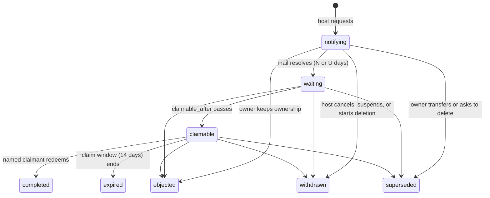

# Let a host replace a community owner who has left

**Status:** Draft (decisions resolved under the operator's "go with your picks", revised after spec review on 2026-09-28; decomposed into `03-tasks.json`)
**Author:** Claude (for DOR-2252)
**Date:** 2026-09-28

## Overview

A host can ask to replace the owner of a community. The owner is told by email, in the product, and on their DorkOS connection, and a waiting period runs. The owner can say no with one click from the email itself, with no sign-in, because an owner who has left often cannot sign in any more. If the owner can still sign in, they can also hand the community to someone themselves or delete it, where their community's state and their account allow. If the owner does not object, the account named in the request signs in and redeems a one-time claim. Ownership then moves in one transaction, exactly as a voluntary transfer would move it, and every step is recorded in both audit trails.

This is the online break-glass contract the tenancy contract deferred (`specs/community-tenancy-contract/02-specification.md:57`, ADR `260920-192429`). It adds optional outbound mail to the Community server, because notice that only lives inside a community never reaches an owner who has left it.

## Background / Problem Statement

A community has exactly one owner (`enforce_community_owner_lifecycle()`, migration `0014`). Ownership moves only when the owner transfers it (`POST /owner/transfer`, password-confirmed, `active` only). Host authority cannot change it: the tenancy contract says "There is no online host-operator path to replace a lost owner or mint membership in an existing community", and the only repair is to stop the service and edit the database.

For a hosted service this breaks a real case. An organization relies on a community; the person who created it leaves; their account is the owner; they do not answer, or will not transfer. Every member keeps working, but nobody can manage settings, admins, exports of the whole community, or deletion. The only path today is a support ticket that ends in a hand edit of production data, with no notice to the owner and no record members can see.

The host-operator spec already has a pattern for a destructive host power done honestly: host-started deletion needs a published notice at least 7 days out, keeps the owner's export open, runs a further cancellable window, and audits every step (ADR `260923-121712`). Replacing an owner needs the same shape, plus two things deletion did not: notice that reaches the owner outside the community, and a way for that owner to answer even when they can no longer sign in. The Community server has no password reset by email (`RECOVERY.md`), `/change-password` is disabled (`auth.ts`), and an owner who signed in through an organization's single sign-on loses that sign-in when the organization closes their account.

## Goals

- A host (a key with the new `communities:ownership` scope, or a host operator with their password) can request that the account named in the request become a community's owner.
- The current owner is notified by email, in the community, and on their DorkOS connection, and has a waiting period of at least 7 days, counted from when notice could first reach them, and 30 days whenever the address is not marked verified, the mail failed, the owner has objected before, a request was withdrawn in the last 30 days, or the reason is that the owner has left the group.
- The owner can object with one click from the email, without signing in, and with one step in the product, without a password, at any point before completion.
- After an objection the host cannot ask again for that community for a cooling-off period (default 90 days).
- Only the named claimant can complete it. On a host with single sign-on, the request must name an identity and only that account can accept.
- Completion is the same role swap as a voluntary transfer; the old owner stays a member.
- Every step is audited on the host plane and the tenant plane; members are told afterwards.
- The host never reads content, never learns member names or ids from this feature, and never gets a new route into the community.
- Hosts that do nothing see no change: without mail configured the feature is refused, and no email is ever sent.

## Non-Goals

- Deciding who may ask. The host decides; a hosted service decides in its own code.
- Any billing, plan, or pricing concept, and any change to `packages/cloud-api`.
- Replacing an owner in `pending_owner` (use `POST /host/communities/:id/owner-claims/reissue`), `suspended`, or `deletion_pending`.
- Changing admins, removing the old owner, or rebinding history.
- Reauthentication through the OIDC issuer (host-operator spec Open Question 5), and password reset by email. Both stay separate follow-ups; this spec works around their absence with the object-only link.
- Sending any other notice by mail (host deletion, takedown). The mail module makes it possible; each needs its own decision.
- A two-person rule on the host side.
- Time or effort estimates.

## Technical Dependencies

| Dependency                               | Version                     | Used for                                                                                                                                                                                                                                                                                                                                                                                                    |
| ---------------------------------------- | --------------------------- | ----------------------------------------------------------------------------------------------------------------------------------------------------------------------------------------------------------------------------------------------------------------------------------------------------------------------------------------------------------------------------------------------------------- |
| `nodemailer`                             | 10.0.1, exact               | SMTP delivery (`smtp:` with required STARTTLS, `smtps:`; a plain loopback relay is used as is). The newest release past the repo's 21-day dependency cooldown when built (the 7.x line this table first named was three majors old). The bare-CR fix in later releases is also enforced by our own `plainTextMail`, the only way to make a `ComposedMail`. New runtime dependency of `apps/community` only. |
| `smtp-server` (dev)                      | 3.19.9, exact               | an in-process SMTP fake for integration tests (accept, `4xx`, `5xx`, slow, STARTTLS offered or not). The newest release past the cooldown; it depends on the same nodemailer. Dev dependency only. Its `@types/smtp-server` 3.5.13 pulls `@types/nodemailer` 8.0.2, still inside the cooldown; it is types-only and dev-only, and accepted.                                                                 |
| `hono` 4.13.8, `better-auth` 1.7.5, `pg` | in repo                     | routes, sessions, the `databaseHooks.user.create` admission check, `account` rows with `providerId='oidc'`                                                                                                                                                                                                                                                                                                  |
| hand-written SQL migrations              | `apps/community/migrations` | new migrations after import (`0019`) and takedown (`0020`), each at the next free number when built, mirrored in `src/schema.ts`, listed in `src/migrate.ts`                                                                                                                                                                                                                                                |
| `zod` ^4.1.13                            | in repo                     | strict schemas in `@dorkos/shared/community-admin-wire` and `@dorkos/shared/community-wire`                                                                                                                                                                                                                                                                                                                 |

**Build order.** This work lands after the host-operator import migration (`0019`) and the takedown migration (`0020`). The takedown migration adds the `communities:takedown` scope, the host audit `system` actor kind, and the tenant audit `host` actor kind; this spec uses all three and adds none of them. Scope counts below are relative to `main` at build time, never a fixed number.

## Detailed Design

### Shared rules

- **Host authority stays content-blind.** Host routes here take and return ids, states, dates, a reason code, and the host's own reference. They never return a member id, name, handle, email, or any content. The owner's email is read by the mail worker at send time and never leaves the server except to the configured SMTP server.
- **Tenant first, lock first.** Every route that names a community resolves the UUID from the path (`404` for unknown or malformed), locks the community row `FOR UPDATE` before changing anything, and re-checks every gate under the lock.
- **Lock order.** community → `owner_replacements` row → token rows → member rows in id order → `"user"` row. The same order as owner transfer and owner claims, so replacement, transfer, deletion, claim, and erasure cannot deadlock.
- **One-time secrets.** Claim tokens and object tokens are 256 random bits (`randomToken()`), stored only as `hashSecret(token)`, never in a list, log, audit row, or error. A claim token is returned once to the host with `Cache-Control: no-store` and never emailed. An object token is only ever emailed to the owner (below).
- **Clock.** Every route and worker takes an injected `now()`, as `host-lifecycle.ts` does, so every date rule is testable.

### What actually protects the owner

The defences are the **notice**, the **wait**, and the **objection**, in that order. The claim link is not a barrier: the host that issues it can always issue it again, so a stolen host key with `communities:ownership` holds everything the link gives. The named single-sign-on identity is not a defence against a stolen key either: whoever holds the key chooses the identity, and anyone with an account at the issuer (or at any issuer that lets people sign up) can name their own. So against a stolen key or a phished host operator, the owner's protection on **every** host is the notice, the wait, and the one-click objection. What the named identity does stop is a leaked claim link being used by a stranger: the link works only for the account the request named. Operators are told both things plainly in `OPERATIONS.md`.

### States



Open states: `notifying`, `waiting`, `claimable`. Closed: `completed`, `objected`, `withdrawn`, `superseded`, `expired`. A closed replacement never reopens. At most one open replacement per community.

- **N** = `COMMUNITY_OWNER_REPLACEMENT_NOTICE_DAYS` (default 14, minimum 7, maximum 90).
- **U** = `COMMUNITY_OWNER_REPLACEMENT_UNREACHABLE_DAYS` (default 30, minimum 14, maximum 180, never below N; `parseConfig` refuses otherwise).
- **C** = `COMMUNITY_OWNER_REPLACEMENT_OBJECTION_COOLDOWN_DAYS` (default 90, minimum 30, maximum 365).
- The claim window is a constant 14 days (`OWNER_REPLACEMENT_CLAIM_DAYS`).

**Which wait applies.** N applies only when all of these hold: the notice was accepted by the mail server; the owner's account email is marked verified (`"user"."emailVerified" = true`, which a sign-in service such as the host's OIDC issuer, Google, or GitHub can set when it has confirmed the address; the Community server never sets it itself, because it sends no verification mail, so a password-only account is never verified); the community has never had an `objected` replacement; no replacement of the community was `withdrawn` in the 30 days before this request; and the reason is not `owner_left_group`. Otherwise U applies. Put plainly: a password account, a failed email, a request after an objection, a request within 30 days of a withdrawal, and every "the owner has left the group" request get the long wait. The last one is deliberate: an owner who has left is the owner whose address is most likely dead.

### Mail delivery (new, optional)

- **Configuration**, all or none, validated in `parseConfig`: `COMMUNITY_SMTP_URL` (`smtp://` or `smtps://`, credentials in the URL; `smtps:` or STARTTLS required unless the host is loopback) and `COMMUNITY_MAIL_FROM` (an RFC 5322 mailbox). Unset: the server sends nothing, exactly as today, and `GET /api/v1/host/capabilities` (new, scope `communities:read`) answers `{ mail: false, oidc }`. The startup log names whether mail is on, never the URL or credentials.
- **Outbox.** `notice_outbox(id uuid PK, community_id uuid NOT NULL FK, kind text CHECK IN ('owner_replacement.notice','owner_replacement.reminder','owner_replacement.claim_reissued','owner_replacement.ended','owner_replacement.completed'), subject_id uuid NOT NULL, recipient_user_id text NOT NULL, state text CHECK IN ('pending','accepted','failed'), attempts int NOT NULL DEFAULT 0, next_attempt_at timestamptz, lease_until timestamptz, accepted_at, failed_at, last_error_class text NULL CHECK (~ '^[A-Z][A-Z0-9_]{0,63}$'), created_at)`. A message is queued in the same transaction as the state change that causes it. The recipient's address is **not** stored; the worker reads `"user".email` when it sends, so an account erasure never leaves an address behind.
- **Worker.** One message at a time per replica (`FOR UPDATE SKIP LOCKED`, a lease), the cleanup backoff the other workers use, `last_error_class` only (never the server's reply text, which can echo the address). SMTP `2xx` for the whole message: **accepted**. Recipient `5xx`: **failed** at once (`SMTP_REJECTED`). `4xx`, timeout, or connection error: retried until 72 hours after `created_at`, then **failed** (`SMTP_UNAVAILABLE`). A recipient whose `"user"` row is gone or whose account erasure is open or done: **failed** at once (`RECIPIENT_UNAVAILABLE`), nothing sent. Accepted means "the mail server took it", and the product never says more.
- **Content.** Plain text, no tracking pixel, no link rewriting. Minimal on purpose: what is happening, the deadline, and how to object. It names the community and links to its canonical `/c/<uuid>` address; it never contains a claim token, the host's reason or reference, or anything from inside the community. The only secret a mail may carry is an **object-only link** (below). Copy is in "User Experience".
- **Deliverability.** `OPERATIONS.md` explains, without naming any provider, that the sender domain in `COMMUNITY_MAIL_FROM` should pass SPF and DKIM and be aligned under a DMARC policy, and that a host should watch its failed-notice count on the host page, because unaligned mail is often rejected or filtered and every rejection turns into a 30-day wait.
- **Retention.** A message row is deleted 30 days after it resolves, and with its community by the deletion worker.

### Object-only link

An owner who has left often cannot sign in: there is no password reset by email, `/change-password` is disabled, and an organization's single sign-on account may be closed. So the notice and the reminder each carry a link that can do exactly one thing: object.

- **Token.** `owner_replacement_object_tokens(id uuid PK, replacement_id uuid NOT NULL REFERENCES owner_replacements(id) ON DELETE CASCADE, community_id uuid NOT NULL, token_hash text NOT NULL UNIQUE, outbox_id uuid NULL, created_at, used_at NULL)`. The mail worker mints a token when it sends a notice or reminder, stores only its hash, and puts `<COMMUNITY_PUBLIC_URL>/keep-ownership#<token>` in the message. Each send attempt mints its own token, and the worker **never deletes** a minted token when an attempt fails: an SMTP timeout after the body was sent may still have delivered the message. Extra live tokens are harmless, because each can only object and all of them die with the request. The plaintext exists only in the message.
- **Power.** Object, and nothing else. It is not a session, cannot sign in, cannot read the community, and cannot transfer, delete, or export. Emailing it is safe because the only thing it can do keeps the status quo.
- **Single use and expiry.** A token is live while it is unused and its replacement is open. Using one marks it `used_at` and closes the replacement as `objected`, which makes every other token for that replacement dead too. It expires with the request: when the replacement closes for any reason, its tokens stop working (the check joins the replacement's state; the rows are deleted with the replacement's community).
- **Routes.** `POST /api/v1/owner-replacements/object-preflight { token }` (public, rate limited per caller) answers `{ communityName, claimableAfter }` for a live token, and one identical `403 FORBIDDEN` ("This link no longer works.") for anything else. `POST /api/v1/owner-replacements/object { token }` does the objection. A `GET` never objects, so a mail scanner that fetches the link changes nothing: the page at `/keep-ownership` reads the token from the fragment, preflights it, and asks the person to press **Keep ownership**. Replaying a used token for a replacement that is `objected` answers the same success page ("You kept ownership."); any other closed state answers "This request has already ended." with no further detail.
- **Audit.** Tenant `owner.replacement.objected` with `actor_kind='system'` and `changed_fields {via_link}` (no member id: the link proves only the mailbox); host `owner_replacement.objected` (`system`).

### Scope and authority

- New scope `communities:ownership` in `CommunityAdminHostApiKeyScopeSchema`, the key issue form, the offline `host-keys.js issue --scope`, and the `host_api_keys_scopes` check, which grows by exactly one over whatever `main` has at build time (after the takedown migration). `communities:lifecycle` does not imply it, as `communities:legal_hold` is not implied.
- A host operator's session may act, as on every host route, but the request that **starts** a replacement must carry that operator's `password` (`confirmPassword`, the budget API-key issuance uses). A host operator who signs in only through single sign-on has no password and must use a key with the scope; the host page says so. A key carries no password; its scope is the authorization. Cancelling needs no password; reissuing a claim needs none but notifies the owner (below).

### Host routes

All under `/api/v1/host`, JSON, strict schemas, `assertHostActor` inside every write transaction.

**`POST /host/communities/:id/owner-replacements`** (scope `communities:ownership`)

Body `CommunityAdminOwnerReplacementRequestSchema`:

- `idempotencyKey` (1–200), `lifecycleVersion`,
- `reason`: `'owner_left_group' | 'owner_unreachable' | 'other'`, shown to the owner inside the product (never in mail) as a fixed sentence,
- `reference`: the host's own pointer (a ticket or case number), 1–80 characters of `[A-Za-z0-9 ._#-]` (no `:` or `/`, so it can never read as a link), or `null`. Shown to the owner inside the product as quoted plain text, never as a link; never shown to admins or members; never in mail; never in an audit row.
- `claimant`: `{ oidcSubject: string (1–255) | null }`. When the host has OIDC configured, a subject is **required** (`400` without one). When it does not, a subject is refused (`409 STATE_CONFLICT`, "This host has no single sign-on to name an account with."). The server stores the subject together with the configured issuer URL (`claimant_oidc_issuer`).
- `password` when the actor is a person (refused with `400` when a key sends one).

Steps, in one transaction after the community lock:

1. Mail configured, else `409 NOTICE_DELIVERY_UNAVAILABLE` ("This host can't send email, so it can't give the owner notice. Set up mail first.").
2. Idempotency, scoped to the community: a row with the same `(community_id, actor, idempotencyKey)` and payload hash returns `200` with that replacement, `claimToken: null`, `replayed: true`. Same key, different hash: `409 IDEMPOTENCY_CONFLICT`.
3. Lifecycle `active`, `archived`, or `held`, and `lifecycleVersion` current; otherwise `409 STATE_CONFLICT`. `pending_owner` names the claim-reissue route in its message.
4. No open replacement: `409 OWNER_REPLACEMENT_OPEN` (the partial unique index is the backstop).
5. Cooling-off: if the community's most recent `objected` replacement ended less than C days ago, `409 OWNER_REPLACEMENT_COOLDOWN` with the date it ends ("The owner kept ownership on <date>. You can ask again after <date>."). Record `after_objection = true` when the community has any `objected` replacement, and `after_withdrawal = true` when one of its replacements was `withdrawn` within the last 30 days; either forces the U wait.
6. Lock the current owner's member row and their `"user"` row; record `prior_owner_member_id` (host-invisible).
7. Insert the replacement (`notifying`), the claim token hash, and one `owner_replacement.notice` outbox message to the owner.
8. Host audit `owner_replacement.request`. Tenant audit `owner.replacement.requested` (`actor_kind='host'`, `subject_id` the replacement id).

Response `201` (`200` on replay), `Cache-Control: no-store`: `{ replacement, claimToken: string | null, claimUrl: string | null, replayed }`. `claimUrl` is `<COMMUNITY_PUBLIC_URL>/owner-replacement#<token>` (a fragment, so the token never reaches a server log), `null` on replay.

**`GET /host/communities/:id/owner-replacements`** (scope `communities:ownership`): this community's replacements, newest first, at most 50: id, state, reason, reference, `claimantNamed` (boolean; the subject is never echoed), `requestedAt`, `requestedBy` (`person` display name or `api_key` prefix), `notice: { state, resolvedAt, verifiedAddress }`, `wait: 'standard' | 'long'`, `claimableAfter`, `claimExpiresAt`, `claimReissuedAt`, `endedAt`, and `cooldownUntil` on an `objected` row. No member data.

**`POST /host/communities/:id/owner-replacements/:replacementId/cancel`** (scope `communities:ownership`): any open state → `withdrawn`. Revokes the claim token. Queues `owner_replacement.ended`. Audits both planes. A closed replacement is `409 STATE_CONFLICT`. A withdrawal does not start a cooling-off.

**`POST /host/communities/:id/owner-replacements/:replacementId/claim-token`** (scope `communities:ownership`): reissues the claim in an open state. Revokes the old hash, stores a new one, returns it once, sets `claim_reissued_at`. It never moves a date. It **tells the owner**: an `owner_replacement.claim_reissued` email (with a fresh object-only link) and a line in the owner's banner ("The link for the new owner was sent again on <date>."). Host audit `owner_replacement.claim_token.reissue`; tenant audit `owner.replacement.claim_reissued` (`host`).

**Host projection.** `CommunityAdminHostProjectionSchema` gains `ownerReplacement: { replacementId, state, claimableAfter: timestamp | null } | null`, the open replacement only, visible to every host actor. Details stay behind `communities:ownership`.

**Capabilities.** `GET /host/capabilities` (scope `communities:read`) → `{ mail: boolean, oidc: boolean }`.

### Timeline worker

A job in the existing worker loop, `SKIP LOCKED`, per open replacement:

- **Notice resolves.** When the notice message is `accepted` or `failed`: `notice_state` set, `notice_resolved_at` set, `verified_address` recorded from `"user"."emailVerified"` at send time, `claimable_after = resolved_at + (N or U, per "Which wait applies")`, state `waiting`. The in-product banner and DorkOS notice show from `notifying` on, whatever the mail does.
- **Reminder.** 48 hours before `claimable_after`, queue `owner_replacement.reminder` once (`reminder_queued_at`). Its outcome never moves the date.
- **Claimable.** At `claimable_after`: state `claimable`, `claim_expires_at = claimable_after + 14 days`. No audit row: no person did anything; the host projection shows it.
- **Expired.** At `claim_expires_at` without a claim: `expired`, tokens dead, `owner_replacement.ended` email, audits on both planes.
- Every transition locks the community first and re-reads the replacement; a transition that lost a race to an objection, cancel, or completion does nothing.

### What the owner can actually do

The owner's options depend on the community's state and on their account, and every piece of copy (mail, banner, DorkOS) shows only what this owner can do now:

| Action         | Needs                                                                                                      | Available in                                                     |
| -------------- | ---------------------------------------------------------------------------------------------------------- | ---------------------------------------------------------------- |
| Keep ownership | the object-only link from the email, **or** a signed-in session (no password)                              | `active`, `archived`, `held`, in every open state of the request |
| Transfer       | a signed-in session and the account's password (`POST /owner/transfer`)                                    | `active` only (refused in `archived` and `held`, unchanged)      |
| Delete         | a signed-in session and the account's password (`POST /owner/deletion`, with the name and id confirmation) | every state the owner-deletion route accepts                     |

An owner whose account has no password (single sign-on only) can keep ownership but cannot transfer or delete until they add a password, and the copy says so. An owner who cannot sign in at all can still keep ownership through the email link. The mail builder and the banner compute the options at send or render time from the lifecycle and `hasPassword(account)`.

### Things that end an open replacement

Each runs inside the transaction that causes it, after its own locks, and writes `ended_at` and the state, kills every claim and object token, writes the audits listed under "Audit", and queues `owner_replacement.ended` to the owner unless the owner did it.

| Event                                                                                        | State        | Where                                                                              |
| -------------------------------------------------------------------------------------------- | ------------ | ---------------------------------------------------------------------------------- |
| Owner keeps ownership in the product (session) or from the email link (object token)         | `objected`   | new owner routes (below); starts the cooling-off                                   |
| Owner transfers ownership (`POST /owner/transfer`: `active`, session, password)              | `superseded` | `routes/members.ts`                                                                |
| Owner asks to delete the community (`POST /owner/deletion`: session, password, confirmation) | `superseded` | `routes/administration.ts`                                                         |
| Host suspends the community                                                                  | `withdrawn`  | `routes/host-lifecycle.ts`, beside the deletion-notice withdrawal                  |
| Host-started deletion, or a takedown's community deletion, enters `deletion_pending`         | `withdrawn`  | `routes/host-lifecycle.ts` and the takedown route                                  |
| Host cancels                                                                                 | `withdrawn`  | host route                                                                         |
| The claim window ends                                                                        | `expired`    | timeline worker                                                                    |
| The community is deleted by the worker                                                       | rows deleted | `deletion-worker.ts` deletes replacements, tokens, and outbox rows with the tenant |

A hold, a release, archive, restore, limits, short names, and a legal hold do not end it. In `held` and `archived` the owner's choices are keep ownership or delete; transfer is not available there.

### Owner and member routes (tenant plane)

**`GET /api/v1/communities/:communityId/owner-replacement`** (any active member; bearer grants allowed for the DorkOS read):

- Owner, while one is open: `{ open: { replacementId, state, reason, reference, requestedAt, claimableAfter, noticeState, claimReissuedAt, options: { keep: true, transfer: boolean, delete: boolean, needsPassword: boolean } } }`.
- Admins, while one is open: the same without `reference`, `claimReissuedAt`, and `options`.
- Every member, for 7 days after a completion: `{ completed: { newOwnerDisplayName, completedAt } }`.
- Otherwise `{ open: null, completed: null }`. Never mentions a legal hold, a host operator, a key, or the claimant.

**`POST /api/v1/communities/:communityId/owner-replacement/objection`** (the owner's browser session only; any bearer credential is `403 FORBIDDEN`; no password). Body `{ replacementId }`. Allowed in `active`, `archived`, and `held`. Open → `objected`. Idempotent for an already-objected replacement (`204`); any other closed state `409 STATE_CONFLICT`. Tenant audit `owner.replacement.objected` by the owner member; host audit `owner_replacement.objected` (`system`).

### Claim and completion

**`POST /api/v1/owner-replacements/preflight`** `{ token }` (public, rate limited like owner-claim preflight): finds an open replacement with that claim-token hash; sets a signed, `httpOnly`, `Lax`, 30-minute `community_owner_replacement` cookie; answers `{ communityId, communityName, state, claimableAfter, claimExpiresAt, requiresSingleSignOn }`. Unknown, revoked, or closed: one identical `403 FORBIDDEN` ("This ownership claim is unavailable.").

**Admission for a named person without an account.** `checkAdmission` in `auth.ts` (the `databaseHooks.user.create` and social sign-in checks, which today accept only the `community_bootstrap` and `community_admission` cookies) also accepts a live `community_owner_replacement` cookie whose replacement is `claimable` and before `claim_expires_at` in a community that is `active`, `archived`, or `held`. When the replacement names an identity, only an OIDC sign-up through the host's configured issuer is admitted (a password sign-up with that cookie is refused), and the new account must carry the named subject; the claim step checks it again.

**`POST /api/v1/owner-replacements/claim`** `{}` (session plus the cookie). One transaction:

1. `pg_advisory_xact_lock` on a constant distinct from owner claims; find the replacement by token hash without locking it; lock the community `FOR UPDATE`; lock the replacement.
2. State `claimable` and `now() < claim_expires_at`; `waiting` answers `409 STATE_CONFLICT` ("You can take ownership after <date>."). Lifecycle `active`, `archived`, or `held`.
3. When no identity is named but the host now has OIDC configured, refuse (`409 STATE_CONFLICT`, "This host now uses a sign-in service, so the host must ask again."); the host files a new request, with a fresh wait. When an identity is named: the host's configured issuer must still equal `claimant_oidc_issuer` (else `409 STATE_CONFLICT`, "This host's sign-in service changed, so this claim can't be used. Ask the host for a new request."); exactly one `account` row on the host has `providerId='oidc'` and `accountId = claimant_oidc_subject` (zero or more than one: `403 FORBIDDEN`); and that row belongs to the session's user (else `403 FORBIDDEN`, "Sign in with the account named in the request, then try again."). The cookie is kept after a `403` so the person can retry.
4. Lock the current owner's member row and, if the claimant has a membership, that row (id order). The claimant must not be the current owner (`409`, "You already own this community."). A leaving membership (`memberIsLeaving`) or an account with an open erasure (`accountErasureOpen`) is refused (`409`).
5. Swap: old owner `role='member'` (stays active); the claimant's active row becomes `owner`, or an inactive row of theirs is reactivated as owner, or a new row is inserted as owner with `mintHandle` and its `community_handles` row. Bump `lifecycle_version`. The old owner's queued or building owner-scope exports end `cancelled` (`endExportJob`); a ready one is already refused by `hasExportAuthority`.
6. Replacement `completed`, `new_owner_member_id` set, claim token consumed, object tokens dead. Audits as below. Queue `owner_replacement.completed` to the old owner.

Response `{ community: { id, name }, memberId }`, `no-store`, cookie dropped; the browser opens Settings.

**Credentials.** None are revoked: the old owner stays a member, exactly as after a transfer, so their connections, agents, and sessions keep member access. Owner authority ends with the role, because every owner-only route re-reads the live role under a lock, and their owner-scope exports end as above. This is the credential answer the tenancy contract asked a break-glass flow to give.

Nothing else changes at completion: every other member, admin, invitation, connection, agent, file, and channel stays as it was.

**Pairwise subject identifiers.** Some issuers give each relying party a different `sub` for the same person. The subject in a request must be the one the issuer gives **this host's** client, not one seen by another application. `OPERATIONS.md` says so, and says that a host whose issuer is pairwise gets the right value from its own records (for example a prior sign-in by that person on this host) or from the issuer's administration tools.

### Audit

The host plane never records a member id, name, email, subject, or the reference. The tenant plane uses the member when a member acted, `host` when the host acted, and `system` otherwise.

| Transition                          | Host audit action (actor)                            | Tenant audit action (actor)                                                                   |
| ----------------------------------- | ---------------------------------------------------- | --------------------------------------------------------------------------------------------- |
| Request                             | `owner_replacement.request` (person or key)          | `owner.replacement.requested` (`host`)                                                        |
| Claim reissued                      | `owner_replacement.claim_token.reissue` (person/key) | `owner.replacement.claim_reissued` (`host`)                                                   |
| Notice resolves, becomes claimable  | none                                                 | none                                                                                          |
| Objected in the product             | `owner_replacement.objected` (`system`)              | `owner.replacement.objected` (the owner member)                                               |
| Objected from the email link        | `owner_replacement.objected` (`system`)              | `owner.replacement.objected` (`system`, `changed_fields {via_link}`)                          |
| Superseded by transfer or deletion  | `owner_replacement.superseded` (`system`)            | `owner.replacement.superseded` (the owner member)                                             |
| Withdrawn by cancel                 | `owner_replacement.cancel` (person or key)           | `owner.replacement.withdrawn` (`host`)                                                        |
| Withdrawn by suspension or deletion | `owner_replacement.withdrawn` (`system`)             | `owner.replacement.withdrawn` (`host`)                                                        |
| Expired                             | `owner_replacement.expired` (`system`)               | `owner.replacement.expired` (`system`)                                                        |
| Completed                           | `owner_replacement.complete` (`system`)              | `owner.replace` (`host`; prior and next owner member ids, `changed_fields {owner_member_id}`) |

### Wire schemas

In `packages/shared/src/community-admin-wire.ts` (host plane, strict):

```ts
/** Why a host asked to replace an owner. Shown to the owner in the product as a fixed sentence. */
export const CommunityAdminOwnerReplacementReasonSchema = z.enum([
  'owner_left_group',
  'owner_unreachable',
  'other',
]);
export const CommunityAdminOwnerReplacementStateSchema = z.enum([
  'notifying',
  'waiting',
  'claimable',
  'completed',
  'objected',
  'withdrawn',
  'superseded',
  'expired',
]);
export const CommunityAdminOwnerReplacementRequestSchema = z.strictObject({
  idempotencyKey: z.string().min(1).max(200),
  lifecycleVersion: version,
  reason: CommunityAdminOwnerReplacementReasonSchema,
  reference: z
    .string()
    .regex(/^[A-Za-z0-9 ._#-]{1,80}$/)
    .nullable(),
  claimant: z.strictObject({ oidcSubject: z.string().min(1).max(255).nullable() }),
  password: z.string().min(1).optional(), // required for a person, refused for a key
});
/** Host view of one replacement. Never a member id, name, email, or the OIDC subject. */
export const CommunityAdminOwnerReplacementSchema = z.strictObject({
  replacementId: id,
  communityId: id,
  state: CommunityAdminOwnerReplacementStateSchema,
  reason: CommunityAdminOwnerReplacementReasonSchema,
  reference: z.string().nullable(),
  claimantNamed: z.boolean(),
  requestedAt: timestamp,
  requestedBy: z.strictObject({ kind: z.enum(['person', 'api_key']), label: z.string() }),
  notice: z.strictObject({
    state: z.enum(['pending', 'accepted', 'failed']),
    resolvedAt: timestamp.nullable(),
    verifiedAddress: z.boolean().nullable(),
  }),
  wait: z.enum(['standard', 'long']).nullable(),
  claimableAfter: timestamp.nullable(),
  claimExpiresAt: timestamp.nullable(),
  claimReissuedAt: timestamp.nullable(),
  endedAt: timestamp.nullable(),
  cooldownUntil: timestamp.nullable(), // set on an objected replacement
});
export const CommunityAdminOwnerReplacementCreateResponseSchema = z.strictObject({
  replacement: CommunityAdminOwnerReplacementSchema,
  claimToken: z.string().min(1).nullable(), // once; null on replay
  claimUrl: z.url().nullable(),
  replayed: z.boolean(),
});
export const CommunityAdminOwnerReplacementListSchema = z.strictObject({
  replacements: z.array(CommunityAdminOwnerReplacementSchema).max(50),
});
export const CommunityAdminOwnerReplacementClaimTokenSchema = z.strictObject({
  replacementId: id,
  claimToken: z.string().min(1),
  claimUrl: z.url(),
});
export const CommunityAdminHostCapabilitiesSchema = z.strictObject({
  mail: z.boolean(),
  oidc: z.boolean(),
});
```

`CommunityAdminHostApiKeyScopeSchema` gains `'communities:ownership'`, and the scope array maximum grows by one over `main` at build time. `CommunityAdminHostProjectionSchema` gains `ownerReplacement`.

In `packages/shared/src/community-wire.ts` (tenant and public plane, strict): the notice read schema (with `options`), `CommunityWireOwnerReplacementObjectionRequestSchema` (`{ replacementId }`), object-preflight and object request and response schemas (`{ token }`), claim preflight and claim schemas, and route constants beside `ownerClaimPreflight`. `CommunityWireErrorCodeSchema` gains `NOTICE_DELIVERY_UNAVAILABLE`, `OWNER_REPLACEMENT_OPEN`, and `OWNER_REPLACEMENT_COOLDOWN`.

`packages/cloud-api` does not change. A hosted service calls these host routes with its own key; the DorkOS app already renders a service's generic community `notice`. A later in-app flow is a contract-first change in its own issue.

### Data model

Two migrations, both after `0020` (takedown), each at the next free number when built:

- **Mail (task 1.1):** `notice_outbox` and its index on `(state, next_attempt_at)`.
- **Replacement (task 2.1):**
  - `host_api_keys_scopes`: the subset gains `communities:ownership` and the cardinality ceiling grows by one over `main`'s.
  - `owner_replacements(id uuid PK, community_id uuid NOT NULL REFERENCES communities(id), state text NOT NULL CHECK (…eight…), reason text NOT NULL CHECK (…three…), reference text NULL CHECK (reference ~ '^[A-Za-z0-9 ._#-]{1,80}$'), claimant_oidc_issuer text NULL, claimant_oidc_subject text NULL CHECK (length BETWEEN 1 AND 255), claim_token_hash text NULL UNIQUE, claim_reissued_at timestamptz NULL, requested_by_host_actor text NOT NULL CHECK (~ '^(person|api_key):'), idempotency_actor text NOT NULL, idempotency_key text NOT NULL, payload_hash text NOT NULL, after_objection boolean NOT NULL, after_withdrawal boolean NOT NULL, prior_owner_member_id uuid NOT NULL, new_owner_member_id uuid NULL, notice_state text NOT NULL DEFAULT 'pending' CHECK IN ('pending','accepted','failed'), notice_resolved_at timestamptz NULL, verified_address boolean NULL, claimable_after timestamptz NULL, reminder_queued_at timestamptz NULL, claim_expires_at timestamptz NULL, requested_at timestamptz NOT NULL, ended_at timestamptz NULL)`, with:
    - `UNIQUE (community_id, idempotency_actor, idempotency_key)`;
    - a partial unique index `ON owner_replacements(community_id) WHERE state IN ('notifying','waiting','claimable')`;
    - an index on `(community_id, ended_at DESC) WHERE state = 'objected'` for the cooling-off check;
    - composite tenant foreign keys `(community_id, prior_owner_member_id)` and `(community_id, new_owner_member_id)` to `members(community_id, id)`;
    - `(claimant_oidc_issuer IS NULL) = (claimant_oidc_subject IS NULL)`;
    - shape checks: `claimable_after` is null in `notifying` and set in `waiting` and `claimable` (a replacement closed before its notice resolved keeps it null); `claim_expires_at` is set in `claimable` and `completed`; `ended_at` is set exactly in the closed states; `new_owner_member_id` is set exactly in `completed`; `claim_token_hash` is null in every closed state.
  - `owner_replacement_object_tokens` as above.
- The deletion worker deletes replacements, tokens, and outbox rows with the tenant. Member erasure leaves `owner_replacements` alone: it references member rows, which erasure husks rather than deletes.

### Code structure

| Path                                                                                                                                                                      | Change                                                                             |
| ------------------------------------------------------------------------------------------------------------------------------------------------------------------------- | ---------------------------------------------------------------------------------- |
| `apps/community/src/mail/transport.ts`, `outbox.ts`, `worker.ts`, `messages.ts` (new)                                                                                     | SMTP transport, outbox writes, delivery worker, plain-text messages                |
| `apps/community/src/config.ts`                                                                                                                                            | the five new keys and their cross-checks                                           |
| `apps/community/src/owner-replacement/state.ts`, `end.ts`, `worker.ts`, `object-tokens.ts`, `options.ts` (new)                                                            | transitions, the shared end helper, the timeline job, object tokens, owner options |
| `apps/community/src/routes/host-owner-replacements.ts` (new)                                                                                                              | host routes and capabilities                                                       |
| `apps/community/src/routes/owner-replacement.ts` (new)                                                                                                                    | notice read, objection (session and link), preflights, claim                       |
| `apps/community/src/auth.ts`                                                                                                                                              | `checkAdmission` accepts a live claimable replacement cookie                       |
| `apps/community/src/routes/members.ts`, `routes/administration.ts`, `routes/host-lifecycle.ts`, `deletion-worker.ts`                                                      | call the end helper; delete rows with the tenant                                   |
| `apps/community/src/host/communities.ts`                                                                                                                                  | projection field                                                                   |
| `apps/community/src/main.ts`, `browser/BrowserRoot.tsx`                                                                                                                   | serve and route `/owner-replacement` and `/keep-ownership` (both reserved names)   |
| `apps/community/src/browser/components/OwnerReplacementBanner.tsx`, `OwnerReplacementClaim.tsx`, `KeepOwnership.tsx`, `HostOwnerReplacement.tsx` (new), `HostApiKeys.tsx` | banners, claim page, object-link page, host section, scope checkbox                |
| `apps/server/src/services/communities/remote/` and the client community row                                                                                               | the owner's notice on their DorkOS connection                                      |
| `packages/shared/src/community-admin-wire.ts`, `community-wire.ts`                                                                                                        | schemas above                                                                      |

## User Experience

All copy follows `writing-for-humans`. No copy mentions a plan, price, billing, a legal hold, or who at the host acted. Copy says "the account named in the request", never who asked or why they are entitled to.

**Host page (`/host`, a community's record).** A section "Owner". With nothing open: "No change requested." and **Replace the owner**. The form has reason (three choices), reference, and, for a person, password. When single sign-on is on, it also has a required field "Sign-in ID of the new owner" with the help text "The ID your sign-in service gives this person for this site. Only that account can accept." When mail is off, the button is disabled with "This host can't send email, so it can't give the owner notice. Set up mail first." A host operator without a password sees "Use a host API key with the ownership scope to do this." After submitting, the page shows the claim link once with a copy button and "Send this link to the new owner. It works only after the waiting period, and only once." During a cooling-off the button is disabled with "The owner kept ownership on <date>. You can ask again after <date>."

Each request row says, in words:

- `notifying`: "Sending the notice to the owner."
- `waiting`, mail accepted, standard wait: "The owner's mail server accepted the notice on <date>. The owner has until <date>."
- `waiting`, long wait: "The owner has until <date>." plus the reason for the long wait: "The notice couldn't be delivered by email." / "The owner's email address was never confirmed." / "The owner kept ownership before, so this request has the longer wait." / "An earlier request was withdrawn less than 30 days ago, so this one has the longer wait." / "Requests saying the owner has left always have the longer wait."
- `claimable`: "The new owner can accept until <date>."
- `completed`: "The new owner accepted on <date>."
- `objected`: "The owner kept ownership on <date>. You can ask again after <date>."
- `withdrawn`: "Withdrawn on <date>." (with "by you", "because the community was suspended", or "because the community is being deleted")
- `superseded`: "Ended on <date> because the owner handed the community to someone or asked to delete it."
- `expired`: "The new owner didn't accept in time. Ended on <date>."

Open rows have **Cancel** and **Send the claim link again** (the confirm says "The owner will be told that the link was sent again.").

**The owner, by email.** Minimal on purpose: what is happening, the deadline, how to object. Subject: "Someone asked to take over <community>".

> The host of <community> has been asked to make someone else its owner.
> If you do nothing, that can happen on or after <date>.
> To keep ownership, open this link and press Keep ownership. You don't need to sign in: <object-only link>
> [only when the owner has a password and the community is active] If you can sign in, you can also hand the community to someone yourself from its Settings: <community link>
> [only when the owner has a password] If you can sign in, you can also delete the community from its Settings.

The reminder is the same with "in 2 days". "Claim link sent again" says: "The host sent the link for the new owner again. Nothing else changed. The earliest date is still <date>." plus the object-only link. Endings: "The host withdrew its request. Nothing changed.", "The request expired. Nothing changed.", and on completion "<new owner name> is now the owner of <community>. You are still a member."

**The object-only link page (`/keep-ownership`).** "Keep ownership of <community>? The host's request will end. The host can ask again after 90 days [the configured C], and you'll be told again." One button, **Keep ownership**. Then: "You kept ownership. The host has been told." A dead link: "This link no longer works."

**The owner, in the community.** A banner on every page, above the hold banner if both apply: "The host has been asked to make someone else the owner of this community. Unless you keep ownership, that can happen on or after <date>." Buttons: **Keep ownership** (confirm as on the link page) and **What this means**, a panel with the reason sentence, the reference as quoted plain text ("The host's reference: "ABC-123""), and only the options this owner has, from the table above: "You can hand the community to someone yourself." (active, has a password), "You can delete the community." (has a password), or "To hand it to someone or delete it, add a password to your account first." (no password). A reissued claim adds "The link for the new owner was sent again on <date>."

Reason sentences: "The host was told you've left the group this community belongs to." / "The host couldn't reach you." / "The host didn't give a specific reason."

**Admins** see: "The host has been asked to make someone else the owner. The owner has until <date> to respond."

**Every member**, for 7 days after completion: "The host made <name> the owner of this community on <date>." Dismissible, remembered per browser.

**The new owner.** The claim link opens `/owner-replacement`. Before the date: "You can take ownership of <community> on or after <date>. Keep this link." At the date: sign in, or create an account (through the named sign-in service when the request names one), then **Take ownership** with the confirm "You'll become the owner of <community>. The current owner stays a member." Errors, one plain sentence each: "This ownership claim is unavailable.", "Sign in with the account named in the request, then try again.", "This host's sign-in service changed, so this claim can't be used. Ask the host for a new request.", "You already own this community.", "This account is being deleted, so it can't take ownership."

**DorkOS app.** On the owner's installation, the community's row shows a warning dot and the community header shows the owner banner text with **Open community** (opens the browser, where keeping ownership in the product lives; the email link also works). One notification when a request is first seen, and one when it completes. Nothing for non-owners.

## Testing Strategy

Real Postgres (`vitest.pg.config.ts`) and the in-process SMTP fake for everything in `apps/community`. Each test carries a purpose comment and names the failure it would catch.

### Acceptance criteria that discriminate

- **AC-1 Scope.** A key with every other scope gets `403` on every host replacement route; a key with only `communities:ownership` succeeds; a person without `password` gets `400`, with a wrong one `403 REAUTH_FAILED`; an SSO-only operator gets `403 PASSWORD_REQUIRED`. Fails if lifecycle implies ownership or a person skips reauthentication.
- **AC-2 No mail, no replacement.** With mail unset, the request is `409 NOTICE_DELIVERY_UNAVAILABLE`, writes no row, and capabilities says `mail: false`; the SMTP fake receives nothing from any test that leaves mail unset.
- **AC-3 Idempotency and one at a time.** Replaying the same key and body for the same community returns the same replacement with `claimToken: null` and queues no second message; the same key for a different community is an independent request; a different body under the key is `409 IDEMPOTENCY_CONFLICT`; a second open request is `409 OWNER_REPLACEMENT_OPEN`; two concurrent requests produce exactly one row (barrier).
- **AC-4 The right wait.** With injected clocks: an account whose email is marked verified, with accepted mail and reason `owner_unreachable`, gets `claimable_after` = acceptance + N, not request + N; a password-only account (unverified) with accepted mail gets U; `550` gets failure + U at once; `421` for 72 hours fails then and gets U; with verified, accepted mail, each of these still gets U: a request after an earlier objection, a request filed 29 days after a withdrawal (and N again at 31 days), and reason `owner_left_group`. Fails if any case gets the short wait.
- **AC-5 Config bounds.** `NOTICE_DAYS=6`, `UNREACHABLE_DAYS=13`, `UNREACHABLE_DAYS` below `NOTICE_DAYS`, `OBJECTION_COOLDOWN_DAYS=29`, a plain non-loopback `smtp:` URL without STARTTLS, and only one of the two mail keys each fail `parseConfig`.
- **AC-6 No early claim.** A valid claim in `notifying` or `waiting` gets `409` with the date and changes nothing; one minute after `claimable_after` it succeeds.
- **AC-7 Named identity.** With OIDC on, a request without a subject is `400`. At claim: an account with no OIDC link, one linked to a different subject, a subject matched by two account rows (fixture), and a host whose configured issuer changed since the request are each refused and change nothing; the cookie survives the `403`s; the one account linked to the subject succeeds. With OIDC off, a subject in the request is `409`. A request filed with OIDC off (no identity) whose host turns OIDC on before the claim is refused at claim time (`409 STATE_CONFLICT`, "This host now uses a sign-in service, so the host must ask again.") and changes nothing; a new request then runs a fresh wait.
- **AC-8 Completion equals transfer.** Exactly one active owner (the claimant); the old owner is an active `member` with the same connections, agents, and handle; an existing claimant member keeps their id; a non-member claimant gets a new member with a unique handle; `lifecycle_version` bumped; lifecycle unchanged (including `held`); every other member row, grant, agent, invitation, channel, and entry count identical before and after; the old owner's queued owner export is `cancelled` and a ready one answers `403`.
- **AC-9 Everything that ends it.** In each open state: objection in the product and objection by link → `objected`; transfer (in `active`, with password) and a deletion request → `superseded`; suspension, host-started deletion → `withdrawn`; cancel → `withdrawn`. After each, the claim preflight and every object token are dead. Objection in the product works for an SSO-only owner with no password, refuses a connection-grant bearer and an agent credential with `403`, and refuses an admin.
- **AC-10 Lifecycle gates.** Request refused in `pending_owner`, `suspended`, `deletion_pending`; accepted in `active`, `archived`, `held`; objection accepted in `held`; transfer still refused in `held`.
- **AC-11 Legal hold is invisible and irrelevant.** Under a legal hold, request, objection, and completion behave identically, and no tenant response, captured email, or banner mentions it.
- **AC-12 Erasure.** A claimant with an open account erasure, or a leaving membership, is refused; the owner cannot erase while owner (unchanged) and can after completion; an erasure request racing the claim's member lock (barrier) never leaves two owners or none. A notice whose recipient's account is erased before sending fails with `RECIPIENT_UNAVAILABLE` and sends nothing.
- **AC-13 Audit.** For each transition in the "Audit" table, the host plane gets exactly the listed row (or none) with the listed actor kind, and the tenant plane gets exactly the listed row (or none) with the listed actor; a JSON and column scan of every host audit row finds no member id, subject, reference, or email.
- **AC-14 Host stays content-blind.** Every host response in this feature contains no member id, name, handle, email, OIDC subject, or content; the claim preflight gives only the community name; the existing tenancy and administration isolation suites pass unchanged.
- **AC-15 Mail content.** Every captured message is plain text, names the community, carries UTC dates with the day spelled out, links to `/c/<uuid>`, and contains no claim token, no reason, no reference, no legal-hold wording, and nothing from inside the community. Only notice, reminder, and claim-reissued messages carry an object-only link. The transfer sentence appears only when the owner has a password and the community is `active`; the delete sentence only when the owner has a password. The outbox never stores an address; `last_error_class` never contains reply text.
- **AC-16 Expiry.** A claimable replacement not claimed within 14 days becomes `expired`, emails the owner, and its tokens fail.
- **AC-17 Isolation.** Community B is unchanged by every step of a replacement in A; A's claim and object tokens are refused against B.
- **AC-18 Members are told.** For 7 days after completion every member's notice read returns `completed` with the new owner's display name, and afterwards `null`; before completion non-admin members see nothing.
- **AC-19 Object-only link.** A send that times out after the body was accepted by the fake (so the message was delivered) is retried and delivered again; both messages' links still object (the first use ends the request, the second answers the same success). Also: A live object token objects without a session and ends the request; a `GET` of `/keep-ownership#<token>` and of the preflight changes nothing; the token cannot be used as a session, a claim, a grant, or on any other route (each `401`/`403`); a second use of the same token after objection returns the same success and writes no second audit row; a token from a withdrawn or expired request answers "This request has already ended."; tokens are stored only as hashes (column scan).
- **AC-20 Cooling-off.** After an objection, a new request within C days is `409 OWNER_REPLACEMENT_COOLDOWN` with the end date; one minute after C days it is accepted and gets U (AC-4). A withdrawal, expiry, or supersession starts no cooling-off.
- **AC-21 Reissue tells the owner.** Reissuing the claim link queues exactly one `claim_reissued` email with a fresh object token, shows the reissue line in the owner's banner, writes the host and tenant audit rows, kills the old claim token, and moves no date.
- **AC-22 A named person can sign up.** With OIDC on and a request naming a subject: a person with no account who preflights the claim and signs up through the issuer with that subject is admitted and can claim; a password sign-up with the same cookie is refused; a sign-up with the cookie while the request is `waiting`, expired, or objected is refused. With OIDC off: a password sign-up with a live claimable cookie is admitted. Without the cookie, sign-up is refused as today.

### Other tests

- Unit: the state table, the wait rule (every combination of accepted, verified, and after-objection), the owner-options rule, reason sentences, date formatting, config parsing, SMTP error classification.
- Browser (`apps/community/browser-tests`, `acceptance/run.sh`): the host section with a row in each state (including failed mail, expired, withdrawn, superseded, and cooling-off) with the exact sentences; owner banner with each option combination; admin banner; the object-link page; the claim page before and after the date; the member notice. Axe checks on each, at phone and desktop widths.
- DorkOS: the remote client parses the notice read; the row renders the warning for an owner and nothing for a member.
- The deployment smoke test still runs with every DorkOS host blocked, mail unset, and OIDC unset.

### Mocking strategy

Real Postgres; the `smtp-server` fake in process (accept, `421`, `550`, hang); OIDC through the existing in-process fake issuer; DorkOS with a mock `Transport` and a fixture Community server. No test sends real mail.

## Performance Considerations

- One indexed read per worker tick for due replacements and due messages; replacements are rare and human-scale.
- The DorkOS notice read rides the existing per-connection budget (`COMMUNITY_ATTENTION_BUDGET_MS`) and is cached like the counts; a slow Community shows no notice rather than a stale one.
- SMTP sends happen outside any database transaction; a slow mail server holds a lease, never a row lock.

## Security Considerations

- **Takeover is the core risk, and the defences are notice, wait, and objection.** A stolen key with `communities:ownership`, or a phished host operator, can start a request and can always reissue a claim link, so the link itself is not a defence. What stops a takeover is that the owner is told by email, in the product, and in DorkOS; that they have at least 7 days (30 for any unverified address, any failed mail, and every request after an objection); and that they can end it with one click from the email without signing in. The named identity does not help here, because the key chooses it; it only stops a leaked claim link being used by a stranger. A reissued link is announced to the owner. The scope is its own, so a host can withhold it from every key that does not need it.
- **An owner who objects wins.** There is no override. The cooling-off stops the host from wearing the owner down with repeated requests, and every later request gets the long wait. A real dispute is settled outside the product; offline repair stays documented in `RECOVERY.md` as the last resort.
- **The object-only link** can do one thing that preserves the status quo. Mail forwarding, a scanner, or a shared mailbox can at worst keep things as they are. It never signs anyone in and never reaches content.
- **Honest delivery.** "Accepted by the mail server", never "read". Unverified addresses and failures lengthen the wait instead of pretending.
- **Secrets and privacy.** Claim tokens never go in mail and live in URL fragments; object tokens only in mail and URL fragments; both hashed at rest. The outbox stores no address and no SMTP reply text. Mail carries no content, reason, reference, or claim token. The host plane sees no member identity. The reference cannot form a link.
- **Enumeration.** Both preflights answer one identical `403` for every unusable token, give only the community name for a live one, and are rate limited per caller.
- **Admission.** The replacement cookie admits a sign-up only while the request is claimable, and only through the named issuer when an identity is named; it creates an account, never a membership, until the claim transaction.
- **SMTP.** TLS required off loopback; credentials only in configuration; never logged.

## Documentation

- `apps/community/API.md`: the scope, host routes, capabilities, tenant notice and objection, the object-only link routes, claim routes, error codes.
- `apps/community/OPERATIONS.md`: setting up mail and deliverability (SPF, DKIM, DMARC alignment of the sender domain, watching failed notices), with no provider named; when to replace an owner and when not to; what the owner and members see; the real defences (notice, wait, objection on every host, against a stolen key or phished operator) and why neither the claim link nor the named identity is one against a stolen key, while the named identity does stop a stranger using a leaked link; the cooling-off; naming an account with single sign-on, pairwise subject identifiers, and that SSO-only host operators must use a key.
- `apps/community/DEPLOYMENT.md` and `README.md`: the five configuration keys; mail stays off by default.
- `apps/community/RECOVERY.md`: offline repair is the last resort after the online path.
- `docs/` (Communities guide): "If someone asks to take over your community", written with `writing-for-humans`.
- Changelog fragments per user-facing task in `changelog/unreleased/`.

## Implementation Phases

- **Phase 1 — Mail.** Optional SMTP, the outbox, the worker, configuration, capabilities.
- **Phase 2 — The contract on the server.** Schemas, migration, scope; host routes; the timeline worker, object-only link, and end hooks; objection, admission, claim, and completion.
- **Phase 3 — People.** The Community browser and the DorkOS owner notice; the owner guide.

### Backout

- **Phase 1:** unset the mail keys; revert the code; the outbox table is ignored.
- **Phase 2:** cancel every open replacement first, then revert. The migration stays: old code ignores the tables and never writes the new scope. A completed replacement is an ordinary owner change old code already understands.
- **Phase 3:** revert the UI; the server routes keep working for keys.

## Open Questions

None open. Resolved while specifying, under the operator's standing instruction, and revised after spec review (2026-09-28):

1. ~~**Who can start it?**~~ (RESOLVED) **Answer:** a key with `communities:ownership`, or a host operator with their password; SSO-only operators use a key. **Rationale:** the most sensitive host power gets its own scope, following `communities:legal_hold`.
2. ~~**Who can become owner?**~~ (RESOLVED) **Answer:** the signed-in holder of the claim; on a host with single sign-on the request must name an identity (issuer and subject stored together, exactly one matching account); never the current owner. A named person without an account may sign up through the claim. **Rationale:** the host cannot see members; the issuer subject is the only real proof of who should own it.
3. ~~**Notice channel?**~~ (RESOLVED) **Answer:** SMTP mail configured by the host, required, plus in-product and DorkOS notices. **Rationale:** an owner who left does not read the community; a webhook could claim delivery that never happened.
4. ~~**How can an owner who cannot sign in answer?**~~ (RESOLVED, spec review) **Answer:** an object-only link in the notice, reminder, and reissue emails; hashed at rest, single use, dead when the request closes. **Rationale:** no password reset by email, `/change-password` disabled, and closed SSO accounts would otherwise leave the owner voiceless; objecting only keeps the status quo, so the link is safe to email.
5. ~~**Waiting period?**~~ (RESOLVED, revised) **Answer:** from when mail resolves; N (default 14, 7–90) only for accepted mail to a verified address with no earlier objection; U (default 30) otherwise; claim window 14 days. **Rationale:** a password account's address was never confirmed, so it gets the long wait; repeat requests, requests soon after a withdrawal, and "the owner has left" requests get it too.
6. ~~**Can the host re-ask after an objection?**~~ (RESOLVED, spec review) **Answer:** not for C days (default 90, minimum 30), and then always with the long wait. **Rationale:** stops a host wearing an owner down.
7. ~~**Is the claim link a defence?**~~ (RESOLVED, spec review) **Answer:** no; the defences are notice, wait, and objection. On SSO hosts the named identity is required; it stops a leaked link being used by a stranger, but not a stolen key, which picks the identity. A reissued link is announced to the owner and audited. **Rationale:** whoever can issue the link can reissue it and name any identity.
8. ~~**Old owner's role?**~~ (RESOLVED) **Answer:** `member`, as in a transfer.
9. ~~**Owner options in copy?**~~ (RESOLVED, spec review) **Answer:** computed per owner: keep always; transfer only in `active` with a password; delete only with a password. **Rationale:** copy must not offer what the owner cannot do.
10. ~~**Holds, legal hold, erasure, deletion, imports, suspension?**~~ (RESOLVED) **Answer:** see the lifecycle and "end" tables.
11. ~~**Must the host hold the community first?**~~ (RESOLVED) **Answer:** no.
12. ~~**Do members learn of a pending request?**~~ (RESOLVED) **Answer:** admins do; every member learns of a completion for 7 days.
13. ~~**Cloud contract?**~~ (RESOLVED) **Answer:** no change to `packages/cloud-api`.
14. ~~**Launch blocker?**~~ (RESOLVED) **Answer:** no. The hosted launch ships with the warning to transfer first and the owner's own transfer.

## Related ADRs

- `260929-012844` — A host may replace a community owner only through a noticed, objectable, time-delayed claim (proposed, from this spec; amends `260920-192429`)
- `260929-012845` — The Community server sends mail only when a host configures SMTP, through a durable outbox that stores no address (proposed, from this spec)
- `260920-192429` — Scope host accounts through immutable community memberships (its "lost-owner repair is offline" sentence is amended)
- `260923-121150` — Host API keys are scoped host credentials that never reach community content
- `260923-121712` — A host hold stops growth without blocking export, and host-started deletion follows only a noticed hold (the notice precedent)
- `260924-215422` — A host legal hold silently blocks every permanent deletion of a community until released

## References

- DOR-2252 — this specification
- `specs/community-host-operator-api/02-specification.md` (host keys, hold, host-started deletion, legal hold, owner claims, OIDC, import)
- `specs/community-host-takedown/02-specification.md` (the `communities:takedown` scope, `system` and `host` audit actors)
- `specs/community-tenancy-contract/02-specification.md` (the offline-only rule this amends)
- `specs/community-member-erasure/`, `specs/community-hold-keeps-access/`
- `apps/community/src/auth.ts` (`checkAdmission`, disabled `/change-password`), `routes/members.ts`, `routes/owner-claims.ts`, `routes/host-lifecycle.ts`, `routes/administration.ts`, `host/authority.ts`, `exports/authority.ts`, `erasure/guards.ts`, `oidc.ts`, `password-confirmation.ts`, `RECOVERY.md`
- RFC 5321 (SMTP reply classes), RFC 5322 (mailbox syntax), RFC 7208 (SPF), RFC 6376 (DKIM), RFC 7489 (DMARC), OpenID Connect Core 1.0 §8 (pairwise subject identifiers)

## Changelog

- **2026-09-29** — Task 1.1 (DOR-2537): pinned `nodemailer` 10.0.1 and `smtp-server` 3.19.9, the newest releases past the 21-day dependency cooldown, instead of "latest 7.x".

- **2026-09-28** — Delta review: minted object-only tokens are never deleted on a failed send (a timeout may still deliver); the named identity is no longer called a defence against a stolen key, only against a stranger using a leaked link; a claim with no named identity is refused once the host turns single sign-on on; requests within 30 days of a withdrawal and every `owner_left_group` request get the long wait; "verified" names the sign-in services that can set it.

- **2026-09-28** — Spec review: object-only link in notice emails; 90-day cooling-off after an objection and the long wait for every later request; the claim link is no longer called a defence; a named identity is required on SSO hosts, and reissuing the claim tells the owner; a named person can sign up through the claim; migrations after `0019` and `0020`, no fixed scope count, no re-added `system` actor; unverified addresses always get the long wait and mail stays minimal; owner options computed per owner; reference narrowed and shown as quoted text; issuer stored with the subject and exactly one account match; idempotency scoped to the community; `RECIPIENT_UNAVAILABLE`; audit table; SSO-only operators use a key; generic deliverability guidance; host-page row copy.
