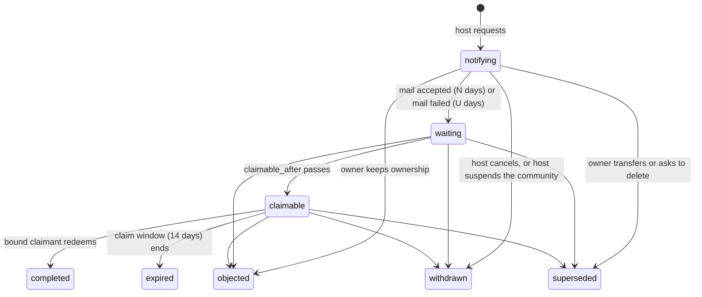

# Let a host replace a community owner who has left

**Status:** Draft (decisions resolved under the operator's "go with your picks"; decomposed into `03-tasks.json`)
**Author:** Claude (for DOR-2252)
**Date:** 2026-09-28

## Overview

A host can ask to replace the owner of a community. The owner is told by email and in the product, a waiting period runs, and the owner can say no, hand the community to someone themselves, or delete it. If none of that happens, the person the host named signs in and redeems a one-time claim, bound to their outside identity when the host uses single sign-on. Ownership then moves in one transaction, exactly as a voluntary transfer would move it, and every step is recorded in both audit trails.

This is the online break-glass contract the tenancy contract deferred (`specs/community-tenancy-contract/02-specification.md:57`, ADR `260920-192429`). It adds optional outbound mail to the Community server, because notice that only lives inside a community never reaches an owner who has left it.

## Background / Problem Statement

A community has exactly one owner (`enforce_community_owner_lifecycle()`, migration `0014`). Ownership moves only when the owner transfers it (`POST /owner/transfer`, password-confirmed). Host authority cannot change it: the tenancy contract says "There is no online host-operator path to replace a lost owner or mint membership in an existing community", and the only repair is to stop the service and edit the database.

For a hosted service this breaks a real case. An organization pays for a community; the employee who created it leaves; their account is the owner; they do not answer, or will not transfer. Every member keeps working, but nobody can manage settings, admins, invitations policy, exports of the whole community, or deletion. The organization's only path is a support ticket that ends in a hand edit of production data, with no notice to the owner and no record members can see.

The host-operator spec already has a pattern for a destructive host power done honestly: host-started deletion needs a published notice at least 7 days out, keeps the owner's export open, runs a further cancellable window, and audits every step (ADR `260923-121712`). Replacing an owner needs the same shape, plus two things deletion did not: notice that reaches the owner outside the community, and proof that the person taking over is the one the host meant.

## Goals

- A host (a key with the new `communities:ownership` scope, or a host operator with their password) can request that a named identity become a community's owner.
- The current owner is notified by email, in the community, and on their DorkOS connection, and has a waiting period of at least 7 days, counted from when notice could first reach them, to object, transfer, or delete.
- The owner can object with one step and no password, at any point before completion.
- Only the claimant the host named can complete it: the holder of a one-time claim, signed in, and linked to the named OIDC subject when the host named one.
- Completion is the same role swap as a voluntary transfer; the old owner stays a member.
- Every step writes a host audit row and a tenant audit row; members are told afterwards.
- The host never reads content, never learns member names or ids from this feature, and never gets a new route into the community.
- Hosts that do nothing see no change: without mail configured the feature is refused, and no email is ever sent.

## Non-Goals

- Deciding who in an organization may ask. The host decides; a hosted service decides in its own code.
- Any billing, plan, or pricing concept, and any change to `packages/cloud-api`.
- Replacing an owner in `pending_owner` (use `POST /host/communities/:id/owner-claims/reissue`), `suspended`, or `deletion_pending`.
- Changing admins, removing the old owner, or rebinding history.
- Reauthentication through the OIDC issuer (host-operator spec Open Question 5).
- Sending any other notice by mail (host deletion, takedown). The mail module makes it possible; each needs its own decision.
- A two-person rule on the host side. The waiting period and the owner's objection are the safeguards.
- Time or effort estimates.

## Technical Dependencies

| Dependency                               | Version                     | Used for                                                                                                                                                              |
| ---------------------------------------- | --------------------------- | --------------------------------------------------------------------------------------------------------------------------------------------------------------------- |
| `nodemailer`                             | latest 7.x at build time    | SMTP delivery (`smtp:` with STARTTLS, `smtps:`), pinned exactly like the app's other runtime dependencies. New runtime dependency of `apps/community` only.           |
| `smtp-server` (dev)                      | latest 3.x at build time    | an in-process SMTP fake for integration tests (accept, `4xx`, `5xx`, slow). Dev dependency only.                                                                      |
| `hono` 4.13.8, `better-auth` 1.7.5, `pg` | in repo                     | routes, sessions, `account` rows with `providerId='oidc'`                                                                                                             |
| hand-written SQL migrations              | `apps/community/migrations` | one new migration at the next free number when built (the takedown and erasure specs may take numbers first), mirrored in `src/schema.ts`, listed in `src/migrate.ts` |
| `zod` ^4.1.13                            | in repo                     | strict schemas in `@dorkos/shared/community-admin-wire` and `@dorkos/shared/community-wire`                                                                           |

## Detailed Design

### Shared rules

- **Host authority stays content-blind.** Host routes here take and return ids, states, dates, a reason code, and the host's own reference. They never return a member id, name, handle, email, or any content. The owner's email is read by the mail worker at send time and never leaves the server except to the configured SMTP server.
- **Tenant first, lock first.** Every route that names a community resolves the UUID from the path (`404` for unknown or malformed), locks the community row `FOR UPDATE` before changing anything, and re-checks every gate under the lock.
- **Lock order.** community → `owner_replacements` row → member rows in id order → `"user"` row. The same order as owner transfer and owner claims, so replacement, transfer, deletion, claim, and erasure cannot deadlock.
- **One-time secrets.** The claim token is 256 random bits (`randomToken()`), stored only as `hashSecret(token)`, returned once with `Cache-Control: no-store`, never in a list, log, audit row, email, or error.
- **Clock.** Every route and worker takes an injected `now()`, as `host-lifecycle.ts` does, so every date rule is testable.

### States



Open states: `notifying`, `waiting`, `claimable`. Closed: `completed`, `objected`, `withdrawn`, `superseded`, `expired`. A closed replacement never reopens. At most one open replacement per community.

- **N** = `COMMUNITY_OWNER_REPLACEMENT_NOTICE_DAYS` (default 14, minimum 7, maximum 90).
- **U** = `COMMUNITY_OWNER_REPLACEMENT_UNREACHABLE_DAYS` (default 30, minimum 14, maximum 180, and never below N; `parseConfig` refuses otherwise).
- The claim window is a constant 14 days (`OWNER_REPLACEMENT_CLAIM_DAYS`), not configuration: long enough for a person to find the link, short enough that a stale claim does not linger.

### Mail delivery (new, optional)

- **Configuration**, all or none, validated in `parseConfig`: `COMMUNITY_SMTP_URL` (`smtp://` or `smtps://`, credentials in the URL, required to be `smtps:` or to offer STARTTLS unless the host is loopback) and `COMMUNITY_MAIL_FROM` (an RFC 5322 mailbox). Unset: the server sends nothing, exactly as today, and `GET /api/v1/host/capabilities` (new, scope `communities:read`) answers `{ mail: false }` so a host page or script can explain why replacement is unavailable. The startup log names whether mail is on, never the URL or credentials.
- **Outbox.** `notice_outbox(id uuid PK, community_id uuid NOT NULL FK, kind text CHECK IN ('owner_replacement.notice','owner_replacement.reminder','owner_replacement.ended','owner_replacement.completed'), subject_id uuid NOT NULL /* the replacement */, recipient_user_id text NOT NULL, state text CHECK IN ('pending','accepted','failed'), attempts int NOT NULL DEFAULT 0, next_attempt_at timestamptz, lease_until timestamptz, accepted_at, failed_at, last_error_class text NULL CHECK (~ '^[A-Z][A-Z0-9_]{0,63}$'), created_at)`. A message is queued in the same transaction as the state change that causes it. The recipient's address is **not** stored: the worker reads `"user".email` when it sends, so an account erasure never leaves an address behind in the outbox.
- **Worker.** One message at a time per replica (`FOR UPDATE SKIP LOCKED`, a lease), the cleanup backoff the other workers use, `last_error_class` only (never the server's reply text, which can echo the address). An SMTP `2xx` for the whole message is **accepted**. A `5xx` for the recipient is **failed** at once. A `4xx`, timeout, or connection error retries until 72 hours after `created_at`, then **failed**. Accepted means "the mail server took it", and the product never says more than that.
- **Content.** Plain text, no tracking pixel, no link rewriting. A message names the community by its name, states the facts and dates, and links to the community's canonical `/c/<uuid>` address. It never contains the claim token, the host's reference, or anything from inside the community. Copy is in "User Experience".
- **Retention.** A message row is deleted 30 days after it resolves, and with its community by the deletion worker.

### Scope and authority

- New scope `communities:ownership` in `CommunityAdminHostApiKeyScopeSchema`, the key issue form, the offline `host-keys.js issue --scope`, and the `host_api_keys_scopes` check (`cardinality(scopes) BETWEEN 1 AND 6`). `communities:lifecycle` does not imply it, as `communities:legal_hold` is not implied.
- A host operator's session may act, as on every host route, but the request that **starts** a replacement must carry that operator's `password` (`confirmPassword`, the same budget as API-key issuance). A key carries no password; its scope is the authorization. Cancelling and reissuing a claim need no password (both reduce risk or keep it the same).

### Host routes

All under `/api/v1/host`, JSON, strict schemas, `assertHostActor` inside every write transaction.

**`POST /host/communities/:id/owner-replacements`** (scope `communities:ownership`)

Body `CommunityAdminOwnerReplacementRequestSchema`:

- `idempotencyKey` (1–200), `lifecycleVersion`,
- `reason`: `'owner_left_organization' | 'owner_unreachable' | 'other'` (shown to the owner as a fixed sentence),
- `reference`: the host's own pointer (ticket or case number), 1–120 characters of `[A-Za-z0-9 ._:#/-]`, or `null`. Shown to the owner so they can quote it when they contact the host; never shown to members; never written to an audit row.
- `claimant`: `{ oidcSubject: string (1–255) | null }`. Non-null is allowed only when the host has OIDC configured (else `409 STATE_CONFLICT`, "This host has no single sign-on to bind a claim to.").
- `password` when the actor is a person (refused with `400` when a key sends one).

Steps, in one transaction after the community lock:

1. Mail configured, else `409 NOTICE_DELIVERY_UNAVAILABLE` ("This host can't send email, so it can't give the owner notice. Set up mail first.").
2. Idempotency: a row with the same `(actor, idempotencyKey)` and payload hash returns `200` with that replacement, `claimToken: null`, `replayed: true`. Same key, different hash: `409 IDEMPOTENCY_CONFLICT`.
3. Lifecycle `active`, `archived`, or `held`, and `lifecycleVersion` current; otherwise `409 STATE_CONFLICT`. `pending_owner` names the claim-reissue route in its message.
4. No open replacement (the partial unique index is the backstop): `409 OWNER_REPLACEMENT_OPEN`.
5. Lock the current owner's member row and their `"user"` row; record `prior_owner_member_id` (host-invisible).
6. Insert the replacement (`notifying`), the claim token hash, and one `owner_replacement.notice` outbox message to the owner. The owner's account email is read by the worker, not here.
7. Host audit `owner_replacement.request` (`changed_fields {owner_replacement}`, `next_state 'notifying'`). Tenant audit `owner.replacement.requested`, `actor_kind='host'`, `subject_id` = the replacement id.

Response `201` (`200` on replay), `Cache-Control: no-store`: `{ replacement: CommunityAdminOwnerReplacementSchema, claimToken: string | null, claimUrl: string | null, replayed: boolean }`. `claimUrl` is `<COMMUNITY_PUBLIC_URL>/owner-replacement#<token>` (a fragment, so the token never reaches a server log), `null` on replay.

**`GET /host/communities/:id/owner-replacements`** (scope `communities:ownership`) lists this community's replacements, newest first, at most 50: id, state, reason, reference, `claimantBound` (boolean; the subject itself is not echoed), `requestedAt`, `requestedBy` (`person` display name or `api_key` prefix), `notice: { state, resolvedAt }`, `claimableAfter`, `claimExpiresAt`, `endedAt`. No member data.

**`POST /host/communities/:id/owner-replacements/:replacementId/cancel`** (scope `communities:ownership`) in any open state → `withdrawn`. Queues an `owner_replacement.ended` email to the owner ("The host withdrew its request"). Revokes the claim token. Audits both planes. A closed replacement is `409 STATE_CONFLICT`.

**`POST /host/communities/:id/owner-replacements/:replacementId/claim-token`** (scope `communities:ownership`) reissues the claim in `notifying`, `waiting`, or `claimable`: revokes the old hash, stores a new one, returns it once. Never moves any date. Audited (`owner_replacement.claim_token.reissue`).

**Host projection.** `CommunityAdminHostProjectionSchema` gains `ownerReplacement: { replacementId, state, claimableAfter: timestamp | null } | null`, the open replacement only, visible to every host actor (it explains why a community's owner may change soon). Details stay behind the `communities:ownership` routes.

**Capabilities.** `GET /host/capabilities` (scope `communities:read`) → `{ mail: boolean, oidc: boolean }`.

### Timeline worker

A small job in the existing worker loop, `SKIP LOCKED`, per open replacement:

- **Notice resolves.** When the notice message becomes `accepted`: `notice_state='accepted'`, `claimable_after = accepted_at + N days`, state `waiting`. When it becomes `failed`: `notice_state='failed'`, `claimable_after = failed_at + U days`, state `waiting`. The in-product banner and DorkOS notice are shown from `notifying` on, whatever the mail does.
- **Reminder.** 48 hours before `claimable_after`, queue `owner_replacement.reminder` once (`reminder_queued_at`). Its outcome never moves the date.
- **Claimable.** At `claimable_after`: state `claimable`, `claim_expires_at = claimable_after + 14 days`. Tenant audit `owner.replacement.claimable` is not written (nothing happened that a person did); the host projection shows it.
- **Expired.** At `claim_expires_at` without a claim: `expired`, token revoked, `owner_replacement.ended` email to the owner, audits on both planes.
- Every transition locks the community first and re-reads the replacement; a transition that lost a race to an objection, cancel, or completion does nothing.

### Things that end an open replacement

Each runs inside the transaction that causes it, after its own locks, and writes `ended_at`, the state, audits on both planes (host audit with the new `actor_kind='system'`, tenant audit with the acting member or `system`), revokes the claim token, and queues `owner_replacement.ended` to the owner unless the owner did it.

| Event                                                                              | State        | Where                                                             |
| ---------------------------------------------------------------------------------- | ------------ | ----------------------------------------------------------------- |
| Owner presses "Keep ownership"                                                     | `objected`   | new owner route (below)                                           |
| Owner transfers ownership (`POST /owner/transfer`)                                 | `superseded` | `routes/members.ts`                                               |
| Owner asks to delete the community (`POST /owner/deletion`)                        | `superseded` | `routes/administration.ts`                                        |
| Host suspends the community (`PATCH /host/.../lifecycle` `suspend`)                | `withdrawn`  | `routes/host-lifecycle.ts`, beside the deletion-notice withdrawal |
| Host cancels                                                                       | `withdrawn`  | host route                                                        |
| Host-started deletion or a takedown's community deletion enters `deletion_pending` | `withdrawn`  | `routes/host-lifecycle.ts`, the takedown route when it lands      |
| The community is deleted by the worker                                             | rows deleted | `deletion-worker.ts` deletes `owner_replacements` and its outbox  |

A hold, a release, archive, restore, limits, short names, and a legal hold do not end it. An owner transfer is still refused while `held` (unchanged), so in `held` the owner's choices are object or ask to delete.

### Owner and member routes (tenant plane)

**`GET /api/v1/communities/:communityId/owner-replacement`** (any active member; bearer grants allowed for the DorkOS read):

- Owner and admins, while one is open: `{ open: { replacementId, state, reason, reference (owner only; null for admins), requestedAt, claimableAfter, noticeState } }`.
- Every member, for 7 days after a completion: `{ completed: { newOwnerDisplayName, completedAt } }`.
- Otherwise `{ open: null, completed: null }`. Never mentions a legal hold, a host operator, a key, or the claimant.

**`POST /api/v1/communities/:communityId/owner-replacement/objection`** (the owner's browser session only; any bearer credential is `403 FORBIDDEN`; no password). Body `{ replacementId }`. Allowed in `active`, `archived`, and `held` (it is not growth). Open → `objected`. Idempotent: objecting to an already-objected replacement is `204`. Any other closed state is `409 STATE_CONFLICT`. Tenant audit `owner.replacement.objected` by the owner member; host audit `owner_replacement.objected` (`system`).

A session-only rule with no password is deliberate: objecting only keeps things as they are, and an owner who signs in only through OIDC has no password to give (`403 PASSWORD_REQUIRED` would make the right unusable).

### Claim and completion

**`POST /api/v1/owner-replacements/preflight`** `{ token }` (public, rate limited like owner-claim preflight): finds an open replacement with that token hash; sets a signed, `httpOnly`, `Lax`, 30-minute `community_owner_replacement` cookie; answers `{ communityId, communityName, state, claimableAfter, claimExpiresAt, requiresSingleSignOn }`. Unknown, revoked, or closed: one identical `403 FORBIDDEN` ("This ownership claim is unavailable."). The name is the only community detail given, and only to the holder of a live token the host issued.

**`POST /api/v1/owner-replacements/claim`** `{}` (session plus the cookie). One transaction:

1. `pg_advisory_xact_lock` on a new constant (distinct from owner claims), then find the replacement by token hash without locking it; lock the community `FOR UPDATE`; lock the replacement.
2. State must be `claimable` and `now() < claim_expires_at`; `waiting` answers `409 STATE_CONFLICT` "You can take ownership after <date>." Lifecycle must be `active`, `archived`, or `held`.
3. If `claimant_oidc_subject` is set: the session's user must have an `account` row with `providerId='oidc'` and `accountId = claimant_oidc_subject`; otherwise `403 FORBIDDEN` "Sign in with the account your organization named, then try again." The cookie is kept so the person can retry after linking.
4. Lock the current owner's member row and, if the claimant already has a membership, that row (id order). The claimant must not be the current owner (`409 STATE_CONFLICT`, "You already own this community."). A claimant membership that is leaving (`memberIsLeaving`) or an account with an open erasure (`accountErasureOpen`) is refused (`409 STATE_CONFLICT`).
5. Swap: old owner `role='member'` (stays active); claimant's active row `role='owner'`, or an inactive row of theirs reactivated as owner, or a new row inserted as owner with `mintHandle` and its `community_handles` row. Bump `lifecycle_version`. Any queued or building owner-scope export by the old owner ends `cancelled` (`endExportJob`); a ready one is already refused by `hasExportAuthority`.
6. Replacement `completed`, `new_owner_member_id` set, token consumed. Tenant audit `owner.replace` (`actor_kind='host'`, `prior_state` old owner member id, `next_state` new owner member id, `changed_fields {owner_member_id}`, the same shape as `owner.transfer`). Host audit `owner_replacement.complete` (`system`, no member ids). Queue `owner_replacement.completed` to the old owner.

Response: `{ community: { id, name }, memberId }`, `no-store`, cookie dropped. The browser then opens the community's Settings.

**Credentials.** None are revoked: the old owner stays a member, exactly as after a transfer, so their connections, agents, and sessions keep member access. Owner authority ends with the role, because every owner-only route re-reads the live role under a lock, and their owner-scope exports end as above. This is the credential answer the tenancy contract asked a break-glass flow to give.

Nothing else changes at completion: every other member, admin, invitation, connection, agent, file, and channel stays exactly as it was. The new owner can then remove the old owner, change admins, or transfer again with the existing tools.

### Wire schemas

In `packages/shared/src/community-admin-wire.ts` (host plane, strict):

```ts
/** Why a host asked to replace an owner. Shown to the owner as a fixed sentence. */
export const CommunityAdminOwnerReplacementReasonSchema = z.enum([
  'owner_left_organization',
  'owner_unreachable',
  'other',
]);
export const CommunityAdminOwnerReplacementStateSchema = z.enum([
  'notifying',
  'waiting',
  'claimable',
  'completed',
  'objected',
  'withdrawn',
  'superseded',
  'expired',
]);
export const CommunityAdminOwnerReplacementRequestSchema = z.strictObject({
  idempotencyKey: z.string().min(1).max(200),
  lifecycleVersion: version,
  reason: CommunityAdminOwnerReplacementReasonSchema,
  reference: z
    .string()
    .regex(/^[A-Za-z0-9 ._:#/-]{1,120}$/)
    .nullable(),
  claimant: z.strictObject({ oidcSubject: z.string().min(1).max(255).nullable() }),
  password: z.string().min(1).optional(), // required for a person, refused for a key
});
/** Host view of one replacement. Never a member id, name, email, or the OIDC subject. */
export const CommunityAdminOwnerReplacementSchema = z.strictObject({
  replacementId: id,
  communityId: id,
  state: CommunityAdminOwnerReplacementStateSchema,
  reason: CommunityAdminOwnerReplacementReasonSchema,
  reference: z.string().nullable(),
  claimantBound: z.boolean(),
  requestedAt: timestamp,
  requestedBy: z.strictObject({ kind: z.enum(['person', 'api_key']), label: z.string() }),
  notice: z.strictObject({
    state: z.enum(['pending', 'accepted', 'failed']),
    resolvedAt: timestamp.nullable(),
  }),
  claimableAfter: timestamp.nullable(),
  claimExpiresAt: timestamp.nullable(),
  endedAt: timestamp.nullable(),
});
export const CommunityAdminOwnerReplacementCreateResponseSchema = z.strictObject({
  replacement: CommunityAdminOwnerReplacementSchema,
  claimToken: z.string().min(1).nullable(), // once; null on replay
  claimUrl: z.url().nullable(),
  replayed: z.boolean(),
});
export const CommunityAdminOwnerReplacementListSchema = z.strictObject({
  replacements: z.array(CommunityAdminOwnerReplacementSchema).max(50),
});
export const CommunityAdminOwnerReplacementClaimTokenSchema = z.strictObject({
  replacementId: id,
  claimToken: z.string().min(1),
  claimUrl: z.url(),
});
export const CommunityAdminHostCapabilitiesSchema = z.strictObject({
  mail: z.boolean(),
  oidc: z.boolean(),
});
```

`CommunityAdminHostApiKeyScopeSchema` gains `'communities:ownership'` (scope arrays `.max(6)`). `CommunityAdminHostProjectionSchema` gains `ownerReplacement` as above.

In `packages/shared/src/community-wire.ts` (tenant and public plane, strict): `CommunityWireOwnerReplacementNoticeSchema` (the `open`/`completed` shape above), `CommunityWireOwnerReplacementObjectionRequestSchema` (`{ replacementId }`), `CommunityWireOwnerReplacementPreflightRequestSchema` (`{ token }`), `CommunityWireOwnerReplacementPreflightResponseSchema`, `CommunityWireOwnerReplacementClaimResponseSchema`, and route constants beside `ownerClaimPreflight`. `CommunityWireErrorCodeSchema` gains `NOTICE_DELIVERY_UNAVAILABLE` and `OWNER_REPLACEMENT_OPEN`. Only the same-origin browser bundle, the community app, and (for the notice read) the DorkOS remote client parse these, so they change in one release.

`packages/cloud-api` does not change. A hosted service calls these host routes with its own key; the DorkOS app already renders a service's generic community `notice`. A later in-app flow for an organization is a contract-first change in its own issue.

### Data model (one migration)

- `host_api_keys_scopes` check: six scopes, `cardinality BETWEEN 1 AND 6`.
- `host_audit_events_actor_kind`: adds `'system'` (no user id, no key id; the existing exactly-one check allows neither for `system`, as for `offline`).
- `audit_events_actor_kind`: adds `'host'` if the takedown migration has not already (whichever lands second drops its copy).
- `owner_replacements(id uuid PK, community_id uuid NOT NULL REFERENCES communities(id), state text NOT NULL CHECK (…eight…), reason text NOT NULL CHECK (…three…), reference text NULL CHECK (reference ~ '^[A-Za-z0-9 ._:#/-]{1,120}$'), claimant_oidc_subject text NULL CHECK (length BETWEEN 1 AND 255), claim_token_hash text NULL UNIQUE, requested_by_host_actor text NOT NULL CHECK (~ '^(person|api_key):'), idempotency_actor text NOT NULL, idempotency_key text NOT NULL, payload_hash text NOT NULL, prior_owner_member_id uuid NOT NULL, new_owner_member_id uuid NULL, notice_state text NOT NULL DEFAULT 'pending' CHECK IN ('pending','accepted','failed'), notice_resolved_at timestamptz NULL, claimable_after timestamptz NULL, reminder_queued_at timestamptz NULL, claim_expires_at timestamptz NULL, requested_at timestamptz NOT NULL, ended_at timestamptz NULL)`, with:
  - `UNIQUE (idempotency_actor, idempotency_key)`;
  - a partial unique index `ON owner_replacements(community_id) WHERE state IN ('notifying','waiting','claimable')`;
  - composite tenant foreign keys `(community_id, prior_owner_member_id)` and `(community_id, new_owner_member_id)` to `members(community_id, id)`;
  - shape checks: `claimable_after` is null in `notifying` and set in `waiting` and `claimable` (a replacement closed before its notice resolved keeps it null); `claim_expires_at` is set in `claimable` and `completed`; `ended_at` is set exactly in the closed states; `new_owner_member_id` is set exactly in `completed`; `claim_token_hash` is null in every closed state.
- `notice_outbox` as above, with an index on `(state, next_attempt_at)`.
- The deletion worker deletes `owner_replacements` and `notice_outbox` rows with the tenant. Member erasure leaves `owner_replacements` alone: it references member rows, which erasure husks rather than deletes.

### Code structure

| Path                                                                                                                                                 | Change                                                                           |
| ---------------------------------------------------------------------------------------------------------------------------------------------------- | -------------------------------------------------------------------------------- |
| `apps/community/src/mail/transport.ts`, `mail/outbox.ts`, `mail/worker.ts`, `mail/messages.ts` (new)                                                 | SMTP transport, outbox writes, delivery worker, the plain-text messages          |
| `apps/community/src/config.ts`                                                                                                                       | the four new keys and their cross-checks                                         |
| `apps/community/src/owner-replacement/state.ts`, `owner-replacement/end.ts`, `owner-replacement/worker.ts` (new)                                     | transitions, the shared "end an open replacement" helper, the timeline job       |
| `apps/community/src/routes/host-owner-replacements.ts` (new)                                                                                         | host routes and capabilities                                                     |
| `apps/community/src/routes/owner-replacement.ts` (new)                                                                                               | notice read, objection, preflight, claim                                         |
| `apps/community/src/routes/members.ts`, `routes/administration.ts`, `routes/host-lifecycle.ts`, `deletion-worker.ts`                                 | call the end helper; delete rows with the tenant                                 |
| `apps/community/src/host/communities.ts`, `host/authority.ts`                                                                                        | projection field; `system` audit actor                                           |
| `apps/community/src/main.ts`, `browser/BrowserRoot.tsx`                                                                                              | serve and route `/owner-replacement` (added to `COMMUNITY_RESERVED_SHORT_NAMES`) |
| `apps/community/src/browser/components/OwnerReplacementBanner.tsx`, `OwnerReplacementClaim.tsx`, `HostOwnerReplacement.tsx` (new), `HostApiKeys.tsx` | banners, objection, claim page, host section, scope checkbox                     |
| `apps/server/src/services/communities/remote/` and the client community row                                                                          | the owner's notice on their DorkOS connection                                    |
| `packages/shared/src/community-admin-wire.ts`, `community-wire.ts`                                                                                   | schemas above                                                                    |

## User Experience

All copy follows `writing-for-humans`. No copy mentions a plan, price, organization billing, a legal hold, or who at the host acted.

**Host page (`/host`, a community's record).** A section "Owner" shows "No change requested" or the open request: its state in words ("Waiting for the owner until 12 October", "Ready for the new owner to accept until 26 October"), whether mail reached the owner ("The owner's mail server accepted the notice on 28 September" / "We couldn't deliver the notice by email, so the owner has 30 days instead of 14"), and a Cancel button. "Replace the owner" opens a form: reason (three choices), reference, and the password. When single sign-on is on, the form also asks for the new owner's sign-in ID ("The ID your sign-in service uses for this person. Only this account can accept."). After submitting, the page shows the claim link once with a copy button and the sentence "Send this link to the new owner. It works only after the waiting period, and only once." When mail is off, the button is disabled with "This host can't send email, so it can't give the owner notice. Set up mail first." A replacement the owner objected to shows "The owner chose to keep this community on 3 October." with no retry button on that row (a new request is a new decision).

**The owner, by email** (subject "Someone asked to take over <community>"):

> The host of <community> has been asked to make someone else its owner.
> Reason: <sentence for the reason>. Reference: <reference, if any>.
> If you do nothing, the new owner can take over on or after <date>. You would stay a member and keep your messages.
> To keep ownership, sign in and choose Keep ownership: <community link>
> You can also hand the community to someone yourself, or delete it, from its Settings.

Reason sentences: "The organization you created it for says you no longer work with them." / "The host couldn't reach you." / "The host didn't give a specific reason." The reminder says the same with "in 2 days". Endings: "The host withdrew its request. Nothing changed.", "The request expired. Nothing changed.", and on completion "<new owner name> is now the owner of <community>. You are still a member."

**The owner, in the community.** A banner on every page, above the hold banner if both apply: "The host has been asked to make someone else the owner of this community. Unless you keep ownership, that can happen on or after <date>." Buttons: **Keep ownership** (one confirm: "Keep ownership? The host's request ends. They can ask again, and you'll be told again.") and **What this means** (a short panel with the reason, the reference, and the transfer and delete options). After objecting: "You kept ownership. The host has been told." Transfer and delete keep their existing flows; the banner disappears once either succeeds.

**Admins** see a quieter version without the reference: "The host has been asked to make someone else the owner. The owner has until <date> to respond."

**Every member**, for 7 days after completion: "The host made <name> the owner of this community on <date>." Dismissible, remembered per browser.

**The new owner.** The claim link opens `/owner-replacement`. Before the date: "You can take ownership of <community> on or after <date>. Keep this link." At the date: sign in (with the named single sign-on when bound), then **Take ownership** with the confirm "You'll become the owner of <community>. The current owner stays a member." On success, Settings opens. Errors in one plain sentence each: "This ownership claim is unavailable." (unknown, used, withdrawn, objected, expired), "Sign in with the account your organization named, then try again.", "You already own this community.", "This account is being deleted, so it can't take ownership."

**DorkOS app.** On the owner's installation, the community's row in the switcher shows a warning dot and, in the community header, the owner banner text with an **Open community** button that opens the community in the browser (where the objection lives, since only a browser session may object). One notification when the request is first seen, and one when it completes. Nothing is shown to non-owners in DorkOS.

## Testing Strategy

Real Postgres (`vitest.pg.config.ts`) and the in-process SMTP fake for everything in `apps/community`. Each test carries a purpose comment and names the failure it would catch.

### Acceptance criteria that discriminate

- **AC-1 Scope.** A key with every scope except `communities:ownership` gets `403` on every host replacement route; a key with only that scope succeeds; a person without `password` gets `400`, with a wrong one `403 REAUTH_FAILED`. Fails if lifecycle implies ownership, or a person skips reauthentication.
- **AC-2 No mail, no replacement.** With mail unset, `POST …/owner-replacements` is `409 NOTICE_DELIVERY_UNAVAILABLE`, writes no row, and `GET /host/capabilities` says `mail: false`; the SMTP fake receives nothing from any test that does not configure mail. Fails if a replacement can start without a way to give notice.
- **AC-3 Idempotency and one at a time.** Replaying the same key and body returns the same replacement with `claimToken: null` and queues no second message; a different body under the key is `409 IDEMPOTENCY_CONFLICT`; a second request with a new key while one is open is `409 OWNER_REPLACEMENT_OPEN`; two concurrent requests with different keys produce exactly one row (barrier). Fails without the payload hash or the partial index.
- **AC-4 Clock starts at notice.** With the fake accepting on the third attempt 2 hours after the request, `claimable_after` equals acceptance + N days (clock injected), not request + N. With the fake answering `550`, `claimable_after` = failure + U days, immediately. With `421` for 72 hours, it fails at 72 hours and gets U days. Fails if the wait counts from the request or a bounce blocks forever.
- **AC-5 Config bounds.** `NOTICE_DAYS=6`, `UNREACHABLE_DAYS=13`, `UNREACHABLE_DAYS` below `NOTICE_DAYS`, a non-TLS non-loopback SMTP URL, and only one of the two mail keys each fail `parseConfig`.
- **AC-6 No early claim.** A valid token and bound account in `notifying` or `waiting` get `409` with the date and change no row; one minute after `claimable_after` the same request succeeds. Fails if any gate is missing.
- **AC-7 Binding.** With `oidcSubject` set: a signed-in account with no OIDC link, and one linked to a different subject, are refused `403` and the cookie survives; the account linked to the subject succeeds. Without a subject, any signed-in account other than the owner succeeds. Fails if the subject is ignored or compared against email.
- **AC-8 Completion equals transfer.** After completion: exactly one active owner (the claimant); the old owner is an active `member` with the same connections, agents, and handle; an existing claimant member keeps their member id; a non-member claimant gets a new member with a unique handle; `lifecycle_version` is bumped; lifecycle is unchanged (including `held`); every other member row, grant, agent, invitation, channel, and entry count is identical before and after. The old owner's queued owner export is `cancelled` and a ready one answers `403` on download. Fails if the swap differs from `owner.transfer` or touches anything else.
- **AC-9 Owner rights end it.** In each open state: objection → `objected`; owner transfer → `superseded`; owner deletion request → `superseded`; host suspension → `withdrawn`; host deletion into `deletion_pending` → `withdrawn`; host cancel → `withdrawn`. After each, the old token's preflight is `403` and a claim at a later time fails. Objection works for an OIDC-only owner with no password, refuses a connection-grant bearer and an agent credential with `403`, and is refused for an admin. Fails if any path leaves a live claim.
- **AC-10 Lifecycle gates.** Request refused in `pending_owner`, `suspended`, `deletion_pending`; accepted in `active`, `archived`, `held`; objection accepted in `held`; owner transfer still refused in `held`. Fails if a replacement can start where the owner cannot answer.
- **AC-11 Legal hold is invisible and irrelevant.** Under a legal hold, request, objection, and completion behave identically, and no tenant response, email body (captured by the fake), or banner contains legal-hold wording. Fails if a legal hold leaks or blocks.
- **AC-12 Erasure.** A claimant with an open account erasure, or whose membership is leaving, is refused; an owner cannot erase while owner (unchanged) and can after completion. Fails if erasure races the swap (barrier between the claim's member lock and an erasure request).
- **AC-13 Audit on both planes.** Each step writes exactly one host row (`owner_replacement.request|claim_token.reissue|cancel|objected|superseded|expired|complete` with the right `actor_kind`, including `system`) and one tenant row; no host row contains a member id, the reference, the subject, or an email (JSON and column scan). Fails if a step is silent or the host plane learns people.
- **AC-14 Host stays content-blind.** Every host response in this feature, scanned, contains no member id, name, handle, email, OIDC subject, or content; the preflight gives only the community name. The existing tenancy and administration isolation suites pass unchanged. Fails if the host plane widens.
- **AC-15 Mail content.** Every captured message is plain text, names the community, carries the right date in UTC with the day spelled out, links to `/c/<uuid>`, and contains no token, no reference in any message but the owner notice and reminder, no legal-hold wording, and nothing from inside the community. The outbox never stores an address; after the owner's account is erased, no row holds it. `last_error_class` never contains the SMTP reply text. Fails if mail leaks a secret or keeps an address.
- **AC-16 Expiry.** A claimable replacement not claimed within 14 days becomes `expired`, emails the owner, and its token fails. Fails without the expiry job.
- **AC-17 Isolation.** Community B is unchanged by every step of a replacement in A, and A's token, preflighted against B's routes or with B's id, is refused. Fails if a token is not tenant-bound.
- **AC-18 Members are told.** For 7 days after completion every member's notice read returns `completed` with the new owner's display name, and afterwards `null`; before completion non-admin members see nothing. Fails if members are not told or learn of a pending request.

### Other tests

- Unit: state-transition table (every allowed and refused edge), reason sentences, date formatting, config parsing, SMTP error classification.
- Browser (`apps/community/browser-tests`, `acceptance/run.sh`): host section at phone and desktop widths; owner banner and Keep ownership; admin banner; claim page before and after the date; the member notice. Axe checks on each.
- DorkOS: remote client parses the notice read; the switcher row renders the warning for an owner and nothing for a member (mock transport).
- The deployment smoke test still runs with every DorkOS host blocked, mail unset, and OIDC unset.

### Mocking strategy

Real Postgres; the SMTP fake is the `smtp-server` package in process (accept, `421`, `550`, hang); OIDC through the existing in-process fake issuer; DorkOS with a mock `Transport` and a fixture Community server. No test sends real mail.

## Performance Considerations

- One indexed read per worker tick for due replacements and due messages; the numbers are tiny (a replacement is a rare, human-scale event).
- The notice read for DorkOS rides the existing per-connection read budget (`COMMUNITY_ATTENTION_BUDGET_MS`) and is cached like the counts; a slow Community shows no notice rather than a stale one.
- SMTP sends happen outside any database transaction; a slow mail server holds a lease, never a row lock.

## Security Considerations

- **Takeover risk is the core risk.** A stolen key with `communities:ownership`, or a phished host operator, could try to take a community. The defences: its own scope (withheld from every key that does not need it), password for people, a notice by email and in the product, a wait of at least 7 days (30 when mail bounces), a one-step objection, the owner's transfer and deletion rights, OIDC binding of the claimant, and audit rows on both planes that the owner can read in their export. The attacker must also hold the claim token and, when bound, the named identity.
- **An owner who objects wins.** There is no host override. A real dispute between an organization and a person is settled outside the product; a host that must act anyway still has offline repair, which `RECOVERY.md` keeps describing, now with a note that the online path should come first.
- **Honest delivery.** The product says "accepted by the mail server", never "read". A bounce lengthens the wait instead of pretending.
- **Secrets and privacy.** Claim tokens as above, and in a URL fragment. The outbox stores no address and no SMTP reply text. Mail carries no community content and no token. The host plane sees no member identity. Members never see the host's reference.
- **Enumeration.** Preflight answers one identical `403` for every unusable token and gives the community name only for a live one; rate limited per caller.
- **Denial of service.** Repeated requests after objections each send one notice and run a full wait; they cannot shorten anything. The host page shows each ended request so a pattern is visible to the operator. A per-community limit of one open request stops parallel pressure.
- **SMTP.** TLS required off loopback; credentials only in configuration; never logged.

## Documentation

- `apps/community/API.md`: the scope, host routes, capabilities, tenant notice and objection, claim routes, error codes.
- `apps/community/OPERATIONS.md`: setting up mail; when to replace an owner and when not to; what the owner and members see; cancelling; what an objection means; why the claim link should go only to the named person; using single sign-on binding.
- `apps/community/DEPLOYMENT.md` and `README.md`: the four configuration keys; mail stays off by default.
- `apps/community/RECOVERY.md`: offline repair is now the last resort after the online path.
- `docs/` (Communities guide): "If someone asks to take over your community" for owners, written with `writing-for-humans`.
- Changelog fragments per user-facing task in `changelog/unreleased/`.

## Implementation Phases

- **Phase 1 — Mail.** Optional SMTP, the outbox, the worker, configuration, capabilities. Useful on its own and a prerequisite for everything else.
- **Phase 2 — The contract on the server.** Schemas, migration, scope; host routes; the timeline worker and the end hooks; objection, claim, and completion with the full acceptance set.
- **Phase 3 — People.** The Community browser (host section, owner and admin banners, claim page, member notice) and the DorkOS owner notice; the owner guide.

### Backout

- **Phase 1:** unset the mail keys; revert the code; the outbox table is ignored.
- **Phase 2:** cancel every open replacement (host route) first, then revert. The migration stays: old code ignores the tables, writes only scopes it knows, and never writes `system` or `host` audit actors. A completed replacement is an ordinary owner change old code already understands.
- **Phase 3:** revert the UI; the server routes keep working for keys.

## Open Questions

None open. Resolved while specifying, under the operator's standing instruction:

1. ~~**Who can start it?**~~ (RESOLVED) **Answer:** a key with `communities:ownership`, or a host operator with their password. **Rationale:** the most sensitive host power gets its own scope, following `communities:legal_hold`.
2. ~~**Who can become owner?**~~ (RESOLVED) **Answer:** the signed-in holder of the one-time claim, bound to a named OIDC subject when the host sets one; never the current owner. **Rationale:** the host cannot see members; the issuer subject is the proof; the bearer form keeps hosts without OIDC able to use it with today's owner-claim trust.
3. ~~**Notice channel?**~~ (RESOLVED) **Answer:** SMTP mail configured by the host, required, plus in-product and DorkOS notices. **Rationale:** an owner who left does not read the community; a webhook would make every self-hoster build a mailer and could claim delivery that never happened.
4. ~~**Waiting period?**~~ (RESOLVED) **Answer:** from when mail resolves; default 14 days (7–90) when accepted, 30 days (14–180, never below the notice days) when it fails; claim window 14 days. **Rationale:** matches the host-deletion notice; the days count from when the owner could know; a dead address gets a longer wait instead of a dead end.
5. ~~**How does the owner object, and can the host override?**~~ (RESOLVED) **Answer:** one step, session only, any open state; it ends the request for good; no override. **Rationale:** an owner who answers is not lost.
6. ~~**Old owner's role?**~~ (RESOLVED) **Answer:** `member`, as in a transfer. **Rationale:** takes nothing a voluntary transfer would not.
7. ~~**Holds, legal hold, erasure, deletion, imports, suspension?**~~ (RESOLVED) **Answer:** see the lifecycle and "end" tables. **Rationale:** the owner must be able to answer for the whole wait; a legal hold stays invisible.
8. ~~**Must the host hold the community first?**~~ (RESOLVED) **Answer:** no. **Rationale:** a hold silences every member for an ownership problem that is not theirs.
9. ~~**Do members learn of a pending request?**~~ (RESOLVED) **Answer:** admins do; every member learns of a completion for 7 days. **Rationale:** admins can reach the owner; members should not discover a change of control by accident, and should not be alarmed by a request that may end in nothing.
10. ~~**Cloud contract?**~~ (RESOLVED) **Answer:** no change to `packages/cloud-api`. **Rationale:** the host API is enough for a hosted service; who may ask is the service's business and stays out of the public repo.
11. ~~**Is this a launch blocker?**~~ (RESOLVED) **Answer:** no. The hosted launch ships with the warning to transfer first and the owner's own transfer. **Rationale:** as the brief says.

## Related ADRs

- `260929-012844` — A host may replace a community owner only through a noticed, objectable, time-delayed claim (proposed, from this spec; amends `260920-192429`)
- `260929-012845` — The Community server sends mail only when a host configures SMTP, through a durable outbox that stores no address (proposed, from this spec)
- `260920-192429` — Scope host accounts through immutable community memberships (its "lost-owner repair is offline" sentence is amended)
- `260923-121150` — Host API keys are scoped host credentials that never reach community content
- `260923-121712` — A host hold stops growth without blocking export, and host-started deletion follows only a noticed hold (the notice precedent)
- `260924-215422` — A host legal hold silently blocks every permanent deletion of a community until released

## References

- DOR-2252 — this specification
- `specs/community-host-operator-api/02-specification.md` (host keys, hold, host-started deletion, legal hold, owner claims, OIDC)
- `specs/community-tenancy-contract/02-specification.md` (the offline-only rule this amends)
- `specs/community-member-erasure/`, `specs/community-hold-keeps-access/`, `specs/community-host-takedown/` (tenant `host` audit actor, notices in the product)
- `apps/community/src/routes/members.ts` (`/owner/transfer`), `routes/owner-claims.ts`, `routes/host-lifecycle.ts`, `routes/administration.ts`, `host/authority.ts`, `exports/authority.ts`, `erasure/guards.ts`, `oidc.ts`, `password-confirmation.ts`
- RFC 5321 (SMTP reply classes `2xx`/`4xx`/`5xx`), RFC 5322 (mailbox syntax)
