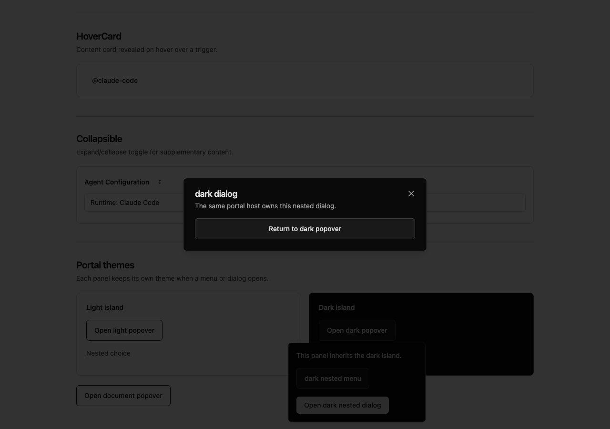
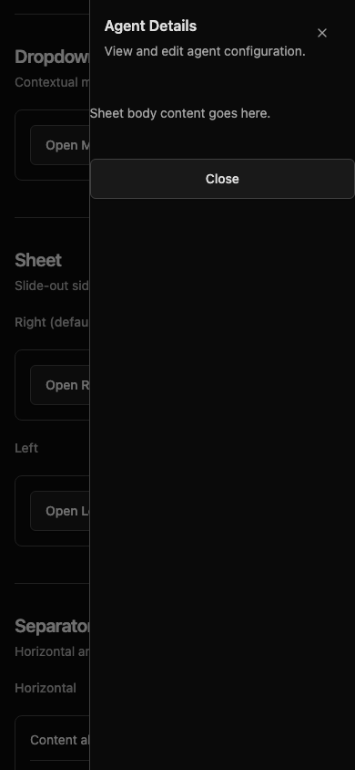

# Installed-package browser evidence

These recordings use the built catalog in an independent React 19 / Tailwind 4 consumer. The package was installed from the exact candidate archive, with no workspace aliases or ancestor dependency directories. The fixture lockfile was regenerated in its final location and a clean npm install repeated before the final checks.

- Released: [`@dork-labs/ui@0.2.0`](https://www.npmjs.com/package/@dork-labs/ui/v/0.2.0).
- Archive SHA256: `e47b82eaa8d96db6deb2cde25d57fc739303279b36b5e8bf9576d776f790934a`.
- Package: 117 files, 55,142 archive bytes, 234,382 unpacked bytes, 30 export paths.
- Typecheck, build, dependency-tree and all 11 browser checks pass; React resolves to one 19.3.0 instance.

After [PR #2082](https://github.com/dork-labs/dorkos/pull/2082) merged, the published registry tarball was downloaded and confirmed byte-for-byte identical to this recorded candidate. The independent consumer then installed the exact registry version and repeated clean install, typecheck, build, all exports, one-React inspection and all 11 browser checks successfully. These recordings remain proof of the identical package bytes.

[Desktop recording: nested theme portals](installed-nested-theme-portals.webm) shows selection through nested menus, dialogs inheriting their caller-owned light/dark hosts, Escape dismissal and focus restoration. Computed dialog backgrounds are `rgb(255, 255, 255)` and `rgb(10, 10, 10)`.

[Phone recording: reduced-motion overlays](installed-phone-sheet-reduced-motion.webm) shows a 390px viewport, dialog/sheet dismissal and focus restoration. Computed animation name and transition property are both `none`; the sheet stays inside the viewport. Annotated GIF tooling was unavailable, so these WebM recordings are the disclosed moving-evidence fallback.

The broader automated suite also covers explicit/system themes, validation, disabled controls, keyboard selection, real scrolling, tab panels, context submenus, normal collapsible animation, immediate menu reopen and 200% text. These are catalog and installed-package checks, not a claim of embedded-app runtime verification.
